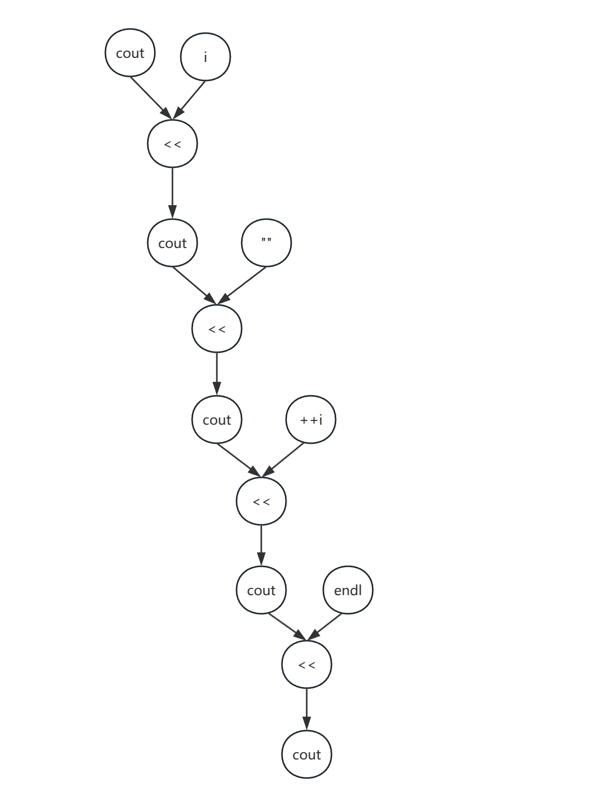

<!-- TOC -->

- [优先级与结合律](#%E4%BC%98%E5%85%88%E7%BA%A7%E4%B8%8E%E7%BB%93%E5%90%88%E5%BE%8B)
- [求值顺序](#%E6%B1%82%E5%80%BC%E9%A1%BA%E5%BA%8F)
    - [求值顺序、优先级、结合律](#%E6%B1%82%E5%80%BC%E9%A1%BA%E5%BA%8F%E4%BC%98%E5%85%88%E7%BA%A7%E7%BB%93%E5%90%88%E5%BE%8B)
- [第六章 函数](#%E7%AC%AC%E5%85%AD%E7%AB%A0-%E5%87%BD%E6%95%B0)
    - [inline函数](#inline%E5%87%BD%E6%95%B0)
- [第七章 类](#%E7%AC%AC%E4%B8%83%E7%AB%A0-%E7%B1%BB)
    - [notes](#notes)
    - [const成员函数](#const%E6%88%90%E5%91%98%E5%87%BD%E6%95%B0)
        - [基于const的重载成员函数](#%E5%9F%BA%E4%BA%8Econst%E7%9A%84%E9%87%8D%E8%BD%BD%E6%88%90%E5%91%98%E5%87%BD%E6%95%B0)
    - [构造函数](#%E6%9E%84%E9%80%A0%E5%87%BD%E6%95%B0)
        - [构造函数不能是const类型](#%E6%9E%84%E9%80%A0%E5%87%BD%E6%95%B0%E4%B8%8D%E8%83%BD%E6%98%AFconst%E7%B1%BB%E5%9E%8B)
        - [= default](#-default)
    - [前向声明](#%E5%89%8D%E5%90%91%E5%A3%B0%E6%98%8E)
    - [友元](#%E5%8F%8B%E5%85%83)
        - [定义在类内部的友元函数](#%E5%AE%9A%E4%B9%89%E5%9C%A8%E7%B1%BB%E5%86%85%E9%83%A8%E7%9A%84%E5%8F%8B%E5%85%83%E5%87%BD%E6%95%B0)
        - [类的成员函数作为其他类的友元](#%E7%B1%BB%E7%9A%84%E6%88%90%E5%91%98%E5%87%BD%E6%95%B0%E4%BD%9C%E4%B8%BA%E5%85%B6%E4%BB%96%E7%B1%BB%E7%9A%84%E5%8F%8B%E5%85%83)
        - [友元声明和作用域](#%E5%8F%8B%E5%85%83%E5%A3%B0%E6%98%8E%E5%92%8C%E4%BD%9C%E7%94%A8%E5%9F%9F)
    - [类的作用域](#%E7%B1%BB%E7%9A%84%E4%BD%9C%E7%94%A8%E5%9F%9F)
        - [名字查找与类的作用域](#%E5%90%8D%E5%AD%97%E6%9F%A5%E6%89%BE%E4%B8%8E%E7%B1%BB%E7%9A%84%E4%BD%9C%E7%94%A8%E5%9F%9F)
        - [类型名要特殊处理](#%E7%B1%BB%E5%9E%8B%E5%90%8D%E8%A6%81%E7%89%B9%E6%AE%8A%E5%A4%84%E7%90%86)
    - [构造函数初始值列表](#%E6%9E%84%E9%80%A0%E5%87%BD%E6%95%B0%E5%88%9D%E5%A7%8B%E5%80%BC%E5%88%97%E8%A1%A8)
    - [委托构造函数](#%E5%A7%94%E6%89%98%E6%9E%84%E9%80%A0%E5%87%BD%E6%95%B0)
    - [默认初始化和值初始化](#%E9%BB%98%E8%AE%A4%E5%88%9D%E5%A7%8B%E5%8C%96%E5%92%8C%E5%80%BC%E5%88%9D%E5%A7%8B%E5%8C%96)
    - [explicit构造函数](#explicit%E6%9E%84%E9%80%A0%E5%87%BD%E6%95%B0)
    - [聚合类aggregate class](#%E8%81%9A%E5%90%88%E7%B1%BBaggregate-class)
    - [字面值常量类literal class](#%E5%AD%97%E9%9D%A2%E5%80%BC%E5%B8%B8%E9%87%8F%E7%B1%BBliteral-class)
        - [constexpr构造函数](#constexpr%E6%9E%84%E9%80%A0%E5%87%BD%E6%95%B0)
    - [类的静态成员](#%E7%B1%BB%E7%9A%84%E9%9D%99%E6%80%81%E6%88%90%E5%91%98)
- [第十章 泛型算法](#%E7%AC%AC%E5%8D%81%E7%AB%A0-%E6%B3%9B%E5%9E%8B%E7%AE%97%E6%B3%95)
    - [bind函数](#bind%E5%87%BD%E6%95%B0)
- [智能指针](#%E6%99%BA%E8%83%BD%E6%8C%87%E9%92%88)
    - [循环引用问题](#%E5%BE%AA%E7%8E%AF%E5%BC%95%E7%94%A8%E9%97%AE%E9%A2%98)
    - [weak_ptr解决循环引用问题](#weak_ptr%E8%A7%A3%E5%86%B3%E5%BE%AA%E7%8E%AF%E5%BC%95%E7%94%A8%E9%97%AE%E9%A2%98)
    - [enable_shared_from_this](#enable_shared_from_this)
- [拷贝构造函数](#%E6%8B%B7%E8%B4%9D%E6%9E%84%E9%80%A0%E5%87%BD%E6%95%B0)
    - [直接初始化和拷贝初始化](#%E7%9B%B4%E6%8E%A5%E5%88%9D%E5%A7%8B%E5%8C%96%E5%92%8C%E6%8B%B7%E8%B4%9D%E5%88%9D%E5%A7%8B%E5%8C%96)
    - [拷贝构造函数的参数为什么是引用类型？](#%E6%8B%B7%E8%B4%9D%E6%9E%84%E9%80%A0%E5%87%BD%E6%95%B0%E7%9A%84%E5%8F%82%E6%95%B0%E4%B8%BA%E4%BB%80%E4%B9%88%E6%98%AF%E5%BC%95%E7%94%A8%E7%B1%BB%E5%9E%8B)
    - [拷贝构造函数的参数为什么一般是const引用类型？](#%E6%8B%B7%E8%B4%9D%E6%9E%84%E9%80%A0%E5%87%BD%E6%95%B0%E7%9A%84%E5%8F%82%E6%95%B0%E4%B8%BA%E4%BB%80%E4%B9%88%E4%B8%80%E8%88%AC%E6%98%AFconst%E5%BC%95%E7%94%A8%E7%B1%BB%E5%9E%8B)
    - [是否可以将拷贝构造函数定义为explicit？](#%E6%98%AF%E5%90%A6%E5%8F%AF%E4%BB%A5%E5%B0%86%E6%8B%B7%E8%B4%9D%E6%9E%84%E9%80%A0%E5%87%BD%E6%95%B0%E5%AE%9A%E4%B9%89%E4%B8%BAexplicit)
- [返回值优化](#%E8%BF%94%E5%9B%9E%E5%80%BC%E4%BC%98%E5%8C%96)
    - [强制执行URVO](#%E5%BC%BA%E5%88%B6%E6%89%A7%E8%A1%8Curvo)
    - [NRVO](#nrvo)
    - [纯右值语义](#%E7%BA%AF%E5%8F%B3%E5%80%BC%E8%AF%AD%E4%B9%89)
- [析构函数](#%E6%9E%90%E6%9E%84%E5%87%BD%E6%95%B0)
    - [析构函数的执行顺序](#%E6%9E%90%E6%9E%84%E5%87%BD%E6%95%B0%E7%9A%84%E6%89%A7%E8%A1%8C%E9%A1%BA%E5%BA%8F)
- [三/五法则](#%E4%B8%89%E4%BA%94%E6%B3%95%E5%88%99)
- [delete](#delete)
    - [引导函数重载决议](#%E5%BC%95%E5%AF%BC%E5%87%BD%E6%95%B0%E9%87%8D%E8%BD%BD%E5%86%B3%E8%AE%AE)
    - [阻止拷贝](#%E9%98%BB%E6%AD%A2%E6%8B%B7%E8%B4%9D)
    - [删除的析构函数](#%E5%88%A0%E9%99%A4%E7%9A%84%E6%9E%90%E6%9E%84%E5%87%BD%E6%95%B0)
    - [与default的区别](#%E4%B8%8Edefault%E7%9A%84%E5%8C%BA%E5%88%AB)
- [合成的拷贝控制成员可能是删除的](#%E5%90%88%E6%88%90%E7%9A%84%E6%8B%B7%E8%B4%9D%E6%8E%A7%E5%88%B6%E6%88%90%E5%91%98%E5%8F%AF%E8%83%BD%E6%98%AF%E5%88%A0%E9%99%A4%E7%9A%84)
- [引用限定符](#%E5%BC%95%E7%94%A8%E9%99%90%E5%AE%9A%E7%AC%A6)
- [重载运算与类型转换](#%E9%87%8D%E8%BD%BD%E8%BF%90%E7%AE%97%E4%B8%8E%E7%B1%BB%E5%9E%8B%E8%BD%AC%E6%8D%A2)

<!-- /TOC -->
# 优先级与结合律

复合表达式是指含有两个或者多个运算符的表达式。求复合表达式的值首先需要将运算符和运算对象合理的组合在一起，**优先级与结合律决定了运算对象组合的方式**。也就是说它们决定了表达式中每个运算符对应的运算对象来自表达式的哪一部分，表达式中的括号无视上述规则。

一般来说，表达式最终的值依赖于其子表达式的组合方式。高优先级运算符的运算对象要比低优先级运算符的运算对象更为紧密的结合在一起，如果优先级相同，其组合规则由结合律决定。
- 根据运算符的优先级，表达式$3+4*5$的值是$(3 + (4*5)) = 23$，而不是$((3+4) * 5) = 35$
    - 也就是4和5这两个运算对象先跟高优先级的乘法运算符结合在一起做乘法，子表达式为$4 * 5$, 运算结果等于20
    - 然后得到的结果20和3跟低优先级的加法运算符结合在一起做加法运算，子表达式为$20 + 3$，最后运算结果为23
- 根据运算符的结合律，表达式$20 - 15 -3$的结果是$((20 -15) - 3) = 2$, 而不是$(20 - (15 - 3)) = 8$
    - 因为两个减法运算符的优先级相同，在组合运算对象时按照结合律来组合
    - 算术运算符具有从左到右的结合律，那么按照从左到右的顺序组合运算对象

# 求值顺序

优先级规定了运算对象的组合方式，但是没有说明运算对象按照什么顺序求值。在大多数情况下，不会明确指定求值的顺序。比如，<<运算符没有明确规定何时以及如何对运算对象求值，因此下面的输出表达式是未定义的。

```cpp
int i = 0;
cout << i << " " << ++i << endl; // 未定义行为
```



编译器可能先求++i的值再求i的值，此时输出结果是1 1；也可能先求i的值再求++i的值，输出结果是0 1；甚至编译器还可能做完全不同的操作。

## 求值顺序、优先级、结合律

运算对象的求值顺序与优先级和结合律无关。在一条形如$f() + g() * h() + j()$的表达式中:
- 优先级规定，$g()$的返回值和$h()$的返回值相乘
- 结合律规定，$f()$的返回值与$g()*h()$相加，所得结果再与$j()$的返回值相加
- 然而，对于这些函数的调用顺序没有明确规定，存在未定义行为

如果$f,g,h,j$是无关函数，它们既不会改变同一对象的状态也不执行IO任务，那么函数的调用顺序不受限制。反之，如果其中某几个函数影响同一对象，则它是一条错误的表达式，将产生未定义行为。

规定了求值顺序的4种运算符：
- 逻辑与(&&)
- 逻辑或(||)
- 条件运算符(? : )
- 逗号运算符(,)

# 第六章 函数

## inline函数

和其他函数不一样，inline函数和constexpr函数可以在程序中多次定义。编译器想要展开函数仅有函数声明是不够的，还需要函数的定义。不过对于某个给定的inline函数或者constexpr函数来说，它的多个定义必须完全一致。基于这个原因，inline函数和constexpr函数通常定义在头文件中。

```cpp
// test3 多次定义普通函数

// a.cc
#include <format>
#include <iostream>

void Foo() {
    std::string fstr = std::format("non-inline function 1 {} {} {}", __FILE__, __LINE__, __func__);
    std::cout << fstr << std::endl;
}

void A() {
    Foo();
}

// b.cc 
#include <format>
#include <iostream>

void Foo() {
    std::string fstr = std::format("non-inline function 2 {} {} {}", __FILE__, __LINE__, __func__);
    std::cout << fstr << std::endl;
}

void B() {
    Foo();
}

// common.h 
#ifndef _COMMON_
#define _COMMON_

void A();
void B();

#endif

// main.cc 
#include "common.h"

int main() {
    A();
    B();

    return 0;
}
```

执行编译：
```bash
$ g++ main.cc a.cc b.cc  -std=c++20  
/usr/bin/ld: /tmp/ccyoT1lQ.o: in function `Foo()':
b.cc:(.text+0x0): multiple definition of `Foo()'; /tmp/ccIKv3xy.o:a.cc:(.text+0x0): first defined here
collect2: error: ld returned 1 exit status
```

报函数多次定义的错误，这是因为a.cc生成的.o里面有一个强符号Foo，而b.cc生成的.o里面也有一个强符号Foo,那么在链接时就有两个同名的强符号，报出多次定义的错误。

那么我们把Foo声明为inline函数，{a.o b.o}文件里面的Foo就是一个弱符号，而同名的弱符号是可以同时存在的，那么就不会存在多次定义的错误：

```cpp
// test4 多次定义inline函数

// a.cc
#include <format>
#include <iostream>

inline void Foo() {
    std::string fstr = std::format("inline function 1 {} {} {}", __FILE__, __LINE__, __func__);
    std::cout << fstr << std::endl;
}

void A() {
    Foo();
}

// b.cc 
#include <format>
#include <iostream>

inline void Foo() {
    std::string fstr = std::format("inline function 2 {} {} {}", __FILE__, __LINE__, __func__);
    std::cout << fstr << std::endl;
}

void B() {
    Foo();
}

// common.h 
#ifndef _COMMON_
#define _COMMON_

void A();
void B();

#endif

// main.cc 
#include "common.h"

int main() {
    A();
    B();

    return 0;
}
```

编译并运行：
```bash
$ g++ main.cc a.cc b.cc  -std=c++20  
$ 
$ ./a.out 
inline function 1 a.cc 5 Foo
inline function 1 a.cc 5 Foo
```

结果很奇怪，怎么函数A和函数B输出的是一样的呢？明明A和B调用的Foo实现是不一样的啊？这是为什么？

我们知道现在{a.o b.o}里面各有一个**弱符号Foo**，那么函数A和函数B在查找符号Foo时会选择哪个呢？并不是说函数A会选择a.o里面的Foo，函数B会选择B.o里面的Foo，这里链接器的实现是选择它在符号表里面遇到的第一个弱符号，也就是a.o里面的那一个，**因为a.cc是比b.cc先编译的，所以a.o的弱符号Foo排在b.o的弱符号Foo的前面，所以函数A和函数B在链接时都选择了a.o的弱符号Foo**。

所以说，对于inline函数，我们要确保它的多个定义要完全一致，如果不一致，在调用时有可能得不到期望的结果，而为了保证inline函数的定义一致，我们可以把它定义在头文件里，这样它在多个地方被include时，函数的定义总是一致的。

如果说我们就是想让函数A调用a.o的Foo，函数B调用b.o的Foo，那该怎么办呢？这时候可以把inline函数声明为static的。这样一来符号Foo将不再是GLOBAL类型的，而是LOCAL类型的，在链接时函数A将在本编译单元a.o里面查找Foo，函数B在b.o里面查找Foo。

```cpp
// test5 static修饰inline函数

// a.cc
#include <format>
#include <iostream>

static inline void Foo() {
    std::string fstr = std::format("inline function 1 {} {} {}", __FILE__, __LINE__, __func__);
    std::cout << fstr << std::endl;
}

void A() {
    Foo();
}

// b.cc 
#include <format>
#include <iostream>

static inline void Foo() {
    std::string fstr = std::format("inline function 2 {} {} {}", __FILE__, __LINE__, __func__);
    std::cout << fstr << std::endl;
}

void B() {
    Foo();
}

// common.h 
#ifndef _COMMON_
#define _COMMON_

void A();
void B();

#endif

// main.cc 
#include "common.h"

int main() {
    A();
    B();

    return 0;
}
```

编译并运行：
```bash
$ g++ -o main1 main.cc a.cc  b.cc -std=c++20 
$ 
$ g++ -o main2 main.cc b.cc  a.cc -std=c++20 
$ ./main1 
inline function 1 a.cc 5 Foo
inline function 2 b.cc 5 Foo
$ ./main2
inline function 1 a.cc 5 Foo
inline function 2 b.cc 5 Foo
```

可以看到A调用了a.o的Foo，B调用了b.o的Foo

如果在类外定义inline成员函数，那么inline成员函数的定义应该和类的定义在同一个文件中。也就是说类A的头文件如果是**A.h**，实现类A的文件为**A\.cc**，在**A.h**中声明了一个**A::Foo**的成员函数，如果我们想在类的外部把它实现为inline函数，那么应该在**A.h**中实现这个函数，而不是在**A\.cc**中实现。

```cpp
// test6

// common.h
#ifndef _COMMON_
#define _COMMON_

class A {
public:
    A() = default;
    void Display() const;
private:
    int a_{0};
};

#endif

// common.cc 
#include "common.h"
#include <iostream>
#include <format>

// 在common.cc中定义inline函数
inline void A::Display() const {
    std::string fstr = std::format("{} {} {}", __FILE__, __LINE__, __func__);
    std::cout << fstr << std::endl;
}

// main.cc 
#include "common.h"

int main() {
    A a;
    a.Display();
    return 0;
}
```

编译时报链接错误：
```bash
$ g++ main.cc  common.cc -std=c++20 
/usr/bin/ld: /tmp/ccHQNgF7.o: in function `main':
main.cc:(.text+0x2a): undefined reference to `A::Display() const'
collect2: error: ld returned 1 exit status
```

为什么会报这个错误呢，我们发现编译单元common.cc的.o文件里没有Display这个符号:
```bash
$ g++ -c common.cc   -std=c++20
$ readelf -s common.o | grep Display 
```

所以在链接时就找不到这个函数了，这说明编译器将inline成员函数A::Display()优化掉了，因为这个inline函数在common.cc编译单元内没有被调用，那么编译器认为可以不要这个inline函数，于是就被优化掉了(普通成员函数不会被优化掉)。那如果我们在这个编译单元内调用这个inline函数呢？

```cpp
// test7

// common.h
#ifndef _COMMON_
#define _COMMON_

class A {
public:
    A() = default;
    void Display() const;
    void Display2() const;
private:
    int a_{0};
};

#endif

// common.cc 
#include "common.h"
#include <iostream>
#include <format>

inline void A::Display() const {
    std::string fstr = std::format("{} {} {}", __FILE__, __LINE__, __func__);
    std::cout << fstr << std::endl;
}

// 调用了inline函数
void A::Display2() const {
    Display();
}

// main.cc 
#include "common.h"

int main() {
    A a;
    a.Display();
    a.Display2();
    return 0;
}
```

编译并运行：
```cpp
$ g++ main.cc common.cc  -std=c++20  
$ ./a.out 
common.cc 6 Display
common.cc 6 Display
```
在这个例子中，inline成员函数A::Display还是在common.cc中定义，但它在common.cc中被A::Display2调用，这样就不会被编译器优化掉了，于是main函数也能链接到A::Display。

这个例子说明，在类外定义inline成员函数，最好是在.h文件中定义。因为当我们想调用这个inline成员函数时，肯定要先include这个头文件，此时编译器能看到这个inline函数的完整定义，完成inline函数的展开，同时，这也确保了在此编译单元内有其他地方调用这个inline成员函数，编译器肯定不会优化掉这个inline成员函数。


# 第七章 类

## notes

- 编译器分两步处理类: 首先编译成员的声明, 然后才轮到成员函数体(如果有的话), 因此，成员函数体可以随意使用类中的其他成员而无需在意这些成员出现的顺序
- 一般来说，如果非成员函数是类接口的组成部分，则这些函数的声明应该与类在同一个头文件内
- 只有当类没有声明任何构造函数时，编译器才会自动地生成默认构造函数
- 如果类包含有内置类型或者复合类型的成员，则只有当这些成员全都被赋予了类内初始值时，这个类才适合使用合成的默认构造函数
- 友元关系不存在传递性，每个类负责控制自己的友元类或友元函数


## const成员函数

成员函数的隐式参数this是一个常量指针:
```cpp
T * const this;
```

尽管this是隐式的，但它仍然要遵循初始化规则，那么我们不能把this绑定到一个常量对象上：
```
const T a;
this = &a; // 错误，不能将指向常量的指针赋值给不是指向常量的指针
```

**这意味着我们不能在一个常量对象上调用普通成员函数**：

```cpp
// test0

#include <iostream>

class A {
public:
    A() = default;
    A(int a) : a_{a} {}
    int F() {
        return a_ * a_;
    }
private:
    int a_{10};
};

int main () {
    const A a(100);

    std::cout << a.F() << std::endl;

    return 0;
}
```

上面的代码用const a调用普通成员函数F，编译器就会报错：
```bash
main.cc: In function ‘int main()’:
main.cc:17:21: error: passing ‘const A’ as ‘this’ argument discards qualifiers [-fpermissive]
   17 |     std::cout << a.F() << std::endl;
      |                  ~~~^~
main.cc:7:9: note:   in call to ‘int A::F()’
    7 |     int F() {
      |         ^
```

这是因为上面的代码用一个指向常量的指针来初始化this，这是不符合初始化规则的。如果我们把成员函数的this形参声明为指向常量的指针，那么不管是常量对象还是非常量对象，就都能调用这个成员函数：
```cpp
T t1;
const T t2;
const T *this const = &t1; // 指向非常量的指针&t1初始化指向常量的常量指针this，正确
const T *this const = &t2; // 指向常量的指针&t2初始化指向常量的常量指针this，正确
```

**把this声明为指向常量的指针，这就是常量成员函数的作用：**

```cpp
void F() const;
```

显然，根据初始化规则：
- 常量对象，常量对象的引用，指向常量对象的指针都只能调用常量成员函数
- 非常量对象，既能调用普通成员函数也能调用常量成员函数

所以为了提高成员函数的灵活性，如果我们确定不改变成员变量的值，就应该尽可能地把成员函数声明为常量成员函数，这样常量对象和非常量对象就都能调用这个常量成员函数了。

**从const成员函数返回*this**，那么返回值的类型就是const T&，对常量的引用。

### 基于const的重载成员函数

考虑到如下两点原因：
- 常量对象只能调用常量成员函数，不能调用非常量成员函数
- 非常量对象可以调用常量成员函数和非常量成员函数，但显然非常量成员函数是一个更好的匹配

我们可以基于const定义重载成员函数

```cpp
// test8

#include <iostream>
#include <format>

class A {
public:
    A() = default;
    A(int a, int b) : a_{a}, b_{b} {}

    void Display() const {
        std::cout << "from const member function: " << std::endl;
        DoDisplay();
    }

    void Display() {
        std::cout << "from non-const member function: " << std::endl;
        DoDisplay();
    }
private:
    void DoDisplay()  const {
        std::string fstr = std::format("{} {} {} a: {}, b: {}", __FILE__, __LINE__, __func__, a_, b_);
        std::cout << fstr << std::endl;
    }

    int a_{1};
    int b_{2};
};

int main() {
    const A a(10, 20);
    A b(100, 200);

    a.Display();
    b.Display();

    return 0;
}
```

编译并运行：

```bash
$ g++ main.cc -std=c++20    
$ ./a.out 
from const member function: 
main.cc 10 DoDisplay a: 10, b: 20
from non-const member function: 
main.cc 10 DoDisplay a: 100, b: 200
```

可以看到常量a选择了const版本的Display函数，非常量b选择了non-const的Display函数。在这个例子里，我们把DoDisplay实现为const版本，这样常量对象和非常量对象都可以调用这个私有成员函数，用这个私有成员函数实现Display函数基于const属性的重载。

## 构造函数

构造函数的名字和类名相同，没有返回类型，构造函数也可以重载。

### 构造函数不能是const类型

不同于其他成员函数，构造函数不能被声明为const的。当我们创建一个const对象时，直到构造函数完成初始化过程，对象才能真正取得其**常量**属性。因此，构造函数在const对象的构造过程中可以向其写值。也就是说不管怎样，构造函数肯定是能改变成员的值的，那么声明为const就没啥意义了。


```cpp
// test1
#include <iostream>

class A {
public:
    A() const = default; // 错误，构造函数不能是const的
    A(int a) const : a_{a} {} // 错误，构造函数不能是const的
    int F() const {
        return a_ * a_;
    }
private:
    int a_{10};
};

int main () {
    const A a(100);

    std::cout << a.F() << std::endl;

    return 0;
}
```

这里把默认构造函数声明为const，编译器报错：

```bash
main.cc:5:17: error: constructors may not be cv-qualified
    5 |     A() const = default;
      |                 ^~~~~~~
main.cc:6:14: error: constructors may not be cv-qualified
    6 |     A(int a) const : a_{a} {}
      |              ^~~~~
```

### = default

在C++11新标准中，如果我们需要默认的行为，那么可以通过在参数列表后面写上 **= default**来要求编译器生成构造函数。**= default**既可以和声明一起出现在类的内部，也可以作为定义出现在类的外部。

```cpp
#include <iostream>

class A {
public:
    A();
    A(int a) : a_{a} {}
    int F() const {
        return a_ * a_;
    }
private:
    int a_{10};
};

// 在类的外部定义默认构造函数，那么它就不是内联函数
A::A() = default;

int main () {
    const A a(100);

    std::cout << a.F() << std::endl;

    return 0;
}
```

## 前向声明

我们可以仅仅声明类而暂时不定义它，这种声明被称为前向声明。

```cpp
class A;
```

我们可以定义指向这种类型的指针或引用，也可以声明(但是不能定义)以不完全类型作为参数或者返回类型的函数。

```cpp
// test9

#include <iostream>
#include <format>

class A;

void F1(A a);
void F2(A *p);
void F3(A &a) {}

A F4();
A* F5();
A& F6();

A F7(A a) {return a;}
A* F8() {return nullptr;}
A& F9(A &a) {return a;}

int main() {
    A *p = nullptr;
    A &a = *p;

    return 0;
}
```

编译这段代码看看有没有问题：
```bash
$ g++ main.cc -std=c++20 
main.cc:14:8: error: ‘a’ has incomplete type
   14 | A F7(A a) {return a;}
      |      ~~^
main.cc:4:7: note: forward declaration of ‘class A’
    4 | class A;
      |       ^
main.cc:14:9: error: return type ‘class A’ is incomplete
   14 | A F7(A a) {return a;}
      |         ^
```

可以看到这段代码只有第14行报错：
```cpp
A F7(A a) {return a;}
```

因为这个函数定义的函数体试图返回一个不完整类型。显然函数在返回一个类型时，需要进行拷贝操作，但因为返回的类型是一个不完整类型，编译器就不知道应该给这个类型分配多少内存，也不知道如何拷贝这个类型，那显然就会报错。

而函数F8和F9，返回类型是A的指针和引用，不需要做拷贝操作，在编译器的实现中，返回A的指针和引用并不需要知道类型A的具体实现，A占多大内存，于是通过编译。

## 友元

类的友元有三种：

- 普通的非成员函数
- 其他的整个类
- 其他类的某些成员函数

### 定义在类内部的友元函数

友元函数能定义在类的内部，这样的函数是隐式内联的。

```cpp
// test10
// 在类的内部定义友元函数
// a.h
#ifndef _A_H_
#define _A_H_

#include <iostream>
#include <format>

class A {
public:
    friend void Display(const A &a) {
        std::string fstr = std::format("a: {} b: {}", a.a_, a.b_);
        std::cout << fstr << std::endl;
    }
    A() = default;
    A(int a, int b) : a_{a}, b_{b} {}
private:
    int a_{10};
    int b_{20};
};

//
// 友元声明仅仅指定了访问的权限，而非一个通常意义上的函数声明。如果我们希望类的用户
// 能够调用某个友元函数，那么我们就必须在友元声明之外再专门对函数进行一次声明。
//
// 为了使友元对类的用户可见，我们通常把友元的声明与类本身放置在头一个头文件中(类的外部)。
//
// 一些编译器允许在尚无友元函数的初始声明的情况下就调用它。不过即使你的编译器支持这种
// 行为，最好还是提供一个独立的函数声明，这样即使你更换了一个有这种强制要求的编译器，
// 也不必改变代码
void Display(const A &a);

// main.cc
#include "a.h"

int main() {
    A a(100, 200);

    Display(a);

    return 0;
}
```

编译并运行：
```bash
$ g++ main.cc -std=c++20 
$ ./a.out 
a: 100 b: 200
```

这个例子要注意一下几点：
- 友元函数可以定义在类内部
- 友元函数的声明和类本身放在同一个文件**a.h**
- 除了在类内部的友元声明，友元函数还应该像普通函数一样提供一个独立的函数声明

### 类的成员函数作为其他类的友元

将类的成员声明为其他类的友元提供了更加精细化的访问控制，但这也带来了代码结构的复杂性。我们必须仔细组织代码以满足声明和定义的彼此依赖关系。


这里提供两种实现方式：

**一种实现方式是把涉及到的类都实现在一个h文件里面**，这样是比较简单的：

```cpp
// test11

// AB.h
#ifndef _AB_H_
#define _AB_H_

#include <iostream>
#include <sstream>
#include <format>

class A;

class B {
public:
    B(std::ostringstream &out) : out_(out) {}
    void Display() const {
        std::cout << out_.str() << std::endl;
    }
    // 只有A的前向声明， 用A的引用作为形参，
    void Serialize(const A&);
private:
    std::ostringstream &out_;
};

class A {
// 这里声明了B::Serialize是A的友元，那么B的完整声明应该放在前面，不然就看不到
// B::Serialize这个符号了
friend void B::Serialize(const A&);
public:
    A() = default;
    A(int a, int b) : a_{a}, b_{b} {}

    void Display() const {
        std::string fstr = std::format("a: {} b{}", a_, b_);
        std::cout << fstr << std::endl;
    }
private:
    int a_{10};
    int b_{20};
};

void B::Serialize(const A& a) {
    out_ << "#" << "int:" << a.a_ << "#" << "int:" << a.b_;
}

#endif

// main2.cc
#include "AB.h"

int main() {
    A a(100, 200);

    a.Display();

    std::ostringstream oss;
    B b(oss);
    b.Serialize(a);

    b.Display();

    return 0;
}
```

编译并运行：
```bash
$ g++ -o main2 main2.cc -std=c++20  
$ ./main2 
a: 100 b200
#int:100#int:200

```

**另外一种实现方式是按照常规，h和cc文件分离**，相对复杂一点：

**test11/B.h**

```cpp
// test11

// B.h
#ifndef _B_H_
#define _B_H_

#include <iostream>
#include <sstream>
#include <format>

class A;

class B {
public:
    B(std::ostringstream &out);
    void Display() const;

    // 这个成员函数作为A的友元，将会被实现在A.cc这个文件里
    void Serialize(const A&);
private:
    std::ostringstream &out_;
};

#endif
```

**test11/B.cc**
```cpp
// B.cc
#include "B.h"

B::B(std::ostringstream &out) : out_{out} {}

void B::Display() const {
    std::string fstr = std::format("after serialize: {}", out_.str());
    std::cout << fstr << std::endl;
}

// 这里要注意，B的成员函数B::Serialize作为A的友元，需要定义在A.cc里面，
// 因为在B.cc里面，我们并不能看到A的完整声明

```

**test11/A.h**
```cpp
// A.h

#ifndef _A_H_
#define _A_H_

#include "B.h"

class A {
// A.h include了B.h，所以能看到B的完整声明，不然引入B::Serialize这个符号就会报错
friend void B::Serialize(const A&);
public:
    A();
    A(int a, int b);

    void Display() const;
private:
    int a_{10};
    int b_{20};
};

#endif
```

**test11/A.cc**
```cpp
// A.cc
#include "A.h"

A::A() = default;

A::A(int a, int b) : a_{a}, b_{b} {}

void A::Display() const {
    std::string fstr = std::format("a: {} b{}", a_, b_);
    std::cout << fstr << std::endl;
}

// 这个函数被定义在了A.cc文件
void B::Serialize(const A& a) {
    out_ << "#" << "int:" << a.a_ << "#" << "int:" << a.b_;
}
```

**test11/main.cc**
```cpp
// main.cc
#include "A.h"
#include "B.h"

int main() {
    A a(100, 200);

    a.Display();

    std::ostringstream oss;
    B b(oss);
    b.Serialize(a);

    b.Display();

    return 0;
}
```

编译并运行：
```bash
$ g++ -o main main.cc A.cc B.cc -std=c++20 
$ ./main
a: 100 b200
after serialize: #int:100#int:200
```


### 友元声明和作用域

**类和非成员函数的声明不是必须在它们的友元声明之前**(Classes and nonmember functions need not have been declared before they are used in a friend declaration)。当一个名字第一次出现在一个友元声明中时，我们隐式地假定该名字在当前作用域中是可见的。然而，友元本身不一定真的声明在当前作用域中。

从**test12**这个例子中可以看到，class B和operator<<作为class A的友元类和友元函数，并不需要在class A的声明之前提供一个前向声明。

**test12/A.h**
```cpp
#ifndef _A_H_
#define _A_H_

#include <iostream>
#include <string>
#include <format>

class A {
friend class B;
friend std::ostream& operator<<(std::ostream &out, const A& a);
public:
    A();
    A(int a, const std::string &s);
private:
    int a_{10};
    std::string s_{"A"};
};

#endif
```

**test12/A.cc**
```cpp
#include "A.h"

A::A() = default;
A::A(int a, const std::string &s) : a_{a}, s_{s} {}

std::ostream& operator<<(std::ostream &out, const A& a) {
    std::string fstr = std::format("class A: {{{0} {1}}}", a.a_, a.s_);
    out << fstr << std::endl;
    return out;
}
```

**test12/B.h**
```cpp
#ifndef _B_H_
#define _B_H_

#include <iostream>
#include <string>
#include <format>

class A;

class B {
friend std::ostream& operator<<(std::ostream &out, const B& b);
public:
    B();
    B(int a, const std::string &s);

    B& CopyFrom(const A& a);
private:
    int a_{20};
    std::string s_{"B"};
};

#endif
```

**test12/B.cc**
```cpp
#include "A.h"
#include "B.h"

B::B() = default;
B::B(int a, const std::string &s) : a_{a}, s_{s} {}

B& B::CopyFrom(const A& a) {
    a_ = a.a_;
    s_ = a.s_;
    return *this;
}

std::ostream& operator<<(std::ostream &out, const B& b) {
    std::string fstr = std::format("class B: {{{0} {1}}}", b.a_, b.s_);
    out << fstr << std::endl;
    return out;
}
```

**test12/main.cc**
```cpp
#include "A.h"
#include "B.h"

int main() {
    A a(200, "XXXX");
    std::cout << a << std::endl;

    B b(300, "ZZZZ");
    std::cout << b << std::endl;

    b.CopyFrom(a);
    std::cout << b << std::endl;

    return 0;
}
```

编译并运行：

```bash
$ g++ main.cc A.cc B.cc -std=c++20      
$ ./a.out 
class A: {200 XXXX}

class B: {300 ZZZZ}

class B: {200 XXXX}


```

甚至就算是在类的内部定义定义友元函数，我们也必须在类的外部提供相应的声明从而使得函数可见。换句话说，即使我们仅仅是用声明友元的类的成员调用该友元函数，它也必须是被声明过的。

**Names introduced by friend declarations within a non-local class X become members of the innermost enclosing namespace of X, but they `do not become visible to ordinary name lookup (neither unqualified nor qualified) unless a matching declaration is provided at namespace scope`, either before or after the class definition. Such name may be found through ADL which considers both namespaces and classes.**

**Only the innermost enclosing namespace is considered by such friend declaration when deciding whether the name would conflict with a previously declared name.**

**test13/A.h**
```cpp
#ifndef _A_H_
#define _A_H_

#include <iostream>
#include <string>
#include <format>

class A {
public:
    A() = default;
    A(int a, const std::string &s) : a_{a}, s_{s} {}

    friend void F1() {
        std::string fstr = std::format("{} {} {}", __FILE__, __LINE__, __func__);
        std::cout << fstr << std::endl;
    }

    void F2() {
        F1();
    }

private:
    int a_{10};
    std::string s_{"A"};
};

#endif
```

编译这个头文件：

```bash
$ g++ -c A.h  -std=c++20   
A.h: In member function ‘void A::F2()’:
A.h:19:9: error: ‘F1’ was not declared in this scope; did you mean ‘F2’?
   19 |         F1();
      |         ^~
      |         F2
```

这里有一个容易引起误解的地方，参数依赖查找(ADL)会影响友元声明的查找：

**test14/A.h** 

```cpp
#ifndef _A_H_
#define _A_H_

#include <iostream>
#include <string>
#include <format>

class A {
public:
    A() = default;
    A(int a, const std::string &s) : a_{a}, s_{s} {}

    friend void F1(const A& a) {
        std::string fstr = std::format("{} {} {} {} {}", __FILE__, __LINE__, __func__, a.a_, a.s_);
        std::cout << fstr << std::endl;
    }

    void F2() {
        F1(*this);
    }

private:
    int a_{10};
    std::string s_{"A"};
};

#endif
```

编译这个头文件，发现A::F2并没有报错，没有报错只是说明友元函数F1的参数a的类型为class A，于是成员函数A::F2调用F1时，根据F1的参数类型A，找到了A中的友元声明F1，于是没有报错。


要理解友元声明的作用是影响访问权限，它本身并非普通意义上的声明。友元声明对于限定性查找和非限定查找都是不可见的。(A friend declaration however is not visible for qualified or unqualified lookup (in the absence of other declarations of the same name.)


## 类的作用域

一个类就是一个作用域，这个事实能够很好的解释为什么我们在类的外部定义成员函数时必须同时提供类名和函数名。因为在类的外部，成员的名字被隐藏起来了。

一旦遇到类名，定义的剩余部分就在类的作用域之内了，这里的剩余部分包括参数列表和函数体。

而函数的返回类型出现在函数名之前，因此当类的成员函数定义在类的外部，且返回类型用到了类中定义的类型，那么返回类型需要指出它是哪个类的成员。


### 名字查找与类的作用域

编译器编译程序时，先做预处理，然后以一个文件为编译单元开始编译。

通常情况下的名字查找：
- 首先在名字所在的块中寻找其声明语句，**只考虑在名字的使用之前出现的声明**
- 如果没找到，继续查找外层作用域
- 如果最终没有找到匹配的声明，则程序报错

对于**定义在类的内部的成员函数**来说，解析其中的名字的方式与上述查找规则有所区别。**类的定义分两步处理**：
- 首先，编译成员的声明
- 直到类全部可见后才编译函数体

这种两阶段的处理方式只适合成员函数中使用的名字。声明中使用的名字，包括返回类型和参数列表中使用的名字，都必须在使用前确保可见。如果某个成员的声明使用了类中尚未出现的名字，则编译器将会在定义该类的作用域中继续查找。


### 类型名要特殊处理

一般来说，内层作用域可以重新定义外层作用域中的名字，即使该名字已经在内层作用域中使用过。然而在类中，如果成员使用了外层作用域中的某个名字，而该名字代表一种类型，则类不能在**之后**重新定义该名字。

**test15/A.h**
```cpp
using TD = double;

class A {
public:
    using TD = int;

    A() = default;

    TD F2() {
        return a_;
    }

private:
    TD a_{0};
};
```

尽管类内部重新声明了类型A::TD，但因为是先声明了类型A::TD，然后类的成员函数和数据成员的声明才用到这个类型，这种用法是可以。

**test15/B.h**
```cpp
using TD = double;

class A {
public:
    A() = default;

    TD F2() {
        return a_;
    }
public:
    using TD = double;

private:
    TD a_{0};
};
```

上面的代码类A的成员函数F2的声明先用到了类型TD，编译器从全局作用域中找到了这个类型，但是类在后面又声明了TD类型，这时候就发生冲突了，尽管都是double类型，编译器报了warning:

```bash
$ g++ -c B.h  
B.h:11:11: warning: declaration of ‘using A::TD = double’ changes meaning of ‘TD’ [-Wchanges-meaning]
   11 |     using TD = double;
      |           ^~
B.h:7:5: note: used here to mean ‘using TD = double’
    7 |     TD F2() {
      |     ^~
B.h:1:7: note: declared here
    1 | using TD = double;
      |       ^~
```

## 构造函数初始值列表

如果成员是const，引用，或者属于某种未提供默认构造函数的类类型，我们必须通过构造函数初始值列表为这些成员提供初值。

**test16/A.cc**
```cpp
#include <iostream>
#include <format>

class A {
public:
    A(int a, int b) : a_{a}, b_{b} {
        std::string fstr = std::format("{} {} {}", __FILE__, __LINE__, __func__);
        std::cout << fstr << std::endl;
    }
private:
    int a_;
    int b_;
};

class B {
public:
    B(int a0, int a1, int a2, int a3) : a_{a0}, b_{a1}, c_{a2, a3} {
        std::string fstr = std::format("{} {} {}", __FILE__, __LINE__, __func__);
        std::cout << fstr << std::endl;
    }

    // const成员必须在初始化列表初始化
    B(int a) : b_{a}, c_{a, a} {
        std::string fstr = std::format("{} {} {}", __FILE__, __LINE__, __func__);
        std::cout << fstr << std::endl;
    }

    // 引用必须在初始化列表初始化
    B(int a0, int a1) : a_{a0}, c_{a0, a1} {
        std::string fstr = std::format("{} {} {}", __FILE__, __LINE__, __func__);
        std::cout << fstr << std::endl;
    }

    // 未提供默认构造函数的类类型必须在初始化列表初始化
    B(int a0, int a1, int a2) : a_{a0*a1}, b_{a2} {
        std::string fstr = std::format("{} {} {}", __FILE__, __LINE__, __func__);
        std::cout << fstr << std::endl;
    }
private:
    const int a_;
    int &b_;
    A c_;
};

int main() {
    B b(1, 2, 3, 4);

    return 0;
}
```

查看报错信息：

```bash
$ g++ A.cc  -std=c++20  
A.cc: In constructor ‘B::B(int)’:
A.cc:23:5: error: uninitialized const member in ‘const int’ [-fpermissive]
   23 |     B(int a) : b_{a}, c_{a, a} {
      |     ^
A.cc:40:15: note: ‘const int B::a_’ should be initialized
   40 |     const int a_;
      |               ^~
A.cc: In constructor ‘B::B(int, int)’:
A.cc:29:5: error: uninitialized reference member in ‘int&’ [-fpermissive]
   29 |     B(int a0, int a1) : a_{a0}, c_{a0, a1} {
      |     ^
A.cc:41:10: note: ‘int& B::b_’ should be initialized
   41 |     int &b_;
      |          ^~
A.cc: In constructor ‘B::B(int, int, int)’:
A.cc:35:49: error: no matching function for call to ‘A::A()’
   35 |     B(int a0, int a1, int a2) : a_{a0*a1}, b_{a2} {
      |                                                 ^
A.cc:6:5: note: candidate: ‘A::A(int, int)’
    6 |     A(int a, int b) : a_{a}, b_{b} {
      |     ^
A.cc:6:5: note:   candidate expects 2 arguments, 0 provided
A.cc:4:7: note: candidate: ‘constexpr A::A(const A&)’
    4 | class A {
      |       ^
A.cc:4:7: note:   candidate expects 1 argument, 0 provided
A.cc:4:7: note: candidate: ‘constexpr A::A(A&&)’
A.cc:4:7: note:   candidate expects 1 argument, 0 provided
```

## 委托构造函数

在委托构造函数内，**成员初始值列表只有一个唯一的入口，就是类名本身**。

**test17/A.cc**

```cpp
#include <iostream>
#include <format>

class A {
public:
    A(int a, int b, int c, int d) : a_{a}, b_{b}, c_{c}, d_{d} {
        std::string fstr = std::format("{} {} {}", __FILE__, __LINE__, __func__);
        std::cout << fstr << std::endl;
    }

    A() : A(0, 0, 0, 0), a_{0} {
        std::string fstr = std::format("{} {} {}", __FILE__, __LINE__, __func__);
        std::cout << fstr << std::endl;
    }

    A(int a) : a_{a}, A(a, a, a, a) {
        std::string fstr = std::format("{} {} {}", __FILE__, __LINE__, __func__);
        std::cout << fstr << std::endl;
    }

private:
    int a_;
    int b_;
    int c_;
    int d_;
};

int main() {
    A a(10);

    return 0;
}
```

编译会报错：
```bash
$ g++ A.cc  -std=c++20     
A.cc: In constructor ‘A::A()’:
A.cc:11:30: error: mem-initializer for ‘A::a_’ follows constructor delegation
   11 |     A() : A(0, 0, 0, 0), a_{0} {
      |                              ^
A.cc: In constructor ‘A::A(int)’:
A.cc:16:35: error: constructor delegation follows mem-initializer for ‘A::a_’
   16 |     A(int a) : a_{a}, A(a, a, a, a) {
      |                                   ^
```

当一个构造函数委托给另一个构造函数时，受委托的构造函数的初始值列表和函数体被依次执行。这是一个递归执行的过程：

**test17/B.cc**
```c++
#include <iostream>
#include <format>

class B {
public:
    B(int a, int b, int c, int d) : a_{a}, b_{b}, c_{c}, d_{d} {
        std::string fstr = std::format("4 arguments: {} {} {}", __FILE__, __LINE__, __func__);
        std::cout << fstr << std::endl;
    }

    B(int a, int b, int c) : B(a, b, c, 0) {
        std::string fstr = std::format("3 arguments: {} {} {}", __FILE__, __LINE__, __func__);
        std::cout << fstr << std::endl;
    }

    B(int a, int b) : B(a, b, 0) {
        std::string fstr = std::format("2 arguments: {} {} {}", __FILE__, __LINE__, __func__);
        std::cout << fstr << std::endl;
    }

    B(int a) : B(a, 0) {
        std::string fstr = std::format("1 argument: {} {} {}", __FILE__, __LINE__, __func__);
        std::cout << fstr << std::endl;
    }

    B() : B(0) {
        std::string fstr = std::format("0 argument: {} {} {}", __FILE__, __LINE__, __func__);
        std::cout << fstr << std::endl;
    }

private:
    int a_;
    int b_;
    int c_;
    int d_;
};

int main() {
    B a;

    return 0;
}
```

编译并运行：

```bash
$ g++ B.cc  -std=c++20   
$ ./a.out 
4 arguments: B.cc 7 B
3 arguments: B.cc 12 B
2 arguments: B.cc 17 B
1 argument: B.cc 22 B
0 argument: B.cc 27 B
```

## 默认初始化和值初始化

使用默认初始化的情况：
- 当我们在块作用域内不使用任何初始值定义一个**非静态变量**或者**数组**时
- 当一个类本身含有类类型的成员且使用合成的默认构造函数时
- 当类类型的成员没有在构造函数初始化列表中显示地初始化时

使用值初始化的情况
- 在数组初始化的过程中如果我们提供的**初始值数量少于数组的大小**时
- 当我们不使用初始值定义一个静态局部变量时
- 当我们通过书写形如`T()`或者`T{}`的表达式显式地请求值初始化时，其中T是类型名


对于基本类型，默认初始化意味着没有初始化，值初始化意味着零初始化

**test18/A.cc**
```cpp
#include <iostream>
#include <format>
#include <array>

int main() {
    // int i; 执行默认初始化，对于基本类型，默认类型就是啥也不做
    int i0;
    long long i1;
    double i2;
    float i3;
    char i4;
    std::cout << "default initialize: " << std::endl;
    std::string fstr0 = std::format("{} {} {} {} {}", i0, i1, i2, i3, i4);
    std::cout << fstr0 << std::endl;

    // int i = new int; 也是默认初始化, 这里使用定位new是为了说明基本类型
    // 的默认初始化相当于啥也不做，变量所在的内存当前所存的值是一个垃圾值，new
    // 操作符也不会
    int *p0 = new (&i0) int;
    long long *p1 = new (&i1) long long;
    double *p2 = new (&i2) double;
    float *p3 = new (&i3) float;
    char *p4 = new (&i4) char;
    std::cout << "default initialize: " << std::endl;
    std::string fstr1 = std::format("{} {} {} {} {}", *p0, *p1, *p2, *p3, *p4);
    std::cout << fstr1 << std::endl;

    return 0;
}
```

编译并运行：
```bash
$ clang++-19  A.cc  -std=c++20 
$ 
$ ./a.out 
default initialize: 
888876056 0 6.4566625281648e-310 4.5916e-41 4
default initialize: 
888876056 0 6.4566625281648e-310 4.5916e-41 4
$
$ ./a.out 
default initialize: 
2054430040 0 6.4384240365093e-310 4.5915e-41 z
default initialize: 
2054430040 0 6.4384240365093e-310 4.5915e-41 z
$ 
$ ./a.out 
default initialize: 
-1090544104 0 6.6532818090637e-310 4.5912e-41 �
default initialize: 
-1090544104 0 6.6532818090637e-310 4.5912e-41 �
```

可以看到如果一个基本类型的变量被默认初始化，那么它的值是不确定的。


**test18/B.cc**

```cpp
#include <iostream>
#include <format>
#include <array>

int main() {
    // int i{}; 执行值初始化，对于基本类型，值初始化就是零初始化
    int i0{};
    long long i1{};
    double i2{};
    float i3{};
    char i4{};
    std::cout << "value initialize: " << std::endl;
    std::string fstr0 = std::format("{} {} {} {} '{}'", i0, i1, i2, i3, i4);
    std::cout << fstr0 << std::endl;

    i0 = 10;
    i1 = 10000;
    i2 = 100.11;
    i3 = 11.11;
    i4 = 'a';
    std::cout << "current value : " << std::endl;
    std::string fstr1 = std::format("{} {} {} {} '{}'", i0, i1, i2, i3, i4);
    std::cout << fstr1 << std::endl;

    // int i = new int(); 也是值初始化, 这里使用定位new是为了说明基本类型
    // 的值初始化相当于零初始化，变量所在的内存的值将会被零初始化
    int *p0 = new (&i0) int{};
    long long *p1 = new (&i1) long long{};
    double *p2 = new (&i2) double{};
    float *p3 = new (&i3) float{};
    char *p4 = new (&i4) char{};
    std::cout << "after value initialize: " << std::endl;
    std::string fstr2 = std::format("{} {} {} {} '{}'", *p0, *p1, *p2, *p3, *p4);
    std::cout << fstr2 << std::endl;

    return 0;
}
```

编译并运行：
```bash
$ clang++-19  B.cc  -std=c++20     
$ ./a.out 
value initialize: 
0 0 0 0 ''
current value : 
10 10000 100.11 11.11 'a'
after value initialize: 
0 0 0 0 ''
$ 
$ ./a.out 
value initialize: 
0 0 0 0 ''
current value : 
10 10000 100.11 11.11 'a'
after value initialize: 
0 0 0 0 ''
```

基本类型的值初始化就是零初始化。


用户自定义类类型的默认初始化和值初始化都是调用类的默认构造函数。

**test18/C.cc**

```cpp
#include <string>
#include <iostream>
#include <format>

class C {
    friend std::ostream& operator << (std::ostream &out, const C &c) {
        std::string fstr = std::format("int: {} float: {}", c.i_, c.f_);
        out << fstr;
        return out;
    }
public:
    C() {
        std::string fstr0 = std::format("{} {} {}", __FILE__, __LINE__, __func__);
        std::cout << fstr0 << std::endl;
    }
private:
    int i_;
    float f_;
};

int main() {
    C c1, c2;
    std::cout << c1 << std::endl;
    std::cout << c2 << std::endl;

    auto p0 = new (&c1) C;
    auto p1 = new (&c2) C();

    std::cout << *p0 << std::endl;
    std::cout << *p1 << std::endl;

    return 0;
}
```

编译并运行：

```bash
$ clang++-19  C.cc  -std=c++20 
$ ./a.out 
C.cc 13 C
C.cc 13 C
int: 0 float: -2.7384762e+31
int: 29811 float: 0
C.cc 13 C
C.cc 13 C
int: 0 float: -2.7384762e+31
int: 29811 float: 0
$ 
$ ./a.out 
C.cc 13 C
C.cc 13 C
int: 0 float: 3801.42
int: 29086 float: 0
C.cc 13 C
C.cc 13 C
int: 0 float: 3801.42
int: 29086 float: 0
```

如果类的构造函数的初始化列表没给数据成员显式初始化，那么数据成员将执行默认初始化。


## explicit构造函数

编译器不会将explicit的构造函数用于隐式转换过程，但是我们可以使用这样的构造函数显式地强制进行转换：


**test19/main.cc**

```cpp
#include <iostream>
#include <string>
#include <vector>

int main () {
    // 接受单参数的const char*的string构造函数不是explicit的,可以用const char*
    // 拷贝初始化string
    std::string s = "a";

    // error, 接受一个容量参数的vector构造函数是explicit的，编译器不能将10
    // 自动转换为vector，无法执行拷贝初始化
    // std::vector<int> vec = 10;

    // 强制转换使用容量参数调用vector构造函数创建了一个临时对象
    std::vector<int> vec = static_cast<std::vector<int>>(10);
    std::cout << "size: " << vec.size() << std::endl;

    return 0;
}
```

## 聚合类(aggregate class)

聚合类使得用户可以直接访问其成员，并且具有特殊的初始化语法形式。


当一个类满足如下条件时(按照C++20的标准)，我们说它是聚合的：
- no user-declared or inherited constructors
- no private or protected direct non-static data members
- no virtual base classes
- no private or protected direct base classes
- no virtual member functions

我们可以提供一个花括号括起来的成员初始值列表，并用它初始化聚合类的数据成员。

初始值的顺序必须与声明的顺序一致，也就是说，第一个成员的初始值要放在第一个，然后是第二个，以此类推。

与初始化数组元素的规则一样，如果初始化列表中的元素个数少于类的成员数量，则靠后的成员被值初始化。

**test20/main1.cc**

```cpp
#include <iostream>
#include <string>
#include <vector>

class A {
public:
    A() {
        std::cout << "default contructing" << std::endl;
    }
    A(int a) : a_{a} {
        std::cout << "contructing with " << a << std::endl;
    }

    A(const A& a) : a_{a.a_} {
        std::cout << "copy contructing with " << a_ << std::endl;
    }
private:
    int a_{0};
};

struct B {
    std::string s_{"hello, world"};
    A a_;
    std::vector<A> b_;
};

int main () {
    A a1{1};
    A a2{2};
    A a3{3};

    std::cout << "b1: " << std::endl;
    B b1 = {"xxx", 10, {a1, a2, a3}};

    std::cout << "b2: " << std::endl;

    // 初始化列表没有给B::a_和B::b_成员提供初始值，它们将执行值初始化，
    B b2 = {"xxx"};
    return 0;
}
```

B是一个聚合类，编译并运行：
```bash
$ g++   main.cc -std=c++20     
$ 
$ 
$ ./a.out 
contructing with 1
contructing with 2
contructing with 3
b1: 
contructing with 10
copy contructing with 1
copy contructing with 2
copy contructing with 3
copy contructing with 1
copy contructing with 2
copy contructing with 3
b2: 
default contructing
```

可以看到聚合类的成员也可以有类内初始值，如果给B定义一个用户提供的构造函数，将会报编译错误：

**test20/main2.cc**
```cpp
#include <iostream>
#include <string>
#include <vector>

class A {
public:
    A() {
        std::cout << "default contructing" << std::endl;
    }
    A(int a) : a_{a} {
        std::cout << "contructing with " << a << std::endl;
    }

    A(const A& a) : a_{a.a_} {
        std::cout << "copy contructing with " << a_ << std::endl;
    }
private:
    int a_{0};
};

struct B {
    B() = default;
    ~B() = default;
    std::string s_{"hello, world"};
    A a_;
    std::vector<A> b_;
};

int main () {
    A a1{1};
    A a2{2};
    A a3{3};

    std::cout << "b1: " << std::endl;
    B b1 = {"xxx", 10, {a1, a2, a3}};

    std::cout << "b2: " << std::endl;

    // 初始化列表没有给B::a_和B::b_成员提供初始值，它们将执行值初始化，
    B b2 = {"xxx"};
    return 0;
}
```

编译结果：

```bash
$ g++ main2.cc -std=c++20
main2.cc: In function ‘int main()’:
main2.cc:35:36: error: could not convert ‘{"xxx", 10, {a1, a2, a3}}’ from ‘<brace-enclosed initializer list>’ to ‘B’
   35 |     B b1 = {"xxx", 10, {a1, a2, a3}};
      |                                    ^
      |                                    |
      |                                    <brace-enclosed initializer list>
main2.cc:40:18: error: could not convert ‘{"xxx"}’ from ‘<brace-enclosed initializer list>’ to ‘B’
   40 |     B b2 = {"xxx"};
      |                  ^
      |                  |
      |                  <brace-enclosed initializer list>
```

## 字面值常量类(literal class)

数据成员都是字面值类型的聚合类是字面值常量类。如果一个类不是聚合类，但它符合下述要求，则它也是一个字面值常量类。

- 数据成员必须是字面值类型
- 类必须至少含有一个constexpr构造函数
- 如果一个数据成员含有类内初始值，则内置类型成员的初始值必须是一条常量表达式；或者如果成员属于某种类类型，则初始值必须使用成员自己的constexpr构造函数
- 类必须使用析构函数的默认定义，该成员负责销毁类的对象


### constexpr构造函数

尽管构造函数不能是const的，但是字面值常量类的构造函数可以是constexpr函数，事实上，一个字面值常量类必须提供一个constexpr构造函数。

constexpr构造函数可以声明成default或者delete的形式。否则，constexpr构造函数必须既符合构造函数的要求，意味着不能包含返回语句，又符合constexpr函数的要求，，意味着它能拥有的唯一可执行语句就是返回语句。综合以上两点可知，constexpr构造函数体一般来说应该是空的。

**constexpr构造函数必须初始化所有数据成员**，初始值或者使用constexpr构造函数，或者是一条常量表达式。

constexpr构造函数用于生成constexpr对象以及constexpr函数的参数或者返回类型。


**test21/main1.cc**

```cpp
#include <iostream>

class Debug {
public:
    constexpr Debug() = default;
    constexpr Debug(bool b) : hw{b}, io{b}, other{b} {}
    constexpr Debug(bool h, bool i, bool o) : hw{h}, io{i}, other{o} {}

    constexpr bool any() const {
        return hw || io || other;
    }

    void set_hw(bool b) {
        hw = b;
    }

    void set_io(bool b) {
        io = b;
    }

    void set_other(bool b) {
        other = b;
    }
private:
    bool hw = true;
    bool io = true;
    bool other = true;
};

int main() {
    constexpr Debug dbg0;
    constexpr Debug dbg1(false, true, false);
    constexpr Debug dbg2(true);

    return 0;
}
```

这个例子展示用constexpr构造函数构造constexpr对象。

**为什么说constexpr构造函数必须初始化所有数据成员**, 用下面的例子说明：

**test21/main2.cc**
```cpp
#include <iostream>

class Debug {
public:
    constexpr Debug(bool b) : hw{b}, io{b} {}

    constexpr bool any() const {
        return hw || io || other;
    }

    void set_hw(bool b) {
        hw = b;
    }

    void set_io(bool b) {
        io = b;
    }

    void set_other(bool b) {
        other = b;
    }
private:
    bool hw;
    bool io;
    bool other;
};

int main() {
    constexpr Debug dbg1(true);

    return 0;
}
```

编译报错：

```bash
$ g++ main2.cc  -std=c++20    
main2.cc: In function ‘int main()’:
main2.cc:29:30: error: ‘Debug{true, true}’ is not a constant expression
   29 |     constexpr Debug dbg1(true);
      |                              ^
main2.cc:29:30: error: ‘Debug(1)’ is not a constant expression because it refers to an incompletely initialized variable
```

## 类的静态成员

**成员函数不用通过作用域运算符就能直接使用静态成员。**

通常情况下类的静态成员不应该在类的内部初始化。然而，我们可以为静态成员提供const整数类型的类内初始值，不过要求静态成员必须是字面值常量类型constexpr。

constexpr static成员的类外定义在C++17之后并不是必须的：

**test22/main.cc**
```cpp
#include <iostream>
#include <string>

struct foo {
    void bar();
    static constexpr char baz[] = "quz";
};

void foo::bar() {
    std::string str(baz);
    std::cout << str << std::endl;
}

int main() {
    foo f;

    f.bar();

    return 0;
}
```

C++11标准编译：

```bash
$ g++ main.cc  -std=c++11  
/usr/bin/ld: /tmp/ccFPaECl.o: warning: relocation against `_ZN3foo3bazE' in read-only section `.text'
/usr/bin/ld: /tmp/ccFPaECl.o: in function `foo::bar()':
main.cc:(.text+0x35): undefined reference to `foo::baz'
/usr/bin/ld: warning: creating DT_TEXTREL in a PIE
collect2: error: ld returned 1 exit status
```

C++20编译：

```
$ g++ main.cc  -std=c++20   
$ 
$ ./a.out 
quz
```

为什么C++11标准编译会报链接错误？因为在C++17之后constexpr static成员是隐式inline的：

```
A constexpr static data member is implicitly inline and does not need to be redeclared at
namespace scope. This redeclaration without an initializer (formerly required) is still permitted,
but is deprecated.
```

要想确保对象只定义一次，最好的办法是把静态数据成员的定义与其他非内联函数的定义放在同一个cpp文件中。

# 第十章 泛型算法

## bind函数

可以将std::bind看作一个通用的函数适配器，它接受一个可调用对象，生成一个新的可调用对象来“适应”原对象的参数列表：

```cpp
auto newCallable = std::bind(callable, arg_list);
```

其中，newCallable是一个可调用对象，arg_list是一个逗号分隔的参数列表，对应给定的callable的参数。即，当我们调用newCallable时，newCallable会调用callable，并传递给它arg_list中的参数。

arg_list中参数可能包含形如_n的名字，其中n是一个整数。这些参数是“占位符”，表示**newCallable**的参数，它们占据了传递给**newCallable**的参数的“位置”。数值n表示生成的可调用对象中参数的位置：_1为**newCallable**的第一个参数，_2为第二个参数，依次类推。

```bash
newCallable(arg1, arg2, arg3, ...)
              |     |    |
              |     |    +--> _3
              |     +--> _2
              +--> _1
```


# 智能指针

- shared_ptr
- unique_ptr
- weak_ptr

如果你将shared_ptr存放于一个容器中，而后不再需要全部元素，而只是使用其中一部分，要记得用erase删除不再需要的那些元素。

默认情况下，shared_ptr假定它们指向的是动态内存。因此，当一个shared_ptr被销毁时，它默认地对它管理的指针进行delete操作。

## 循环引用问题

使用智能指针需要注意的一个问题是避免循环引用。如果两个对象互相引用了对方，这就是循环引用问题。

**test24/main1.cc**
```c++
#include <iostream>
#include <string>
#include <memory>
#include <format>

class A {
public:
    A() = default;
    A(int a) : a_{a} {
        std::string fstr = std::format("constructing @ {}", static_cast<void *>(this));
        std::cout << fstr << std::endl;
    }

    ~A() {
        std::string fstr = std::format("destructing @ {}", static_cast<void *>(this));
        std::cout << fstr << std::endl;
    }

    void SetNext(std::shared_ptr<A> ptr) {
        next_ = ptr;
    }
private:
    int a_{0};
    std::shared_ptr<A> next_;
};

int main() {
    auto a1 = std::make_shared<A>(1);
    auto a2 = std::make_shared<A>(2);

    a1->SetNext(a2);
    a2->SetNext(a1);

    return 0;
}
```

编译并运行：
```bash
$ g++ main1.cc   -std=c++20
$ ./a.out
constructing @ 0x55c8d79a32c0
constructing @ 0x55c8d79a32f0
```

发现构造的两个A对象在程序退出时并没有被析构，假设构造的两个对象是obj1和obj2,

那么obj1有两个智能指针指向它：
- a1
- obj2.next_

同理，指向obj2的两个智能指针：
- a2
- obj1.next_

当a1析构时，对obj1的引用计数从2变为1，于是obj1不会被析构。同理，obj2也不会被释放。


## weak_ptr解决循环引用问题

因为A::next_成员的存在，导致object的引用技术可能大于1,那就换成weak_ptr，它不增加引用计数：

**test24/main2.cc**

```cpp
#include <iostream>
#include <string>
#include <memory>
#include <format>

class A {
public:
    A() = default;
    A(int a) : a_{a} {
        std::string fstr = std::format("constructing @ {}", static_cast<void *>(this));
        std::cout << fstr << std::endl;
    }

    ~A() {
        std::string fstr = std::format("destructing @ {}", static_cast<void *>(this));
        std::cout << fstr << std::endl;
    }

    void SetNext(std::shared_ptr<A> ptr) {
        next_ = ptr;
    }
private:
    int a_{0};
    std::weak_ptr<A> next_;
};

int main() {
    auto a1 = std::make_shared<A>(1);
    auto a2 = std::make_shared<A>(2);

    a1->SetNext(a2);
    a2->SetNext(a1);

    return 0;
}
```

编译并运行，可以看到object被释放：

```bash
$ g++ -std=c++20 main2.cc
$ ./a.out
constructing @ 0x55b1eb2302c0
constructing @ 0x55b1eb2302f0
destructing @ 0x55b1eb2302f0
destructing @ 0x55b1eb2302c0
```

## enable_shared_from_this


# 拷贝构造函数

如果一个**构造函数**的**第一个参数**是其自身类类型的**引用**，且其他额外参数都有默认值，则此构造函数是拷贝构造函数。

## 直接初始化和拷贝初始化

```cpp
std::string dots(10, '.'); // 直接初始化
std::string s(dots); // 直接初始化
std::string s2 = dots; // 拷贝初始化
std::string null_book = "9-999-99999-9"; // 拷贝初始化
std::string nines = std::string(100, '9'); // 拷贝初始化
```

如果使用等号(=)初始化一个变量，实际上执行的是拷贝(移动)初始化，编译器把等号右侧的初始值拷贝(移动)到新创建的对象中去。这种操作是编译器通过隐式调用拷贝构造函数或者移动构造函数实现的。如果拷贝构造函数(移动构造函数被声明为explicit)，那么编译器就不能进行隐式调用了，此时就会编译报错。


当使用直接初始化时，我们实际上是要求编译器使用普通的函数匹配来选择与我们提供的参数最匹配的构造函数。```这里的直接初始化，是指在代码里直接进行了函数调用，所以这种初始化语法使用了与函数调用一致的括号语法()```，括号里面是用于初始化的实际参数。


拷贝(移动)初始化不仅在我们用=定义变量时会发生，在下列情况下也会发生：

- 将一个对象作为实参传递给一个非引用类型的参数
- 从一个返回类型为非引用类型的函数返回一个对象
- 用花括号列表初始化一个数组中的元素或一个聚合类中的成员


**test25/main1.cc**
```cpp
#include <iostream>

class A {
  public:
      A() {
          std::cout << "A::A(): object at " << this << " has value: " << a_ << std::endl;
      };

      explicit A(int a) : a_{a} {
          std::cout << "A::A(int): object at " << this << " has value: " << a_ << std::endl;
      }

      A(const A& rhs) {
          a_ = rhs.a_;
          std::cout << "A::A(const A&): object at " << this << " has value: " << a_ << std::endl;
      }

      void Display() const {
        std::cout << a_ << std::endl;
      }

  public:
      int a_{0};
};


void Func1(A a) {
    // do nothing
}

A Func2(int i) {
    A a(i * i);
    return a;
}

struct B {
    double d_;
    A a_;
};

int main() {
    A a1;

    // 用=定义变量
    std::cout << std::endl << "case: 1)"  << std::endl;
    A a2 = a1;

    // 形参类型为非引用类型
    std::cout << std::endl << "case: 2)"  << std::endl;
    Func1(a1);

    // 返回类型为非引用类型
    std::cout << std::endl << "case: 3)"  << std::endl;
    A a3 = Func2(10);

    // 数组列表初始化
    std::cout << std::endl << "case: 4)"  << std::endl;
    A arr[2] = {a1, a1};

    // 聚合类列表初始化
    std::cout << std::endl << "case: 5)"  << std::endl;
    B b{1.1, a1};


    return 0;
}
```

编译并运行

```bash
$ g++  -o main1 main1.cc -std=c++20
$ ./main1
A::A(): object at 0x7ffdd00edbf4 has value: 0

case: 1)
A::A(const A&): object at 0x7ffdd00edbf8 has value: 0

case: 2)
A::A(const A&): object at 0x7ffdd00edc00 has value: 0

case: 3)
A::A(int): object at 0x7ffdd00edbfc has value: 100

case: 4)
A::A(const A&): object at 0x7ffdd00edc10 has value: 0
A::A(const A&): object at 0x7ffdd00edc14 has value: 0

case: 5)
A::A(const A&): object at 0x7ffdd00edc08 has value: 0
```

## 拷贝构造函数的参数为什么是引用类型？

如果不是引用类型，那么在调用拷贝构造函数时，会先调用拷贝构造函数传入实参，发生无穷递归调用。

**test25/main2.cc**
```cpp
#include <iostream>

class A {
  public:
      A() {
          std::cout << "A::A(): object at " << this << " has value: " << a_ << std::endl;
      };

      explicit A(int a) : a_{a} {
          std::cout << "A::A(int): object at " << this << " has value: " << a_ << std::endl;
      }

      A(A rhs) {
          a_ = rhs.a_;
          std::cout << "A::A(A&): object at " << this << " has value: " << a_ << std::endl;
      }
  public:
      int a_{0};
};


int main() {
    A a1;

    A a2 = a1;

    return 0;
}
```

```bash
$ g++ -o main2 main2.cc -std=c++20
main2.cc:13:7: error: invalid constructor; you probably meant ‘A (const A&)’
   13 |       A(A rhs) {
      |       ^
```

编译器直接报错，不允许将拷贝构造函数的参数定义为非引用类型


## 拷贝构造函数的参数为什么一般是const引用类型？

可以将构造函数的参数定义为非const引用，但是非const的引用只能绑定到左值上，所以拷贝构造函数的形参只能是左值，当用临时对象拷贝构造对象时就用不了拷贝构造函数了。

**test25/main3.cc**

```cpp
#include <iostream>

class A {
  public:
      A() {
          std::cout << "A::A(): object at " << this << " has value: " << a_ << std::endl;
      };

      ~A() {
        std::cout << "A::~A(): object at " << this << " has value: " << a_ << std::endl;
      }

      explicit A(int a) : a_{a} {
          std::cout << "A::A(int): object at " << this << " has value: " << a_ << std::endl;
      }

      A(A& rhs) {
          a_ = rhs.a_;
          std::cout << "A::A(A&): object at " << this << " has value: " << a_ << std::endl;
      }
  public:
      int a_{0};
};


A Func(int i) {
    A a(i * i);
    return a;
}

int main() {
    A a1 = Func(10);

    return 0;
}
```

这个例子在不同的编译标准下行为有些不同, 先看下这条语句：

```cpp
A a1 = Func(10);
```

可以拆分为如下形式：

```cpp
A a(10*10); // 调用A::A(int)构造函数
A anonymous = a; // return a; 调用拷贝构造函数/移动构造函数
A a1 = anonymous; // a1拷贝初始化，调用拷贝构造函数/移动构造函数
```

其中**A anonymous = a**的拷贝构造/移动构造过程可以被NRVO优化，**A a1 = anonymous**的步骤可以被URVO优化。

接下来我们进行编译：

**按照C++11/14标准编译将会报错:**

```bash
$ g++   -o main3 main3.cc  -std=c++11
main3.cc: In function ‘int main()’:
main3.cc:32:15: error: cannot bind non-const lvalue reference of type ‘A&’ to an rvalue of type ‘A’
   32 |     A a = Func(10);
      |           ~~~~^~~~
main3.cc:17:12: note:   initializing argument 1 of ‘A::A(A&)’
   17 |       A(A& rhs) : a_{rhs.a_} {
```

报错发生在**A a1 = anonymous**这个步骤，虽然可以做URVO优化，但是C++11/C++14在做这个优化时，要求类的拷贝构造函数/移动构造函数是可用的，现在我们定义了拷贝构造函数，但没有定义移动构造函数，那么编译器也不会合成移动构造函数，所以构造函数的最佳匹配是拷贝构造函数，但因为我们用的是非const的引用作为形参，那么匿名对象作为右值就不能绑定到非const引用上，于是报错。

用clang编译器编译一下，报错信息更加好懂一点：
```bash
$ clang++-19   -o main3 main3.cc  -std=c++11
main3.cc:32:7: error: no matching constructor for initialization of 'A'
   32 |     A a = Func(10);
      |       ^   ~~~~~~~~
main3.cc:17:7: note: candidate constructor not viable: expects an lvalue for 1st argument
   17 |       A(A& rhs) : a_{rhs.a_} {
      |       ^ ~~~~~~
main3.cc:9:16: note: explicit constructor is not a candidate
    9 |       explicit A(int a) : a_{a} {
      |                ^
main3.cc:5:7: note: candidate constructor not viable: requires 0 arguments, but 1 was provided
    5 |       A() {
      |       ^
1 error generated.
```

**按照C++17/C++20标准编译不会报错:**

```bash
$ g++   -o main3 main3.cc  -std=c++17
$ ./main3
A::A(int): object at 0x7ffff414f984 has value: 100
a @0x7ffff414f984
A::~A(): object at 0x7ffff414f984 has value: 100
$
$ g++   -o main3 main3.cc  -std=c++17 -fno-elide-constructors
$ ./main3
A::A(int): object at 0x7ffd41f8f884 has value: 100
A::A(A&): {lhs : rhs} <==> {0x7ffd41f8f8b4 : 0x7ffd41f8f884}
A::~A(): object at 0x7ffd41f8f884 has value: 100
a @0x7ffd41f8f8b4
A::~A(): object at 0x7ffd41f8f8b4 has value: 100
```

为什么C++17/C++20不会报错呢？因为C++17/C++20强制执行URVO优化，并且执行URVO优化时不要求拷贝构造函数/移动构造函数必须可见。那么**A a1 = anonymous**这一步对C++17/C++20标准来说相当于不存在，只有如下步骤：

```cpp
A a(10*10);
A a1 = a;
```

所以可以通过编译。

可是C++23也强制执行URVO，为什么反而又报错了？

```bash
$ g++   -o main3 main3.cc  -std=c++23
main3.cc: In function ‘A Func(int)’:
main3.cc:28:12: error: cannot bind non-const lvalue reference of type ‘A&’ to an rvalue of type ‘A’
   28 |     return a;
      |            ^
main3.cc:17:12: note:   initializing argument 1 of ‘A::A(A&)’
   17 |       A(A& rhs) : a_{rhs.a_} {
      |         ~~~^~~
```

并且报错的地方与C++11还不同，是在**A nonymous = a**也就是**return a**语句报错。原因是从C++23开始，**return a**是一个**move-eligible expression**:

**Move-eligible expressions:**

```
Although an expression consisting of the name of any variable is an lvalue expression, such expression
may be move-eligible if it appears as the operand of

- a return statement
- a co_return statement (since C++20)
- a throw expression (since C++17)

If an expression is move-eligible, it is treated either as an rvalue or as an lvalue(until C++23) as an
rvalue (since C++23) for the purpose of overload resolution (thus it may select the move constructor).
```

也就是说，对于C++23，**return a**是一个右值表达式(C++11/C++14/C++17/C++20都是左值表达式)，虽然也可以执行NRVO优化，但由于NRVO要求拷贝构造函数/移动构造函数可见且能正确执行，经过重载决议后发现拷贝构造函数的形参是非const引用，不能绑定到右值，于是对**return a**语句报错。

## 是否可以将拷贝构造函数定义为explicit？

语法上没有问题，但这样做的后果就是类没法进行拷贝初始化，只能直接初始化。从这个例子我们看出直接初始化和拷贝初始化的明显区别。

**test25/main4.cc**
```cpp
#include <iostream>

class A {
  public:
      A() {
          std::cout << "A::A(): object at " << this << " has value: " << a_ << std::endl;
      };

      explicit A(int a) : a_{a} {
          std::cout << "A::A(int): object at " << this << " has value: " << a_ << std::endl;
      }

      explicit A(const A& rhs)  : a_{rhs.a_} {
          std::cout << "A::A(const A&): object at " << this << " has value: " << a_ << std::endl;
      }
  public:
      int a_{0};
};

void F(A a) {
    std::cout << "xxx" << std::endl;
}


int main() {
    A a1{10};

    // 正确，直接初始化，由用户显式调用拷贝构造函数
    A a2(a1);

    // 错误，拷贝初始化，它要求编译器隐式调用拷贝构造函数，但
    // 我们已经将拷贝构造函数声明为explicit的，所以编译器不能
    // 隐式调用它，那么在函数决议时就找不到可用函数，于是调用
    // 失败
    A a3 = a2;
    F(a2);

    return 0;
}
```

这段代码在各个标准下都会报错：

```bash
$ g++ -o main4 main4.cc  -std=c++11 -fdiagnostics-all-candidates
main4.cc: In function ‘int main()’:
main4.cc:35:12: error: no matching function for call to ‘A::A(A&)’
   35 |     A a3 = a2;
      |            ^~
main4.cc:5:7: note: candidate: ‘A::A()’
    5 |       A() {
      |       ^
main4.cc:5:7: note:   candidate expects 0 arguments, 1 provided
main4.cc:13:16: note: candidate: ‘A::A(const A&)’ (ignored)
   13 |       explicit A(const A& rhs)  : a_{rhs.a_} {
      |                ^
main4.cc:9:16: note: candidate: ‘A::A(int)’ (ignored)
    9 |       explicit A(int a) : a_{a} {
      |                ^
main4.cc:36:6: error: no matching function for call to ‘A::A(A&)’
   36 |     F(a2);
      |     ~^~~~
main4.cc:5:7: note: candidate: ‘A::A()’
    5 |       A() {
      |       ^
main4.cc:5:7: note:   candidate expects 0 arguments, 1 provided
main4.cc:13:16: note: candidate: ‘A::A(const A&)’ (ignored)
   13 |       explicit A(const A& rhs)  : a_{rhs.a_} {
      |                ^
main4.cc:9:16: note: candidate: ‘A::A(int)’ (ignored)
    9 |       explicit A(int a) : a_{a} {
      |                ^
main4.cc:20:10: note:   initializing argument 1 of ‘void F(A)’
   20 | void F(A a) {
      |        ~~^
$ g++ -o main4 main4.cc  -std=c++23 -fdiagnostics-all-candidates
main4.cc: In function ‘int main()’:
main4.cc:35:12: error: no matching function for call to ‘A::A(A&)’
   35 |     A a3 = a2;
      |            ^~
main4.cc:5:7: note: candidate: ‘A::A()’
    5 |       A() {
      |       ^
main4.cc:5:7: note:   candidate expects 0 arguments, 1 provided
main4.cc:13:16: note: candidate: ‘A::A(const A&)’ (ignored)
   13 |       explicit A(const A& rhs)  : a_{rhs.a_} {
      |                ^
main4.cc:9:16: note: candidate: ‘A::A(int)’ (ignored)
    9 |       explicit A(int a) : a_{a} {
      |                ^
main4.cc:36:6: error: no matching function for call to ‘A::A(A&)’
   36 |     F(a2);
      |     ~^~~~
main4.cc:5:7: note: candidate: ‘A::A()’
    5 |       A() {
      |       ^
main4.cc:5:7: note:   candidate expects 0 arguments, 1 provided
main4.cc:13:16: note: candidate: ‘A::A(const A&)’ (ignored)
   13 |       explicit A(const A& rhs)  : a_{rhs.a_} {
      |                ^
main4.cc:9:16: note: candidate: ‘A::A(int)’ (ignored)
    9 |       explicit A(int a) : a_{a} {
      |                ^
main4.cc:20:10: note:   initializing argument 1 of ‘void F(A)’
   20 | void F(A a) {
      |        ~~^
```

可以看到explicit的拷贝构造函数在重载决议时被标记为ignored。

# 返回值优化

返回值优化分为NRVO和RVO:

In a return statement in a function with a class return type, when the operand is the name of a non-volatile object obj with automatic storage duration (other than a function parameter or a handler parameter), the copy-initialization of the result object can be omitted by constructing obj directly into the function call’s result object. This variant of copy elision is known as named return value optimization (NRVO).

When a class object target is copy-initialized with a **temporary** class object obj that has not been bound to a reference, the copy-initialization can be omitted by constructing obj directly into target. This variant of copy elision is known as unnamed return value optimization (URVO). Since C++17, URVO is mandatory and no longer considered a form of copy elision.

## 强制执行URVO

从C++17开始，URVO成为了强制标准。

**test26/main1.cc**

```cpp
#include <iostream>

class A {
  public:
      A() {
          std::cout << "A::A(): object at " << this << " has value: " << a_ << std::endl;
      };

      explicit A(int a) : a_{a} {
          std::cout << "A::A(int): object at " << this << " has value: " << a_ << std::endl;
      }

      ~A() {
          std::cout << "A::~A(): object at " << this << " has value: " << a_ << std::endl;
      };

      A(const A& rhs) : a_{rhs.a_} {
          std::printf("A::A(const A&): {lhs : rhs} <==> {%p : %p}\n", this, &rhs);
      }

      A(A&& rhs) : a_{rhs.a_} {
          std::printf("A::A(A&&): {lhs : rhs} <==> {%p : %p}\n", this, &rhs);
      }

  public:
      int a_{0};
};


int main() {
    A a1 = A(10);

    return 0;
}
```

打开返回值优化的情况下，按照C++11/14/17/20标准编译后运行的结果都是一致的：

```bash
$ g++ -o main1 main1.cc  -std=c++20
$
$
$ ./main1
A::A(int): object at 0x7ffff00e2e14 has value: 10
A::~A(): object at 0x7ffff00e2e14 has value: 10
```

可以看到经过优化，编译器只需调用A::A(int)构造最终的对象a1即可。

如果使用`-fno-elide-constructors`关闭返回值优化，看看不同标准下的运行结果：


**C++11/C++14**

```bash
$ g++ -o main1 main1.cc  -std=c++11 -fno-elide-constructors
$
$
$ ./main1
A::A(int): object at 0x7ffeccaf43d4 has value: 10
A::A(A&&): {lhs : rhs} <==> {0x7ffeccaf43d0 : 0x7ffeccaf43d4}
A::~A(): object at 0x7ffeccaf43d4 has value: 10
A::~A(): object at 0x7ffeccaf43d0 has value: 10
```

可以看到发生了一次移动构造。A(10)构造了一个匿名临时对象，然后这个临时对象传入移动构造函数构造对象a1。根据临时对象和a1的内存地址来看，编译器先给a1分配内存，然后在这块内存上构造a1。

**C++17/C++20/C++ 23**

```bash
$ g++ -o main1 main1.cc  -std=c++23  -fno-elide-constructors
$
$
$ ./main1
A::A(int): object at 0x7ffc05cad144 has value: 10
A::~A(): object at 0x7ffc05cad144 has value: 10
```

运行结果少了一次移动构造，即使我们禁用了Copy elision。但在C++17之后这已经是强制标准了，所以仍然执行URVO。

## NRVO

编译器标准并没用规定强制执行NRVO。

**test26/main2.cc**

```cpp
#include <iostream>

class A {
  public:
      A() {
          std::cout << "A::A(): object at " << this << " has value: " << a_ << std::endl;
      };

      explicit A(int a) : a_{a} {
          std::cout << "A::A(int): object at " << this << " has value: " << a_ << std::endl;
      }

      ~A() {
          std::cout << "A::~A(): object at " << this << " has value: " << a_ << std::endl;
      };

      A(const A& rhs) : a_{rhs.a_} {
          std::printf("A::A(const A&): {lhs : rhs} <==> {%p : %p}\n", this, &rhs);
      }

      A(A&& rhs) : a_{rhs.a_} {
          std::printf("A::A(A&&): {lhs : rhs} <==> {%p : %p}\n", this, &rhs);
      }

  public:
      int a_{0};
};


A Func(int i) {
    A a(i * i);
    return a;
}

int main() {
    Func(100);

    return 0;
}
```

开启NRVO，C++11 ~ C++20结果都是一样，额外的移动构造被优化：

```bash
$ g++ -o main2 main2.cc  -std=c++11
$
$ ./main2
A::A(int): object at 0x7ffdc4eeb6d4 has value: 10000
A::~A(): object at 0x7ffdc4eeb6d4 has value: 10000
```

如果使用`-fno-elide-constructors`关闭NRVO返回值优化，不同编译标准下的运行结果也一致：

```bash
$ g++ -o main2 main2.cc  -std=c++20   -fno-elide-constructors
$
$ ./main2
A::A(int): object at 0x7fff85ce3354 has value: 10000
A::A(A&&): {lhs : rhs} <==> {0x7fff85ce3384 : 0x7fff85ce3354}
A::~A(): object at 0x7fff85ce3354 has value: 10000
A::~A(): object at 0x7fff85ce3384 has value: 10000
$
$
$ g++ -o main2 main2.cc  -std=c++11   -fno-elide-constructors
$
$
$ ./main2
A::A(int): object at 0x7ffef967a094 has value: 10000
A::A(A&&): {lhs : rhs} <==> {0x7ffef967a0c4 : 0x7ffef967a094}
A::~A(): object at 0x7ffef967a094 has value: 10000
A::~A(): object at 0x7ffef967a0c4 has value: 10000
```

可以看到在关闭了NRVO之后，编译器调用移动构造函数返回一个具名的局部对象。


## 纯右值语义

**Prvalue semantics ("guaranteed copy elision") :**

Since C++17, a prvalue is not materialized until needed, and then it is constructed directly into the storage of its final destination. This sometimes means that even when the language syntax visually suggests a copy/move (e.g. copy initialization), no copy/move is performed — which means the type need not have an accessible copy/move constructor at all.
 
意思是从C++17开始，如果我们要从一个纯右值拷贝构造或者移动构造一个新的对象，即使拷贝/移动构造函数是delete的，也可以执行copy elision优化。而在C++11/C++14标准下，移动构造函数必须是可见的。

**test25/main3.cc**

```cpp
#include <iostream>

class A {
  public:
      A() {
          std::cout << "A::A(): object at " << this << " has value: " << a_ << std::endl;
      };

      explicit A(int a) : a_{a} {
          std::cout << "A::A(int): object at " << this << " has value: " << a_ << std::endl;
      }

      ~A() {
          std::cout << "A::~A(): object at " << this << " has value: " << a_ << std::endl;
      };

      A(const A&) = delete;

      A(A&&) = delete;

  public:
      int a_{0};
};

int main() {
    A a1 = A(100);

    return 0;
}
```

分别用C++11/C++14和C++17/C++20标准进行编译：

**C++11/C++14**

```bash
$ g++ -o main3 main3.cc  -std=c++11   -fdiagnostics-all-candidates
main3.cc: In function ‘int main()’:
main3.cc:26:17: error: use of deleted function ‘A::A(A&&)’
   26 |     A a1 = A(100);
      |                 ^
main3.cc:19:7: note: declared here
   19 |       A(A&&) = delete;
      |       ^
main3.cc:19:7: note: candidate: ‘A::A(A&&)’ (deleted)
main3.cc:17:7: note: candidate: ‘A::A(const A&)’ (deleted)
   17 |       A(const A&) = delete;
      |       ^
main3.cc:5:7: note: candidate: ‘A::A()’
    5 |       A() {
      |       ^
main3.cc:5:7: note:   candidate expects 0 arguments, 1 provided
main3.cc:9:16: note: candidate: ‘A::A(int)’ (ignored)
    9 |       explicit A(int a) : a_{a} {
      |                ^
```

**C++17/C++20**

```bash
$ g++ -o main3 main3.cc  -std=c++17   -fdiagnostics-all-candidates
$
$ ./main3
A::A(int): object at 0x7ffd01f4f5d4 has value: 100
A::~A(): object at 0x7ffd01f4f5d4 has value: 100
```

可以看到C++17/C++20不需要拷贝/移动构造函数就能做URVO优化，但C++11/C++14编译时拷贝/移动构造函数必须是可见的，即使URVO优化后实际上并不会实际调用到。

但是，在执行NRVO优化时，C++11/C++14/C++17/C++20/C++23标准下移动构造函数必须是可用的，即使不会实际调用：

**test26/main4.cc**

```cpp
#include <iostream>

class A {
  public:
      A() {
          std::cout << "A::A(): object at " << this << " has value: " << a_ << std::endl;
      };

      explicit A(int a) : a_{a} {
          std::cout << "A::A(int): object at " << this << " has value: " << a_ << std::endl;
      }

      ~A() {
          std::cout << "A::~A(): object at " << this << " has value: " << a_ << std::endl;
      };

      A(const A& rhs) : a_{rhs.a_} {
          std::printf("A::A(const A&): {lhs : rhs} <==> {%p : %p}\n", this, &rhs);
      }

      A(A&&) = delete;


  public:
      int a_{0};
};

A Func(int i) {
    A a(i * i);

    return a;
}

int main() {
    Func(10);

    return 0;
}
```

C++20编译：

```bash
$ g++ -o main4 main4.cc  -std=c++17   -fdiagnostics-all-candidates
main4.cc: In function ‘A Func(int)’:
main4.cc:31:12: error: use of deleted function ‘A::A(A&&)’
   31 |     return a;
      |            ^
main4.cc:21:7: note: declared here
   21 |       A(A&&) = delete;
      |       ^
main4.cc:21:7: note: candidate: ‘A::A(A&&)’ (deleted)
main4.cc:17:7: note: candidate: ‘A::A(const A&)’
   17 |       A(const A& rhs) : a_{rhs.a_} {
      |       ^
main4.cc:5:7: note: candidate: ‘A::A()’
    5 |       A() {
      |       ^
main4.cc:5:7: note:   candidate expects 0 arguments, 1 provided
main4.cc:9:16: note: candidate: ‘A::A(int)’ (ignored)
    9 |       explicit A(int a) : a_{a} {
      |                ^
```

编译器报错，移动构造函数不可用，尽管这种情况下移动构造过程可以被优化。

同时也可以看到，在这种情况下构造函数重载决议时移动构造函数是比拷贝构造函数更好的匹配。

最后总结一下：
- C++17以后URVO强制执行，不可关闭。
- NRVO默认打开，可以关闭。要执行NRVO，移动构造函数必须是可用的，不能delete。
- 返回一个具名对象时，如果关闭NRVO优化，那么使用移动构造函数是比拷贝构造函数更好的匹配。

# 析构函数

析构函数是类的一个成员函数，名字由波浪号接类名构成。它没有返回值，也不接受参数。由于析构函数不接受参数，因此它不能被重载。对一个给定类，它只有一个析构函数。


当一个类未定义自己的析构函数时，编译器会为它定义一个**合成析构函数**。


## 析构函数的执行顺序

在一个析构函数中，首先执行函数体，然后销毁成员，成员按初始化顺序的**逆序销毁**

- 函数体
- 析构部分

**test27/main.cc**

```cpp
#include <iostream>


struct A {
    A() {
        std::cout << "A::A() contructs A @" << this << std::endl;
    }

    ~A() {
        std::cout << "A::~A() destructs A @" << this << std::endl;
    }
};

struct B {
    B() {
        std::cout << "B::B() contructs B @" << this << std::endl;
    }

    ~B() {
        std::cout << "B::~B() destructs B @" << this << std::endl;
    }
};

struct C {
    C() {
        std::cout << "C::C() contructs C @" << this << std::endl;
    }

    ~C() {
        std::cout << "C::~C() destructs C @" << this << std::endl;
    }
};

class D {
public:
    D() {
        std::cout << "D::D() contructs D @" << this << std::endl;
    }

    ~D() {
        std::cout << "D::~D() destructs D @" << this << std::endl;
    }
private:
    A a_;
    B b_;
    C c_;
};


int main() {
    D d;


    return 0;
}
```

编译并运行：
```bahs
$ g++ main.cc
$
$
$ ./a.out
A::A() contructs A @0x7ffed65c1c85
B::B() contructs B @0x7ffed65c1c86
C::C() contructs C @0x7ffed65c1c87
D::D() contructs D @0x7ffed65c1c85
D::~D() destructs D @0x7ffed65c1c85
C::~C() destructs C @0x7ffed65c1c87
B::~B() destructs B @0x7ffed65c1c86
A::~A() destructs A @0x7ffed65c1c85
```

按声明顺序构造对象D的成员:
```bash
A -> B -> C
```

按声明顺序的逆序销毁对象D的成员:
```bash
C -> B -> A
```

认识到析构函数体自身并不直接销毁成员是非常重要的。成员是在析构函数体之后隐含的的析构阶段中被销毁的。在整个对象的销毁过程中，析构函数体是作为成员销毁步骤之外的另一部分而进行的。


# 三/五法则

- 需要析构函数的类也需要拷贝和赋值操作
- 需要拷贝操作的类也需要赋值操作，反之亦然

# delete

delete可以用于声明**成员函数**和**非成员函数**，它表示我们希望在代码中明确禁止这个函数所能实现的操作。


## 引导函数重载决议

**test28/main1.cc**

```cpp
#include <iostream>

// 定义重载的Foo函数

void Foo(int) = delete;

void Foo(double) {
    std::cout << "Foo(double)" << std::endl;
}

int main() {
    Foo(10.0);

    // 重载决议将会匹配到void Foo(int) 版本
    Foo('c');

    return 0;
}
```

编译报错：
```bash
$ g++ main1.cc   -fdiagnostics-all-candidates
main1.cc: In function ‘int main()’:
main1.cc:15:8: error: use of deleted function ‘void Foo(int)’
   15 |     Foo('c');
      |     ~~~^~~~~
main1.cc:5:6: note: declared here
    5 | void Foo(int) = delete;
      |      ^~~
main1.cc:5:6: note: candidate: ‘void Foo(int)’ (deleted)
main1.cc:7:6: note: candidate: ‘void Foo(double)’
    7 | void Foo(double) {
      |      ^~~
```

可以看到delete的函数也在重载函数决议的候选集合中，并且因为是更好的匹配选择了void Foo(int)版本，但因为我们把这个函数定义为delete，导致函数不可用编译报错，这样给代码提供了更严格的类型检查。所以如果我们希望用户明确的传入double类型的参数来调用void Foo(double)，就可以将void Foo(int) 定义为删除的。

## 阻止拷贝

可以通过将拷贝构造函数和拷贝赋值运算符定义为删除的函数来阻止拷贝。比如iostream类不需要拷贝构造函数和拷贝赋值运算符。

**test28/main2.cc**

```cpp
#include <iostream>

struct NoCopy {
    NoCopy() = default;
    ~NoCopy() = default;

    NoCopy(const NoCopy&) = delete;
    NoCopy& operator=(const NoCopy&) = delete;
};

int main() {
    NoCopy o1;

    NoCopy o2(o1);

    return 0;
}
```

编译报错：

```bash
$ g++ main.cc
main.cc: In function ‘int main()’:
main.cc:15:17: error: use of deleted function ‘NoCopy::NoCopy(const NoCopy&)’
   15 |     NoCopy o2(o1);
      |                 ^
main.cc:8:5: note: declared here
    8 |     NoCopy(const NoCopy&) = delete;
      |     ^~~~~~
```

## 删除的析构函数

将析构函数定义为delete并没有什么语法错误，只是这样的一个对象在销毁时会调用析构函数，而这个析构函数又是delete的，编译器不会让我们调用它，于是就报错了，那么是不是说只要不销毁这个对象就可以了呢？确实，所以我们可以new一个这样的对象，但又不delete它。

**test28/main3.cc**

```cpp
#include <iostream>

struct NoDtor {
    NoDtor() = default;
    ~NoDtor() = delete;

    NoDtor(const NoDtor&) = delete;
    NoDtor& operator=(const NoDtor&) = delete;
};

int main() {
    NoDtor o1;

    auto p = new NoDtor;

    return 0;
}
```

编译报错：

```bash
$ g++ main.cc
main.cc: In function ‘int main()’:
main.cc:13:12: error: use of deleted function ‘NoDtor::~NoDtor()’
   13 |     NoDtor o1;
      |            ^~
main.cc:6:5: note: declared here
    6 |     ~NoDtor() = delete;
      |     ^
```

报错也只是因为试图销毁局部对象，new出来的对象没人delete，就不会调用到析构函数，也不会报错。

## 与default的区别

=delete必须出现在函数第一次声明的时候。

**test28/main4.cc**

```cpp
#include <iostream>

struct NoDtor {
    NoDtor();
    ~NoDtor();

    NoDtor(const NoDtor&);
    NoDtor& operator=(const NoDtor&);
};

NoDtor::NoDtor() = default;
NoDtor::~NoDtor() = delete;
NoDtor::NoDtor(const NoDtor&) = delete;
NoDtor& NoDtor::operator=(const NoDtor&) = delete;

int main() {
    auto p = new NoDtor;

    return 0;
}
```

将=delete放在成员函数定义的时候，用g++编译发现并不报错:
```bash
$ g++ main4.cc  -std=c++23
main4.cc:10:1: warning: deleted definition of ‘NoDtor::~NoDtor()’ is not first declaration
   10 | NoDtor::~NoDtor() = delete;
      | ^~~~~~
main4.cc:3:5: note: previous declaration of ‘NoDtor::~NoDtor()’
    3 |     ~NoDtor();
      |     ^
main4.cc:11:1: warning: deleted definition of ‘NoDtor::NoDtor(const NoDtor&)’ is not first declaration
   11 | NoDtor::NoDtor(const NoDtor&) = delete;
      | ^~~~~~
main4.cc:5:5: note: previous declaration of ‘NoDtor::NoDtor(const NoDtor&)’
    5 |     NoDtor(const NoDtor&);
      |     ^~~~~~
main4.cc:12:9: warning: deleted definition of ‘NoDtor& NoDtor::operator=(const NoDtor&)’ is not first declaration
   12 | NoDtor& NoDtor::operator=(const NoDtor&) = delete;
      |         ^~~~~~
main4.cc:6:13: note: previous declaration of ‘NoDtor& NoDtor::operator=(const NoDtor&)’
    6 |     NoDtor& operator=(const NoDtor&);
      |             ^~~~~~~~
```

但是clang++会明确报错：

```cpp
$ clang++-19  main4.cc
main4.cc:10:21: error: deleted definition must be first declaration
   10 | NoDtor::~NoDtor() = delete;
      |                     ^
main4.cc:3:5: note: previous declaration is here
    3 |     ~NoDtor();
      |     ^
main4.cc:11:33: error: deleted definition must be first declaration
   11 | NoDtor::NoDtor(const NoDtor&) = delete;
      |                                 ^
main4.cc:5:5: note: previous declaration is here
    5 |     NoDtor(const NoDtor&);
      |     ^
main4.cc:12:44: error: deleted definition must be first declaration
   12 | NoDtor& NoDtor::operator=(const NoDtor&) = delete;
      |                                            ^
main4.cc:6:13: note: previous declaration is here
    6 |     NoDtor& operator=(const NoDtor&);
      |             ^
3 errors generated.
```


任意函数都可以声明为=delete, 但只有编译器可以合成的函数可以定义为=default。

# 合成的拷贝控制成员可能是删除的

如果一个类有数据成员不能默认构造、拷贝、复制或销毁，则对应的成员函数将被定义为删除的。

**test29/main1.cc**

```cpp
#include <iostream>

class A {
public:
    A() = default;
    A(int a, int b) : a_{a}, N{b} {
        std::cout << "A::A(int, int)" << std::endl;
    }

    A(const A&) = default;
    A& operator=(const A&) = default;

private:
    int a_ = 10;
    const int N = 100;
};

int main() {
    A a1(10, 100);

    A a2;

    a2 = a1;

    return 0;
}
```

不能通过编译，因为A有一个const成员，那么它的合成拷贝赋值运算符被定义为delete的：

```bash
$ g++ -o main1 main1.cc
main1.cc: In function ‘int main()’:
main1.cc:23:10: error: use of deleted function ‘A& A::operator=(const A&)’
   23 |     a2 = a1;
      |          ^~
main1.cc:11:8: note: ‘A& A::operator=(const A&)’ is implicitly deleted because the default definition would be ill-formed:
   11 |     A& operator=(const A&) = default;
      |        ^~~~~~~~
main1.cc: At global scope:
main1.cc:11:8: error: non-static const member ‘const int A::N’, cannot use default assignment operator
```

**test29/main2.cc**

```cpp
#include <iostream>

class A {
public:
    A() = default;
    A(int a, int b) : a_{a}, b_{b} {
        std::cout << "A::A(int, int)" << std::endl;
    }

    A(const A&) = default;
    A& operator=(const A&) = default;

private:
    int a_ = 10;
    int &b_;
};

int main() {
    A a1;

    return 0;
}
```

不能通过编译，因为A有一个引用成员，且没有默认初始化器，则它的默认构造函数被定义为delete的：

```bash
$ g++ -o main2 main2.cc
main2.cc: In function ‘int main()’:
main2.cc:19:7: error: use of deleted function ‘A::A()’
   19 |     A a1;
      |       ^~
main2.cc:5:5: note: ‘A::A()’ is implicitly deleted because the default definition would be ill-formed:
    5 |     A() = default;
      |     ^
main2.cc: At global scope:
main2.cc:5:5: error: uninitialized reference member in ‘class A’
main2.cc:15:10: note: ‘int& A::b_’ should be initialized
   15 |     int &b_;
      |          ^~
main2.cc: In function ‘int main()’:
main2.cc:19:7: note: use ‘-fdiagnostics-all-candidates’ to display considered candidates
   19 |     A a1;
      |       ^~
```

# 引用限定符

引用限定符可以是&或者&&，分别指出this可以指向一个左值或者右值。类似const限定符，引用限定符只能用于(非static)成员函数，且必须同时出现在函数的声明和定义中。

如果一个成员函数有引用限定符，则具有相同参数列表的所有版本都必须有引用限定符。

# 重载运算与类型转换

如果一个运算符函数是成员函数，则它的第一个(左侧)运算对象绑定到隐式的this指针。

- 赋值(=)、下标([])、调用(())和成员访问箭头(->)运算符必须是成员。
- 复合赋值运算符一般来说应该是成员，但并非必须，这一点与赋值运算符略有不同。
- 改变对象状态的运算符或者与给定类型密切相关的运算符，如递增、递减和解引用运算符，通常应该是成员。
- 具有对称性的运算符可能转换任意一端的运算对象，例如算术、相等性、关系和位运算符，因此它们通常应该是普通的非成员函数。

