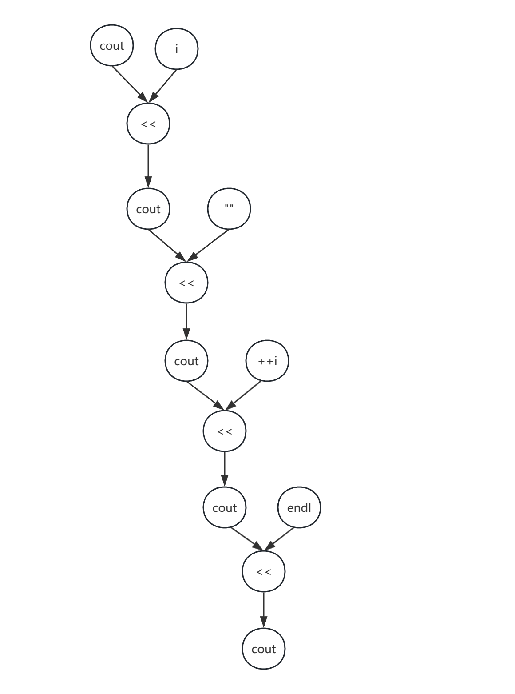
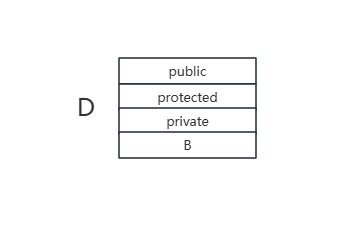

<!-- TOC -->

- [优先级与结合律](#%E4%BC%98%E5%85%88%E7%BA%A7%E4%B8%8E%E7%BB%93%E5%90%88%E5%BE%8B)
- [求值顺序](#%E6%B1%82%E5%80%BC%E9%A1%BA%E5%BA%8F)
    - [求值顺序、优先级、结合律](#%E6%B1%82%E5%80%BC%E9%A1%BA%E5%BA%8F%E4%BC%98%E5%85%88%E7%BA%A7%E7%BB%93%E5%90%88%E5%BE%8B)
- [第六章 函数](#%E7%AC%AC%E5%85%AD%E7%AB%A0-%E5%87%BD%E6%95%B0)
    - [inline函数](#inline%E5%87%BD%E6%95%B0)
- [第七章 类](#%E7%AC%AC%E4%B8%83%E7%AB%A0-%E7%B1%BB)
    - [notes](#notes)
    - [const成员函数](#const%E6%88%90%E5%91%98%E5%87%BD%E6%95%B0)
        - [基于const的重载成员函数](#%E5%9F%BA%E4%BA%8Econst%E7%9A%84%E9%87%8D%E8%BD%BD%E6%88%90%E5%91%98%E5%87%BD%E6%95%B0)
    - [构造函数](#%E6%9E%84%E9%80%A0%E5%87%BD%E6%95%B0)
        - [构造函数不能是const类型](#%E6%9E%84%E9%80%A0%E5%87%BD%E6%95%B0%E4%B8%8D%E8%83%BD%E6%98%AFconst%E7%B1%BB%E5%9E%8B)
        - [= default](#-default)
    - [前向声明](#%E5%89%8D%E5%90%91%E5%A3%B0%E6%98%8E)
    - [友元](#%E5%8F%8B%E5%85%83)
        - [定义在类内部的友元函数](#%E5%AE%9A%E4%B9%89%E5%9C%A8%E7%B1%BB%E5%86%85%E9%83%A8%E7%9A%84%E5%8F%8B%E5%85%83%E5%87%BD%E6%95%B0)
        - [类的成员函数作为其他类的友元](#%E7%B1%BB%E7%9A%84%E6%88%90%E5%91%98%E5%87%BD%E6%95%B0%E4%BD%9C%E4%B8%BA%E5%85%B6%E4%BB%96%E7%B1%BB%E7%9A%84%E5%8F%8B%E5%85%83)
        - [友元声明和作用域](#%E5%8F%8B%E5%85%83%E5%A3%B0%E6%98%8E%E5%92%8C%E4%BD%9C%E7%94%A8%E5%9F%9F)
    - [类的作用域](#%E7%B1%BB%E7%9A%84%E4%BD%9C%E7%94%A8%E5%9F%9F)
        - [名字查找与类的作用域](#%E5%90%8D%E5%AD%97%E6%9F%A5%E6%89%BE%E4%B8%8E%E7%B1%BB%E7%9A%84%E4%BD%9C%E7%94%A8%E5%9F%9F)
        - [类型名要特殊处理](#%E7%B1%BB%E5%9E%8B%E5%90%8D%E8%A6%81%E7%89%B9%E6%AE%8A%E5%A4%84%E7%90%86)
    - [构造函数初始值列表](#%E6%9E%84%E9%80%A0%E5%87%BD%E6%95%B0%E5%88%9D%E5%A7%8B%E5%80%BC%E5%88%97%E8%A1%A8)
    - [委托构造函数](#%E5%A7%94%E6%89%98%E6%9E%84%E9%80%A0%E5%87%BD%E6%95%B0)
    - [默认初始化和值初始化](#%E9%BB%98%E8%AE%A4%E5%88%9D%E5%A7%8B%E5%8C%96%E5%92%8C%E5%80%BC%E5%88%9D%E5%A7%8B%E5%8C%96)
    - [explicit构造函数](#explicit%E6%9E%84%E9%80%A0%E5%87%BD%E6%95%B0)
    - [聚合类aggregate class](#%E8%81%9A%E5%90%88%E7%B1%BBaggregate-class)
    - [字面值常量类literal class](#%E5%AD%97%E9%9D%A2%E5%80%BC%E5%B8%B8%E9%87%8F%E7%B1%BBliteral-class)
        - [constexpr构造函数](#constexpr%E6%9E%84%E9%80%A0%E5%87%BD%E6%95%B0)
    - [类的静态成员](#%E7%B1%BB%E7%9A%84%E9%9D%99%E6%80%81%E6%88%90%E5%91%98)
- [第十章 泛型算法](#%E7%AC%AC%E5%8D%81%E7%AB%A0-%E6%B3%9B%E5%9E%8B%E7%AE%97%E6%B3%95)
    - [bind函数](#bind%E5%87%BD%E6%95%B0)
- [智能指针](#%E6%99%BA%E8%83%BD%E6%8C%87%E9%92%88)
    - [循环引用问题](#%E5%BE%AA%E7%8E%AF%E5%BC%95%E7%94%A8%E9%97%AE%E9%A2%98)
    - [weak_ptr解决循环引用问题](#weak_ptr%E8%A7%A3%E5%86%B3%E5%BE%AA%E7%8E%AF%E5%BC%95%E7%94%A8%E9%97%AE%E9%A2%98)
    - [enable_shared_from_this](#enable_shared_from_this)
- [拷贝构造函数](#%E6%8B%B7%E8%B4%9D%E6%9E%84%E9%80%A0%E5%87%BD%E6%95%B0)
    - [直接初始化和拷贝初始化](#%E7%9B%B4%E6%8E%A5%E5%88%9D%E5%A7%8B%E5%8C%96%E5%92%8C%E6%8B%B7%E8%B4%9D%E5%88%9D%E5%A7%8B%E5%8C%96)
    - [拷贝构造函数的参数为什么是引用类型？](#%E6%8B%B7%E8%B4%9D%E6%9E%84%E9%80%A0%E5%87%BD%E6%95%B0%E7%9A%84%E5%8F%82%E6%95%B0%E4%B8%BA%E4%BB%80%E4%B9%88%E6%98%AF%E5%BC%95%E7%94%A8%E7%B1%BB%E5%9E%8B)
    - [拷贝构造函数的参数为什么一般是const引用类型？](#%E6%8B%B7%E8%B4%9D%E6%9E%84%E9%80%A0%E5%87%BD%E6%95%B0%E7%9A%84%E5%8F%82%E6%95%B0%E4%B8%BA%E4%BB%80%E4%B9%88%E4%B8%80%E8%88%AC%E6%98%AFconst%E5%BC%95%E7%94%A8%E7%B1%BB%E5%9E%8B)
    - [是否可以将拷贝构造函数定义为explicit？](#%E6%98%AF%E5%90%A6%E5%8F%AF%E4%BB%A5%E5%B0%86%E6%8B%B7%E8%B4%9D%E6%9E%84%E9%80%A0%E5%87%BD%E6%95%B0%E5%AE%9A%E4%B9%89%E4%B8%BAexplicit)
- [返回值优化](#%E8%BF%94%E5%9B%9E%E5%80%BC%E4%BC%98%E5%8C%96)
    - [强制执行URVO](#%E5%BC%BA%E5%88%B6%E6%89%A7%E8%A1%8Curvo)
    - [NRVO](#nrvo)
    - [纯右值语义](#%E7%BA%AF%E5%8F%B3%E5%80%BC%E8%AF%AD%E4%B9%89)
- [析构函数](#%E6%9E%90%E6%9E%84%E5%87%BD%E6%95%B0)
    - [析构函数的执行顺序](#%E6%9E%90%E6%9E%84%E5%87%BD%E6%95%B0%E7%9A%84%E6%89%A7%E8%A1%8C%E9%A1%BA%E5%BA%8F)
- [三/五法则](#%E4%B8%89%E4%BA%94%E6%B3%95%E5%88%99)
- [delete](#delete)
    - [引导函数重载决议](#%E5%BC%95%E5%AF%BC%E5%87%BD%E6%95%B0%E9%87%8D%E8%BD%BD%E5%86%B3%E8%AE%AE)
    - [阻止拷贝](#%E9%98%BB%E6%AD%A2%E6%8B%B7%E8%B4%9D)
    - [删除的析构函数](#%E5%88%A0%E9%99%A4%E7%9A%84%E6%9E%90%E6%9E%84%E5%87%BD%E6%95%B0)
    - [与default的区别](#%E4%B8%8Edefault%E7%9A%84%E5%8C%BA%E5%88%AB)
- [合成的拷贝控制成员可能是删除的](#%E5%90%88%E6%88%90%E7%9A%84%E6%8B%B7%E8%B4%9D%E6%8E%A7%E5%88%B6%E6%88%90%E5%91%98%E5%8F%AF%E8%83%BD%E6%98%AF%E5%88%A0%E9%99%A4%E7%9A%84)
- [引用限定符](#%E5%BC%95%E7%94%A8%E9%99%90%E5%AE%9A%E7%AC%A6)
- [重载运算与类型转换](#%E9%87%8D%E8%BD%BD%E8%BF%90%E7%AE%97%E4%B8%8E%E7%B1%BB%E5%9E%8B%E8%BD%AC%E6%8D%A2)
    - [输入输出运算符](#%E8%BE%93%E5%85%A5%E8%BE%93%E5%87%BA%E8%BF%90%E7%AE%97%E7%AC%A6)
        - [输入输出运算符必须是非成员函数](#%E8%BE%93%E5%85%A5%E8%BE%93%E5%87%BA%E8%BF%90%E7%AE%97%E7%AC%A6%E5%BF%85%E9%A1%BB%E6%98%AF%E9%9D%9E%E6%88%90%E5%91%98%E5%87%BD%E6%95%B0)
    - [算术和关系运算符](#%E7%AE%97%E6%9C%AF%E5%92%8C%E5%85%B3%E7%B3%BB%E8%BF%90%E7%AE%97%E7%AC%A6)
        - [相等运算符](#%E7%9B%B8%E7%AD%89%E8%BF%90%E7%AE%97%E7%AC%A6)
        - [关系运算符](#%E5%85%B3%E7%B3%BB%E8%BF%90%E7%AE%97%E7%AC%A6)
    - [赋值运算符](#%E8%B5%8B%E5%80%BC%E8%BF%90%E7%AE%97%E7%AC%A6)
    - [复合赋值运算符](#%E5%A4%8D%E5%90%88%E8%B5%8B%E5%80%BC%E8%BF%90%E7%AE%97%E7%AC%A6)
    - [下标运算符](#%E4%B8%8B%E6%A0%87%E8%BF%90%E7%AE%97%E7%AC%A6)
    - [递增和递减运算符](#%E9%80%92%E5%A2%9E%E5%92%8C%E9%80%92%E5%87%8F%E8%BF%90%E7%AE%97%E7%AC%A6)
    - [成员访问运算符](#%E6%88%90%E5%91%98%E8%AE%BF%E9%97%AE%E8%BF%90%E7%AE%97%E7%AC%A6)
- [第15章 面向对象程序设计](#%E7%AC%AC15%E7%AB%A0-%E9%9D%A2%E5%90%91%E5%AF%B9%E8%B1%A1%E7%A8%8B%E5%BA%8F%E8%AE%BE%E8%AE%A1)
    - [访问说明符](#%E8%AE%BF%E9%97%AE%E8%AF%B4%E6%98%8E%E7%AC%A6)
        - [类定义中的访问说明符](#%E7%B1%BB%E5%AE%9A%E4%B9%89%E4%B8%AD%E7%9A%84%E8%AE%BF%E9%97%AE%E8%AF%B4%E6%98%8E%E7%AC%A6)
        - [类派生列表中的访问说明符](#%E7%B1%BB%E6%B4%BE%E7%94%9F%E5%88%97%E8%A1%A8%E4%B8%AD%E7%9A%84%E8%AE%BF%E9%97%AE%E8%AF%B4%E6%98%8E%E7%AC%A6)
        - [派生类向基类转换的可访问行](#%E6%B4%BE%E7%94%9F%E7%B1%BB%E5%90%91%E5%9F%BA%E7%B1%BB%E8%BD%AC%E6%8D%A2%E7%9A%84%E5%8F%AF%E8%AE%BF%E9%97%AE%E8%A1%8C)
        - [友元与继承](#%E5%8F%8B%E5%85%83%E4%B8%8E%E7%BB%A7%E6%89%BF)
        - [改变个别成员的可访问性](#%E6%94%B9%E5%8F%98%E4%B8%AA%E5%88%AB%E6%88%90%E5%91%98%E7%9A%84%E5%8F%AF%E8%AE%BF%E9%97%AE%E6%80%A7)
    - [派生类构造函数](#%E6%B4%BE%E7%94%9F%E7%B1%BB%E6%9E%84%E9%80%A0%E5%87%BD%E6%95%B0)
    - [静态类型与动态类型](#%E9%9D%99%E6%80%81%E7%B1%BB%E5%9E%8B%E4%B8%8E%E5%8A%A8%E6%80%81%E7%B1%BB%E5%9E%8B)
    - [虚函数](#%E8%99%9A%E5%87%BD%E6%95%B0)
        - [所有的虚函数都必须有定义](#%E6%89%80%E6%9C%89%E7%9A%84%E8%99%9A%E5%87%BD%E6%95%B0%E9%83%BD%E5%BF%85%E9%A1%BB%E6%9C%89%E5%AE%9A%E4%B9%89)
        - [对非虚函数的调用在编译时进行绑定](#%E5%AF%B9%E9%9D%9E%E8%99%9A%E5%87%BD%E6%95%B0%E7%9A%84%E8%B0%83%E7%94%A8%E5%9C%A8%E7%BC%96%E8%AF%91%E6%97%B6%E8%BF%9B%E8%A1%8C%E7%BB%91%E5%AE%9A)
        - [虚函数与默认实参](#%E8%99%9A%E5%87%BD%E6%95%B0%E4%B8%8E%E9%BB%98%E8%AE%A4%E5%AE%9E%E5%8F%82)
    - [final关键字](#final%E5%85%B3%E9%94%AE%E5%AD%97)
    - [抽象基类](#%E6%8A%BD%E8%B1%A1%E5%9F%BA%E7%B1%BB)
        - [纯虚函数](#%E7%BA%AF%E8%99%9A%E5%87%BD%E6%95%B0)
    - [继承中的类作用域](#%E7%BB%A7%E6%89%BF%E4%B8%AD%E7%9A%84%E7%B1%BB%E4%BD%9C%E7%94%A8%E5%9F%9F)
    - [构造函数与拷贝控制](#%E6%9E%84%E9%80%A0%E5%87%BD%E6%95%B0%E4%B8%8E%E6%8B%B7%E8%B4%9D%E6%8E%A7%E5%88%B6)
        - [虚析构函数](#%E8%99%9A%E6%9E%90%E6%9E%84%E5%87%BD%E6%95%B0)
        - [析构函数将阻止合成移动操作](#%E6%9E%90%E6%9E%84%E5%87%BD%E6%95%B0%E5%B0%86%E9%98%BB%E6%AD%A2%E5%90%88%E6%88%90%E7%A7%BB%E5%8A%A8%E6%93%8D%E4%BD%9C)
        - [派生类的拷贝控制成员](#%E6%B4%BE%E7%94%9F%E7%B1%BB%E7%9A%84%E6%8B%B7%E8%B4%9D%E6%8E%A7%E5%88%B6%E6%88%90%E5%91%98)
            - [定义派生类的拷贝或移动构造函数](#%E5%AE%9A%E4%B9%89%E6%B4%BE%E7%94%9F%E7%B1%BB%E7%9A%84%E6%8B%B7%E8%B4%9D%E6%88%96%E7%A7%BB%E5%8A%A8%E6%9E%84%E9%80%A0%E5%87%BD%E6%95%B0)
            - [派生类赋值运算符](#%E6%B4%BE%E7%94%9F%E7%B1%BB%E8%B5%8B%E5%80%BC%E8%BF%90%E7%AE%97%E7%AC%A6)
            - [派生类析构函数](#%E6%B4%BE%E7%94%9F%E7%B1%BB%E6%9E%90%E6%9E%84%E5%87%BD%E6%95%B0)
            - [在构造函数和析构函数中调用虚函数](#%E5%9C%A8%E6%9E%84%E9%80%A0%E5%87%BD%E6%95%B0%E5%92%8C%E6%9E%90%E6%9E%84%E5%87%BD%E6%95%B0%E4%B8%AD%E8%B0%83%E7%94%A8%E8%99%9A%E5%87%BD%E6%95%B0)
            - [继承的构造函数](#%E7%BB%A7%E6%89%BF%E7%9A%84%E6%9E%84%E9%80%A0%E5%87%BD%E6%95%B0)
- [模板与泛型编程](#%E6%A8%A1%E6%9D%BF%E4%B8%8E%E6%B3%9B%E5%9E%8B%E7%BC%96%E7%A8%8B)
    - [定义模版](#%E5%AE%9A%E4%B9%89%E6%A8%A1%E7%89%88)
        - [模板参数](#%E6%A8%A1%E6%9D%BF%E5%8F%82%E6%95%B0)
        - [inline和constexpr的函数模板](#inline%E5%92%8Cconstexpr%E7%9A%84%E5%87%BD%E6%95%B0%E6%A8%A1%E6%9D%BF)
        - [模板编译](#%E6%A8%A1%E6%9D%BF%E7%BC%96%E8%AF%91)
        - [类模板的成员函数](#%E7%B1%BB%E6%A8%A1%E6%9D%BF%E7%9A%84%E6%88%90%E5%91%98%E5%87%BD%E6%95%B0)
        - [在类代码内简化模板类名的使用](#%E5%9C%A8%E7%B1%BB%E4%BB%A3%E7%A0%81%E5%86%85%E7%AE%80%E5%8C%96%E6%A8%A1%E6%9D%BF%E7%B1%BB%E5%90%8D%E7%9A%84%E4%BD%BF%E7%94%A8)
        - [类模板和友元](#%E7%B1%BB%E6%A8%A1%E6%9D%BF%E5%92%8C%E5%8F%8B%E5%85%83)
            - [一对一友元关系](#%E4%B8%80%E5%AF%B9%E4%B8%80%E5%8F%8B%E5%85%83%E5%85%B3%E7%B3%BB)
            - [通用模板友好关系](#%E9%80%9A%E7%94%A8%E6%A8%A1%E6%9D%BF%E5%8F%8B%E5%A5%BD%E5%85%B3%E7%B3%BB)
            - [限定特定的实例为友元](#%E9%99%90%E5%AE%9A%E7%89%B9%E5%AE%9A%E7%9A%84%E5%AE%9E%E4%BE%8B%E4%B8%BA%E5%8F%8B%E5%85%83)
            - [令模板自己的类型参数成为友元](#%E4%BB%A4%E6%A8%A1%E6%9D%BF%E8%87%AA%E5%B7%B1%E7%9A%84%E7%B1%BB%E5%9E%8B%E5%8F%82%E6%95%B0%E6%88%90%E4%B8%BA%E5%8F%8B%E5%85%83)
        - [模板类型别名](#%E6%A8%A1%E6%9D%BF%E7%B1%BB%E5%9E%8B%E5%88%AB%E5%90%8D)
        - [类模板的static成员](#%E7%B1%BB%E6%A8%A1%E6%9D%BF%E7%9A%84static%E6%88%90%E5%91%98)
        - [使用类的类型成员](#%E4%BD%BF%E7%94%A8%E7%B1%BB%E7%9A%84%E7%B1%BB%E5%9E%8B%E6%88%90%E5%91%98)
        - [默认模板参数](#%E9%BB%98%E8%AE%A4%E6%A8%A1%E6%9D%BF%E5%8F%82%E6%95%B0)
        - [模板默认实参与类模板](#%E6%A8%A1%E6%9D%BF%E9%BB%98%E8%AE%A4%E5%AE%9E%E5%8F%82%E4%B8%8E%E7%B1%BB%E6%A8%A1%E6%9D%BF)
        - [成员模板](#%E6%88%90%E5%91%98%E6%A8%A1%E6%9D%BF)
            - [普通非模板类的成员模板](#%E6%99%AE%E9%80%9A%E9%9D%9E%E6%A8%A1%E6%9D%BF%E7%B1%BB%E7%9A%84%E6%88%90%E5%91%98%E6%A8%A1%E6%9D%BF)
            - [类模板的成员模板](#%E7%B1%BB%E6%A8%A1%E6%9D%BF%E7%9A%84%E6%88%90%E5%91%98%E6%A8%A1%E6%9D%BF)
        - [控制实例化](#%E6%8E%A7%E5%88%B6%E5%AE%9E%E4%BE%8B%E5%8C%96)
    - [模板实参推断](#%E6%A8%A1%E6%9D%BF%E5%AE%9E%E5%8F%82%E6%8E%A8%E6%96%AD)
        - [类型转换与模板类型参数](#%E7%B1%BB%E5%9E%8B%E8%BD%AC%E6%8D%A2%E4%B8%8E%E6%A8%A1%E6%9D%BF%E7%B1%BB%E5%9E%8B%E5%8F%82%E6%95%B0)
        - [函数模板显式实参](#%E5%87%BD%E6%95%B0%E6%A8%A1%E6%9D%BF%E6%98%BE%E5%BC%8F%E5%AE%9E%E5%8F%82)
        - [进行类型转换的标准模板库](#%E8%BF%9B%E8%A1%8C%E7%B1%BB%E5%9E%8B%E8%BD%AC%E6%8D%A2%E7%9A%84%E6%A0%87%E5%87%86%E6%A8%A1%E6%9D%BF%E5%BA%93)
        - [函数指针和实参推断](#%E5%87%BD%E6%95%B0%E6%8C%87%E9%92%88%E5%92%8C%E5%AE%9E%E5%8F%82%E6%8E%A8%E6%96%AD)
        - [模板实参推断与引用](#%E6%A8%A1%E6%9D%BF%E5%AE%9E%E5%8F%82%E6%8E%A8%E6%96%AD%E4%B8%8E%E5%BC%95%E7%94%A8)
            - [从左值引用函数参数推断类型](#%E4%BB%8E%E5%B7%A6%E5%80%BC%E5%BC%95%E7%94%A8%E5%87%BD%E6%95%B0%E5%8F%82%E6%95%B0%E6%8E%A8%E6%96%AD%E7%B1%BB%E5%9E%8B)
            - [从右值引用函数参数推断类型](#%E4%BB%8E%E5%8F%B3%E5%80%BC%E5%BC%95%E7%94%A8%E5%87%BD%E6%95%B0%E5%8F%82%E6%95%B0%E6%8E%A8%E6%96%AD%E7%B1%BB%E5%9E%8B)
            - [引用折叠和右值引用参数](#%E5%BC%95%E7%94%A8%E6%8A%98%E5%8F%A0%E5%92%8C%E5%8F%B3%E5%80%BC%E5%BC%95%E7%94%A8%E5%8F%82%E6%95%B0)
            - [编写接收右值引用参数的模板函数](#%E7%BC%96%E5%86%99%E6%8E%A5%E6%94%B6%E5%8F%B3%E5%80%BC%E5%BC%95%E7%94%A8%E5%8F%82%E6%95%B0%E7%9A%84%E6%A8%A1%E6%9D%BF%E5%87%BD%E6%95%B0)
        - [理解std::move](#%E7%90%86%E8%A7%A3stdmove)
            - [std::move是如何定义的](#stdmove%E6%98%AF%E5%A6%82%E4%BD%95%E5%AE%9A%E4%B9%89%E7%9A%84)
            - [std::move是如何工作的](#stdmove%E6%98%AF%E5%A6%82%E4%BD%95%E5%B7%A5%E4%BD%9C%E7%9A%84)
        - [转发](#%E8%BD%AC%E5%8F%91)
            - [核心场景：没有forward会发生什么？](#%E6%A0%B8%E5%BF%83%E5%9C%BA%E6%99%AF%E6%B2%A1%E6%9C%89forward%E4%BC%9A%E5%8F%91%E7%94%9F%E4%BB%80%E4%B9%88)
            - [使用forward保持属性](#%E4%BD%BF%E7%94%A8forward%E4%BF%9D%E6%8C%81%E5%B1%9E%E6%80%A7)
            - [拆解：forward 内部发生了什么？](#%E6%8B%86%E8%A7%A3forward-%E5%86%85%E9%83%A8%E5%8F%91%E7%94%9F%E4%BA%86%E4%BB%80%E4%B9%88)
            - [关键点：为什么forward必须写<T>？](#%E5%85%B3%E9%94%AE%E7%82%B9%E4%B8%BA%E4%BB%80%E4%B9%88forward%E5%BF%85%E9%A1%BB%E5%86%99t)
                - [The Mathematical Problem: Non-Injective Mapping](#the-mathematical-problem-non-injective-mapping)
                - [The Turing-Completeness Problem](#the-turing-completeness-problem)
                - [Why std::forward intentionally uses this](#why-stdforward-intentionally-uses-this)
                - [为什么std::forward的实现还有一个右值版本](#%E4%B8%BA%E4%BB%80%E4%B9%88stdforward%E7%9A%84%E5%AE%9E%E7%8E%B0%E8%BF%98%E6%9C%89%E4%B8%80%E4%B8%AA%E5%8F%B3%E5%80%BC%E7%89%88%E6%9C%AC)
    - [重载与模板](#%E9%87%8D%E8%BD%BD%E4%B8%8E%E6%A8%A1%E6%9D%BF)
    - [可变参数模板](#%E5%8F%AF%E5%8F%98%E5%8F%82%E6%95%B0%E6%A8%A1%E6%9D%BF)
        - [核心语法：参数包Parameter Pack](#%E6%A0%B8%E5%BF%83%E8%AF%AD%E6%B3%95%E5%8F%82%E6%95%B0%E5%8C%85parameter-pack)
        - [参数包的展开方式](#%E5%8F%82%E6%95%B0%E5%8C%85%E7%9A%84%E5%B1%95%E5%BC%80%E6%96%B9%E5%BC%8F)
            - [递归展开（经典方式）](#%E9%80%92%E5%BD%92%E5%B1%95%E5%BC%80%E7%BB%8F%E5%85%B8%E6%96%B9%E5%BC%8F)
            - [折叠表达式（C++17 推荐）](#%E6%8A%98%E5%8F%A0%E8%A1%A8%E8%BE%BE%E5%BC%8Fc17-%E6%8E%A8%E8%8D%90)
            - [包扩展](#%E5%8C%85%E6%89%A9%E5%B1%95)
                - [核心语法](#%E6%A0%B8%E5%BF%83%E8%AF%AD%E6%B3%95)
                - [常见使用场景](#%E5%B8%B8%E8%A7%81%E4%BD%BF%E7%94%A8%E5%9C%BA%E6%99%AF)
                - [高级扩展技巧](#%E9%AB%98%E7%BA%A7%E6%89%A9%E5%B1%95%E6%8A%80%E5%B7%A7)
    - [模板特例化](#%E6%A8%A1%E6%9D%BF%E7%89%B9%E4%BE%8B%E5%8C%96)
- [用于大型程序的工具](#%E7%94%A8%E4%BA%8E%E5%A4%A7%E5%9E%8B%E7%A8%8B%E5%BA%8F%E7%9A%84%E5%B7%A5%E5%85%B7)
    - [命名空间](#%E5%91%BD%E5%90%8D%E7%A9%BA%E9%97%B4)
        - [内联命名空间](#%E5%86%85%E8%81%94%E5%91%BD%E5%90%8D%E7%A9%BA%E9%97%B4)
        - [匿名命名空间](#%E5%8C%BF%E5%90%8D%E5%91%BD%E5%90%8D%E7%A9%BA%E9%97%B4)
    - [多重继承与虚继承](#%E5%A4%9A%E9%87%8D%E7%BB%A7%E6%89%BF%E4%B8%8E%E8%99%9A%E7%BB%A7%E6%89%BF)
        - [多重继承的基本语法](#%E5%A4%9A%E9%87%8D%E7%BB%A7%E6%89%BF%E7%9A%84%E5%9F%BA%E6%9C%AC%E8%AF%AD%E6%B3%95)
        - [构造与析构的语法规则](#%E6%9E%84%E9%80%A0%E4%B8%8E%E6%9E%90%E6%9E%84%E7%9A%84%E8%AF%AD%E6%B3%95%E8%A7%84%E5%88%99)
        - [继承的构造函数与多重继承](#%E7%BB%A7%E6%89%BF%E7%9A%84%E6%9E%84%E9%80%A0%E5%87%BD%E6%95%B0%E4%B8%8E%E5%A4%9A%E9%87%8D%E7%BB%A7%E6%89%BF)
        - [虚继承](#%E8%99%9A%E7%BB%A7%E6%89%BF)
- [第十九章 特殊工具与技术](#%E7%AC%AC%E5%8D%81%E4%B9%9D%E7%AB%A0-%E7%89%B9%E6%AE%8A%E5%B7%A5%E5%85%B7%E4%B8%8E%E6%8A%80%E6%9C%AF)
    - [控制内存分配](#%E6%8E%A7%E5%88%B6%E5%86%85%E5%AD%98%E5%88%86%E9%85%8D)
        - [new表达式和delete表达式](#new%E8%A1%A8%E8%BE%BE%E5%BC%8F%E5%92%8Cdelete%E8%A1%A8%E8%BE%BE%E5%BC%8F)
        - [重载new和delete运算符](#%E9%87%8D%E8%BD%BDnew%E5%92%8Cdelete%E8%BF%90%E7%AE%97%E7%AC%A6)
        - [定位new表达式](#%E5%AE%9A%E4%BD%8Dnew%E8%A1%A8%E8%BE%BE%E5%BC%8F)
    - [运行时类型识别](#%E8%BF%90%E8%A1%8C%E6%97%B6%E7%B1%BB%E5%9E%8B%E8%AF%86%E5%88%AB)
        - [枚举类型](#%E6%9E%9A%E4%B8%BE%E7%B1%BB%E5%9E%8B)
        - [类成员指针](#%E7%B1%BB%E6%88%90%E5%91%98%E6%8C%87%E9%92%88)
            - [成员变量指针 Pointer to Data Members](#%E6%88%90%E5%91%98%E5%8F%98%E9%87%8F%E6%8C%87%E9%92%88-pointer-to-data-members)
            - [成员函数指针](#%E6%88%90%E5%91%98%E5%87%BD%E6%95%B0%E6%8C%87%E9%92%88)
        - [嵌套类](#%E5%B5%8C%E5%A5%97%E7%B1%BB)
        - [union: 一种节省空间的类](#union-%E4%B8%80%E7%A7%8D%E8%8A%82%E7%9C%81%E7%A9%BA%E9%97%B4%E7%9A%84%E7%B1%BB)
        - [局部类](#%E5%B1%80%E9%83%A8%E7%B1%BB)
        - [固有的不可移植的特性](#%E5%9B%BA%E6%9C%89%E7%9A%84%E4%B8%8D%E5%8F%AF%E7%A7%BB%E6%A4%8D%E7%9A%84%E7%89%B9%E6%80%A7)
            - [链接指示：extern "C"](#%E9%93%BE%E6%8E%A5%E6%8C%87%E7%A4%BAextern-c)

<!-- /TOC -->
# 优先级与结合律

复合表达式是指含有两个或者多个运算符的表达式。求复合表达式的值首先需要将运算符和运算对象合理的组合在一起，**优先级与结合律决定了运算对象组合的方式**。也就是说它们决定了表达式中每个运算符对应的运算对象来自表达式的哪一部分，表达式中的括号无视上述规则。

一般来说，表达式最终的值依赖于其子表达式的组合方式。高优先级运算符的运算对象要比低优先级运算符的运算对象更为紧密的结合在一起，如果优先级相同，其组合规则由结合律决定。
- 根据运算符的优先级，表达式$3+4*5$的值是$(3 + (4*5)) = 23$，而不是$((3+4) * 5) = 35$
    - 也就是4和5这两个运算对象先跟高优先级的乘法运算符结合在一起做乘法，子表达式为$4 * 5$, 运算结果等于20
    - 然后得到的结果20和3跟低优先级的加法运算符结合在一起做加法运算，子表达式为$20 + 3$，最后运算结果为23
- 根据运算符的结合律，表达式$20 - 15 -3$的结果是$((20 -15) - 3) = 2$, 而不是$(20 - (15 - 3)) = 8$
    - 因为两个减法运算符的优先级相同，在组合运算对象时按照结合律来组合
    - 算术运算符具有从左到右的结合律，那么按照从左到右的顺序组合运算对象

# 求值顺序

优先级规定了运算对象的组合方式，但是没有说明运算对象按照什么顺序求值。在大多数情况下，不会明确指定求值的顺序。比如，<<运算符没有明确规定何时以及如何对运算对象求值，因此下面的输出表达式是未定义的。

```cpp
int i = 0;
cout << i << " " << ++i << endl; // 未定义行为
```



编译器可能先求++i的值再求i的值，此时输出结果是1 1；也可能先求i的值再求++i的值，输出结果是0 1；甚至编译器还可能做完全不同的操作。

## 求值顺序、优先级、结合律

运算对象的求值顺序与优先级和结合律无关。在一条形如$f() + g() * h() + j()$的表达式中:
- 优先级规定，$g()$的返回值和$h()$的返回值相乘
- 结合律规定，$f()$的返回值与$g()*h()$相加，所得结果再与$j()$的返回值相加
- 然而，对于这些函数的调用顺序没有明确规定，存在未定义行为

如果$f,g,h,j$是无关函数，它们既不会改变同一对象的状态也不执行IO任务，那么函数的调用顺序不受限制。反之，如果其中某几个函数影响同一对象，则它是一条错误的表达式，将产生未定义行为。

规定了求值顺序的4种运算符：
- 逻辑与(&&)
- 逻辑或(||)
- 条件运算符(? : )
- 逗号运算符(,)

# 第六章 函数

## inline函数

和其他函数不一样，inline函数和constexpr函数可以在程序中多次定义。编译器想要展开函数仅有函数声明是不够的，还需要函数的定义。不过对于某个给定的inline函数或者constexpr函数来说，它的多个定义必须完全一致。基于这个原因，inline函数和constexpr函数通常定义在头文件中。

```cpp
// test3 多次定义普通函数

// a.cc
#include <format>
#include <iostream>

void Foo() {
    std::string fstr = std::format("non-inline function 1 {} {} {}", __FILE__, __LINE__, __func__);
    std::cout << fstr << std::endl;
}

void A() {
    Foo();
}

// b.cc 
#include <format>
#include <iostream>

void Foo() {
    std::string fstr = std::format("non-inline function 2 {} {} {}", __FILE__, __LINE__, __func__);
    std::cout << fstr << std::endl;
}

void B() {
    Foo();
}

// common.h 
#ifndef _COMMON_
#define _COMMON_

void A();
void B();

#endif

// main.cc 
#include "common.h"

int main() {
    A();
    B();

    return 0;
}
```

执行编译：
```bash
$ g++ main.cc a.cc b.cc  -std=c++20  
/usr/bin/ld: /tmp/ccyoT1lQ.o: in function `Foo()':
b.cc:(.text+0x0): multiple definition of `Foo()'; /tmp/ccIKv3xy.o:a.cc:(.text+0x0): first defined here
collect2: error: ld returned 1 exit status
```

报函数多次定义的错误，这是因为a.cc生成的.o里面有一个强符号Foo，而b.cc生成的.o里面也有一个强符号Foo,那么在链接时就有两个同名的强符号，报出多次定义的错误。

那么我们把Foo声明为inline函数，{a.o b.o}文件里面的Foo就是一个弱符号，而同名的弱符号是可以同时存在的，那么就不会存在多次定义的错误：

```cpp
// test4 多次定义inline函数

// a.cc
#include <format>
#include <iostream>

inline void Foo() {
    std::string fstr = std::format("inline function 1 {} {} {}", __FILE__, __LINE__, __func__);
    std::cout << fstr << std::endl;
}

void A() {
    Foo();
}

// b.cc 
#include <format>
#include <iostream>

inline void Foo() {
    std::string fstr = std::format("inline function 2 {} {} {}", __FILE__, __LINE__, __func__);
    std::cout << fstr << std::endl;
}

void B() {
    Foo();
}

// common.h 
#ifndef _COMMON_
#define _COMMON_

void A();
void B();

#endif

// main.cc 
#include "common.h"

int main() {
    A();
    B();

    return 0;
}
```

编译并运行：
```bash
$ g++ main.cc a.cc b.cc  -std=c++20  
$ 
$ ./a.out 
inline function 1 a.cc 5 Foo
inline function 1 a.cc 5 Foo
```

结果很奇怪，怎么函数A和函数B输出的是一样的呢？明明A和B调用的Foo实现是不一样的啊？这是为什么？

我们知道现在{a.o b.o}里面各有一个**弱符号Foo**，那么函数A和函数B在查找符号Foo时会选择哪个呢？并不是说函数A会选择a.o里面的Foo，函数B会选择B.o里面的Foo，这里链接器的实现是选择它在符号表里面遇到的第一个弱符号，也就是a.o里面的那一个，**因为a.cc是比b.cc先编译的，所以a.o的弱符号Foo排在b.o的弱符号Foo的前面，所以函数A和函数B在链接时都选择了a.o的弱符号Foo**。

所以说，对于inline函数，我们要确保它的多个定义要完全一致，如果不一致，在调用时有可能得不到期望的结果，而为了保证inline函数的定义一致，我们可以把它定义在头文件里，这样它在多个地方被include时，函数的定义总是一致的。

如果说我们就是想让函数A调用a.o的Foo，函数B调用b.o的Foo，那该怎么办呢？这时候可以把inline函数声明为static的。这样一来符号Foo将不再是GLOBAL类型的，而是LOCAL类型的，在链接时函数A将在本编译单元a.o里面查找Foo，函数B在b.o里面查找Foo。

```cpp
// test5 static修饰inline函数

// a.cc
#include <format>
#include <iostream>

static inline void Foo() {
    std::string fstr = std::format("inline function 1 {} {} {}", __FILE__, __LINE__, __func__);
    std::cout << fstr << std::endl;
}

void A() {
    Foo();
}

// b.cc 
#include <format>
#include <iostream>

static inline void Foo() {
    std::string fstr = std::format("inline function 2 {} {} {}", __FILE__, __LINE__, __func__);
    std::cout << fstr << std::endl;
}

void B() {
    Foo();
}

// common.h 
#ifndef _COMMON_
#define _COMMON_

void A();
void B();

#endif

// main.cc 
#include "common.h"

int main() {
    A();
    B();

    return 0;
}
```

编译并运行：
```bash
$ g++ -o main1 main.cc a.cc  b.cc -std=c++20 
$ 
$ g++ -o main2 main.cc b.cc  a.cc -std=c++20 
$ ./main1 
inline function 1 a.cc 5 Foo
inline function 2 b.cc 5 Foo
$ ./main2
inline function 1 a.cc 5 Foo
inline function 2 b.cc 5 Foo
```

可以看到A调用了a.o的Foo，B调用了b.o的Foo

如果在类外定义inline成员函数，那么inline成员函数的定义应该和类的定义在同一个文件中。也就是说类A的头文件如果是**A.h**，实现类A的文件为**A\.cc**，在**A.h**中声明了一个**A::Foo**的成员函数，如果我们想在类的外部把它实现为inline函数，那么应该在**A.h**中实现这个函数，而不是在**A\.cc**中实现。

```cpp
// test6

// common.h
#ifndef _COMMON_
#define _COMMON_

class A {
public:
    A() = default;
    void Display() const;
private:
    int a_{0};
};

#endif

// common.cc 
#include "common.h"
#include <iostream>
#include <format>

// 在common.cc中定义inline函数
inline void A::Display() const {
    std::string fstr = std::format("{} {} {}", __FILE__, __LINE__, __func__);
    std::cout << fstr << std::endl;
}

// main.cc 
#include "common.h"

int main() {
    A a;
    a.Display();
    return 0;
}
```

编译时报链接错误：
```bash
$ g++ main.cc  common.cc -std=c++20 
/usr/bin/ld: /tmp/ccHQNgF7.o: in function `main':
main.cc:(.text+0x2a): undefined reference to `A::Display() const'
collect2: error: ld returned 1 exit status
```

为什么会报这个错误呢，我们发现编译单元common.cc的.o文件里没有Display这个符号:
```bash
$ g++ -c common.cc   -std=c++20
$ readelf -s common.o | grep Display 
```

所以在链接时就找不到这个函数了，这说明编译器将inline成员函数A::Display()优化掉了，因为这个inline函数在common.cc编译单元内没有被调用，那么编译器认为可以不要这个inline函数，于是就被优化掉了(普通成员函数不会被优化掉)。那如果我们在这个编译单元内调用这个inline函数呢？

```cpp
// test7

// common.h
#ifndef _COMMON_
#define _COMMON_

class A {
public:
    A() = default;
    void Display() const;
    void Display2() const;
private:
    int a_{0};
};

#endif

// common.cc 
#include "common.h"
#include <iostream>
#include <format>

inline void A::Display() const {
    std::string fstr = std::format("{} {} {}", __FILE__, __LINE__, __func__);
    std::cout << fstr << std::endl;
}

// 调用了inline函数
void A::Display2() const {
    Display();
}

// main.cc 
#include "common.h"

int main() {
    A a;
    a.Display();
    a.Display2();
    return 0;
}
```

编译并运行：
```cpp
$ g++ main.cc common.cc  -std=c++20  
$ ./a.out 
common.cc 6 Display
common.cc 6 Display
```
在这个例子中，inline成员函数A::Display还是在common.cc中定义，但它在common.cc中被A::Display2调用，这样就不会被编译器优化掉了，于是main函数也能链接到A::Display。

这个例子说明，在类外定义inline成员函数，最好是在.h文件中定义。因为当我们想调用这个inline成员函数时，肯定要先include这个头文件，此时编译器能看到这个inline函数的完整定义，完成inline函数的展开，同时，这也确保了在此编译单元内有其他地方调用这个inline成员函数，编译器肯定不会优化掉这个inline成员函数。


# 第七章 类

## notes

- 编译器分两步处理类: 首先编译成员的声明, 然后才轮到成员函数体(如果有的话), 因此，成员函数体可以随意使用类中的其他成员而无需在意这些成员出现的顺序
- 一般来说，如果非成员函数是类接口的组成部分，则这些函数的声明应该与类在同一个头文件内
- 只有当类没有声明任何构造函数时，编译器才会自动地生成默认构造函数
- 如果类包含有内置类型或者复合类型的成员，则只有当这些成员全都被赋予了类内初始值时，这个类才适合使用合成的默认构造函数
- 友元关系不存在传递性，每个类负责控制自己的友元类或友元函数


## const成员函数

成员函数的隐式参数this是一个常量指针:
```cpp
T * const this;
```

尽管this是隐式的，但它仍然要遵循初始化规则，那么我们不能把this绑定到一个常量对象上：
```
const T a;
this = &a; // 错误，不能将指向常量的指针赋值给不是指向常量的指针
```

**这意味着我们不能在一个常量对象上调用普通成员函数**：

```cpp
// test0

#include <iostream>

class A {
public:
    A() = default;
    A(int a) : a_{a} {}
    int F() {
        return a_ * a_;
    }
private:
    int a_{10};
};

int main () {
    const A a(100);

    std::cout << a.F() << std::endl;

    return 0;
}
```

上面的代码用const a调用普通成员函数F，编译器就会报错：
```bash
main.cc: In function ‘int main()’:
main.cc:17:21: error: passing ‘const A’ as ‘this’ argument discards qualifiers [-fpermissive]
   17 |     std::cout << a.F() << std::endl;
      |                  ~~~^~
main.cc:7:9: note:   in call to ‘int A::F()’
    7 |     int F() {
      |         ^
```

这是因为上面的代码用一个指向常量的指针来初始化this，这是不符合初始化规则的。如果我们把成员函数的this形参声明为指向常量的指针，那么不管是常量对象还是非常量对象，就都能调用这个成员函数：
```cpp
T t1;
const T t2;
const T *this const = &t1; // 指向非常量的指针&t1初始化指向常量的常量指针this，正确
const T *this const = &t2; // 指向常量的指针&t2初始化指向常量的常量指针this，正确
```

**把this声明为指向常量的指针，这就是常量成员函数的作用：**

```cpp
void F() const;
```

显然，根据初始化规则：
- 常量对象，常量对象的引用，指向常量对象的指针都只能调用常量成员函数
- 非常量对象，既能调用普通成员函数也能调用常量成员函数

所以为了提高成员函数的灵活性，如果我们确定不改变成员变量的值，就应该尽可能地把成员函数声明为常量成员函数，这样常量对象和非常量对象就都能调用这个常量成员函数了。

**从const成员函数返回*this**，那么返回值的类型就是const T&，对常量的引用。

### 基于const的重载成员函数

考虑到如下两点原因：
- 常量对象只能调用常量成员函数，不能调用非常量成员函数
- 非常量对象可以调用常量成员函数和非常量成员函数，但显然非常量成员函数是一个更好的匹配

我们可以基于const定义重载成员函数

```cpp
// test8

#include <iostream>
#include <format>

class A {
public:
    A() = default;
    A(int a, int b) : a_{a}, b_{b} {}

    void Display() const {
        std::cout << "from const member function: " << std::endl;
        DoDisplay();
    }

    void Display() {
        std::cout << "from non-const member function: " << std::endl;
        DoDisplay();
    }
private:
    void DoDisplay()  const {
        std::string fstr = std::format("{} {} {} a: {}, b: {}", __FILE__, __LINE__, __func__, a_, b_);
        std::cout << fstr << std::endl;
    }

    int a_{1};
    int b_{2};
};

int main() {
    const A a(10, 20);
    A b(100, 200);

    a.Display();
    b.Display();

    return 0;
}
```

编译并运行：

```bash
$ g++ main.cc -std=c++20    
$ ./a.out 
from const member function: 
main.cc 10 DoDisplay a: 10, b: 20
from non-const member function: 
main.cc 10 DoDisplay a: 100, b: 200
```

可以看到常量a选择了const版本的Display函数，非常量b选择了non-const的Display函数。在这个例子里，我们把DoDisplay实现为const版本，这样常量对象和非常量对象都可以调用这个私有成员函数，用这个私有成员函数实现Display函数基于const属性的重载。

## 构造函数

构造函数的名字和类名相同，没有返回类型，构造函数也可以重载。

### 构造函数不能是const类型

不同于其他成员函数，构造函数不能被声明为const的。当我们创建一个const对象时，直到构造函数完成初始化过程，对象才能真正取得其**常量**属性。因此，构造函数在const对象的构造过程中可以向其写值。也就是说不管怎样，构造函数肯定是能改变成员的值的，那么声明为const就没啥意义了。


```cpp
// test1
#include <iostream>

class A {
public:
    A() const = default; // 错误，构造函数不能是const的
    A(int a) const : a_{a} {} // 错误，构造函数不能是const的
    int F() const {
        return a_ * a_;
    }
private:
    int a_{10};
};

int main () {
    const A a(100);

    std::cout << a.F() << std::endl;

    return 0;
}
```

这里把默认构造函数声明为const，编译器报错：

```bash
main.cc:5:17: error: constructors may not be cv-qualified
    5 |     A() const = default;
      |                 ^~~~~~~
main.cc:6:14: error: constructors may not be cv-qualified
    6 |     A(int a) const : a_{a} {}
      |              ^~~~~
```

### = default

在C++11新标准中，如果我们需要默认的行为，那么可以通过在参数列表后面写上 **= default**来要求编译器生成构造函数。**= default**既可以和声明一起出现在类的内部，也可以作为定义出现在类的外部。

```cpp
#include <iostream>

class A {
public:
    A();
    A(int a) : a_{a} {}
    int F() const {
        return a_ * a_;
    }
private:
    int a_{10};
};

// 在类的外部定义默认构造函数，那么它就不是内联函数
A::A() = default;

int main () {
    const A a(100);

    std::cout << a.F() << std::endl;

    return 0;
}
```

## 前向声明

我们可以仅仅声明类而暂时不定义它，这种声明被称为前向声明。

```cpp
class A;
```

我们可以定义指向这种类型的指针或引用，也可以声明(但是不能定义)以不完全类型作为参数或者返回类型的函数。

```cpp
// test9

#include <iostream>
#include <format>

class A;

void F1(A a);
void F2(A *p);
void F3(A &a) {}

A F4();
A* F5();
A& F6();

A F7(A a) {return a;}
A* F8() {return nullptr;}
A& F9(A &a) {return a;}

int main() {
    A *p = nullptr;
    A &a = *p;

    return 0;
}
```

编译这段代码看看有没有问题：
```bash
$ g++ main.cc -std=c++20 
main.cc:14:8: error: ‘a’ has incomplete type
   14 | A F7(A a) {return a;}
      |      ~~^
main.cc:4:7: note: forward declaration of ‘class A’
    4 | class A;
      |       ^
main.cc:14:9: error: return type ‘class A’ is incomplete
   14 | A F7(A a) {return a;}
      |         ^
```

可以看到这段代码只有第14行报错：
```cpp
A F7(A a) {return a;}
```

因为这个函数定义的函数体试图返回一个不完整类型。显然函数在返回一个类型时，需要进行拷贝操作，但因为返回的类型是一个不完整类型，编译器就不知道应该给这个类型分配多少内存，也不知道如何拷贝这个类型，那显然就会报错。

而函数F8和F9，返回类型是A的指针和引用，不需要做拷贝操作，在编译器的实现中，返回A的指针和引用并不需要知道类型A的具体实现，A占多大内存，于是通过编译。

## 友元

类的友元有三种：

- 普通的非成员函数
- 其他的整个类
- 其他类的某些成员函数

### 定义在类内部的友元函数

友元函数能定义在类的内部，这样的函数是隐式内联的。

```cpp
// test10
// 在类的内部定义友元函数
// a.h
#ifndef _A_H_
#define _A_H_

#include <iostream>
#include <format>

class A {
public:
    friend void Display(const A &a) {
        std::string fstr = std::format("a: {} b: {}", a.a_, a.b_);
        std::cout << fstr << std::endl;
    }
    A() = default;
    A(int a, int b) : a_{a}, b_{b} {}
private:
    int a_{10};
    int b_{20};
};

//
// 友元声明仅仅指定了访问的权限，而非一个通常意义上的函数声明。如果我们希望类的用户
// 能够调用某个友元函数，那么我们就必须在友元声明之外再专门对函数进行一次声明。
//
// 为了使友元对类的用户可见，我们通常把友元的声明与类本身放置在头一个头文件中(类的外部)。
//
// 一些编译器允许在尚无友元函数的初始声明的情况下就调用它。不过即使你的编译器支持这种
// 行为，最好还是提供一个独立的函数声明，这样即使你更换了一个有这种强制要求的编译器，
// 也不必改变代码
void Display(const A &a);

// main.cc
#include "a.h"

int main() {
    A a(100, 200);

    Display(a);

    return 0;
}
```

编译并运行：
```bash
$ g++ main.cc -std=c++20 
$ ./a.out 
a: 100 b: 200
```

这个例子要注意一下几点：
- 友元函数可以定义在类内部
- 友元函数的声明和类本身放在同一个文件**a.h**
- 除了在类内部的友元声明，友元函数还应该像普通函数一样提供一个独立的函数声明

### 类的成员函数作为其他类的友元

将类的成员声明为其他类的友元提供了更加精细化的访问控制，但这也带来了代码结构的复杂性。我们必须仔细组织代码以满足声明和定义的彼此依赖关系。


这里提供两种实现方式：

**一种实现方式是把涉及到的类都实现在一个h文件里面**，这样是比较简单的：

```cpp
// test11

// AB.h
#ifndef _AB_H_
#define _AB_H_

#include <iostream>
#include <sstream>
#include <format>

class A;

class B {
public:
    B(std::ostringstream &out) : out_(out) {}
    void Display() const {
        std::cout << out_.str() << std::endl;
    }
    // 只有A的前向声明， 用A的引用作为形参，
    void Serialize(const A&);
private:
    std::ostringstream &out_;
};

class A {
// 这里声明了B::Serialize是A的友元，那么B的完整声明应该放在前面，不然就看不到
// B::Serialize这个符号了
friend void B::Serialize(const A&);
public:
    A() = default;
    A(int a, int b) : a_{a}, b_{b} {}

    void Display() const {
        std::string fstr = std::format("a: {} b{}", a_, b_);
        std::cout << fstr << std::endl;
    }
private:
    int a_{10};
    int b_{20};
};

void B::Serialize(const A& a) {
    out_ << "#" << "int:" << a.a_ << "#" << "int:" << a.b_;
}

#endif

// main2.cc
#include "AB.h"

int main() {
    A a(100, 200);

    a.Display();

    std::ostringstream oss;
    B b(oss);
    b.Serialize(a);

    b.Display();

    return 0;
}
```

编译并运行：
```bash
$ g++ -o main2 main2.cc -std=c++20  
$ ./main2 
a: 100 b200
#int:100#int:200

```

**另外一种实现方式是按照常规，h和cc文件分离**，相对复杂一点：

**test11/B.h**

```cpp
// test11

// B.h
#ifndef _B_H_
#define _B_H_

#include <iostream>
#include <sstream>
#include <format>

class A;

class B {
public:
    B(std::ostringstream &out);
    void Display() const;

    // 这个成员函数作为A的友元，将会被实现在A.cc这个文件里
    void Serialize(const A&);
private:
    std::ostringstream &out_;
};

#endif
```

**test11/B.cc**
```cpp
// B.cc
#include "B.h"

B::B(std::ostringstream &out) : out_{out} {}

void B::Display() const {
    std::string fstr = std::format("after serialize: {}", out_.str());
    std::cout << fstr << std::endl;
}

// 这里要注意，B的成员函数B::Serialize作为A的友元，需要定义在A.cc里面，
// 因为在B.cc里面，我们并不能看到A的完整声明

```

**test11/A.h**
```cpp
// A.h

#ifndef _A_H_
#define _A_H_

#include "B.h"

class A {
// A.h include了B.h，所以能看到B的完整声明，不然引入B::Serialize这个符号就会报错
friend void B::Serialize(const A&);
public:
    A();
    A(int a, int b);

    void Display() const;
private:
    int a_{10};
    int b_{20};
};

#endif
```

**test11/A.cc**
```cpp
// A.cc
#include "A.h"

A::A() = default;

A::A(int a, int b) : a_{a}, b_{b} {}

void A::Display() const {
    std::string fstr = std::format("a: {} b{}", a_, b_);
    std::cout << fstr << std::endl;
}

// 这个函数被定义在了A.cc文件
void B::Serialize(const A& a) {
    out_ << "#" << "int:" << a.a_ << "#" << "int:" << a.b_;
}
```

**test11/main.cc**
```cpp
// main.cc
#include "A.h"
#include "B.h"

int main() {
    A a(100, 200);

    a.Display();

    std::ostringstream oss;
    B b(oss);
    b.Serialize(a);

    b.Display();

    return 0;
}
```

编译并运行：
```bash
$ g++ -o main main.cc A.cc B.cc -std=c++20 
$ ./main
a: 100 b200
after serialize: #int:100#int:200
```


### 友元声明和作用域

**类和非成员函数的声明不是必须在它们的友元声明之前**(Classes and nonmember functions need not have been declared before they are used in a friend declaration)。当一个名字第一次出现在一个友元声明中时，我们隐式地假定该名字在当前作用域中是可见的。然而，友元本身不一定真的声明在当前作用域中。

从**test12**这个例子中可以看到，class B和operator<<作为class A的友元类和友元函数，并不需要在class A的声明之前提供一个前向声明。

**test12/A.h**
```cpp
#ifndef _A_H_
#define _A_H_

#include <iostream>
#include <string>
#include <format>

class A {
friend class B;
friend std::ostream& operator<<(std::ostream &out, const A& a);
public:
    A();
    A(int a, const std::string &s);
private:
    int a_{10};
    std::string s_{"A"};
};

#endif
```

**test12/A.cc**
```cpp
#include "A.h"

A::A() = default;
A::A(int a, const std::string &s) : a_{a}, s_{s} {}

std::ostream& operator<<(std::ostream &out, const A& a) {
    std::string fstr = std::format("class A: {{{0} {1}}}", a.a_, a.s_);
    out << fstr << std::endl;
    return out;
}
```

**test12/B.h**
```cpp
#ifndef _B_H_
#define _B_H_

#include <iostream>
#include <string>
#include <format>

class A;

class B {
friend std::ostream& operator<<(std::ostream &out, const B& b);
public:
    B();
    B(int a, const std::string &s);

    B& CopyFrom(const A& a);
private:
    int a_{20};
    std::string s_{"B"};
};

#endif
```

**test12/B.cc**
```cpp
#include "A.h"
#include "B.h"

B::B() = default;
B::B(int a, const std::string &s) : a_{a}, s_{s} {}

B& B::CopyFrom(const A& a) {
    a_ = a.a_;
    s_ = a.s_;
    return *this;
}

std::ostream& operator<<(std::ostream &out, const B& b) {
    std::string fstr = std::format("class B: {{{0} {1}}}", b.a_, b.s_);
    out << fstr << std::endl;
    return out;
}
```

**test12/main.cc**
```cpp
#include "A.h"
#include "B.h"

int main() {
    A a(200, "XXXX");
    std::cout << a << std::endl;

    B b(300, "ZZZZ");
    std::cout << b << std::endl;

    b.CopyFrom(a);
    std::cout << b << std::endl;

    return 0;
}
```

编译并运行：

```bash
$ g++ main.cc A.cc B.cc -std=c++20      
$ ./a.out 
class A: {200 XXXX}

class B: {300 ZZZZ}

class B: {200 XXXX}


```

甚至就算是在类的内部定义定义友元函数，我们也必须在类的外部提供相应的声明从而使得函数可见。换句话说，即使我们仅仅是用声明友元的类的成员调用该友元函数，它也必须是被声明过的。

**Names introduced by friend declarations within a non-local class X become members of the innermost enclosing namespace of X, but they `do not become visible to ordinary name lookup (neither unqualified nor qualified) unless a matching declaration is provided at namespace scope`, either before or after the class definition. Such name may be found through ADL which considers both namespaces and classes.**

**Only the innermost enclosing namespace is considered by such friend declaration when deciding whether the name would conflict with a previously declared name.**

**test13/A.h**
```cpp
#ifndef _A_H_
#define _A_H_

#include <iostream>
#include <string>
#include <format>

class A {
public:
    A() = default;
    A(int a, const std::string &s) : a_{a}, s_{s} {}

    friend void F1() {
        std::string fstr = std::format("{} {} {}", __FILE__, __LINE__, __func__);
        std::cout << fstr << std::endl;
    }

    void F2() {
        F1();
    }

private:
    int a_{10};
    std::string s_{"A"};
};

#endif
```

编译这个头文件：

```bash
$ g++ -c A.h  -std=c++20   
A.h: In member function ‘void A::F2()’:
A.h:19:9: error: ‘F1’ was not declared in this scope; did you mean ‘F2’?
   19 |         F1();
      |         ^~
      |         F2
```

这里有一个容易引起误解的地方，参数依赖查找(ADL)会影响友元声明的查找：

**test14/A.h** 

```cpp
#ifndef _A_H_
#define _A_H_

#include <iostream>
#include <string>
#include <format>

class A {
public:
    A() = default;
    A(int a, const std::string &s) : a_{a}, s_{s} {}

    friend void F1(const A& a) {
        std::string fstr = std::format("{} {} {} {} {}", __FILE__, __LINE__, __func__, a.a_, a.s_);
        std::cout << fstr << std::endl;
    }

    void F2() {
        F1(*this);
    }

private:
    int a_{10};
    std::string s_{"A"};
};

#endif
```

编译这个头文件，发现A::F2并没有报错，没有报错只是说明友元函数F1的参数a的类型为class A，于是成员函数A::F2调用F1时，根据F1的参数类型A，找到了A中的友元声明F1，于是没有报错。


要理解友元声明的作用是影响访问权限，它本身并非普通意义上的声明。友元声明对于限定性查找和非限定查找都是不可见的。(A friend declaration however is not visible for qualified or unqualified lookup (in the absence of other declarations of the same name.)


## 类的作用域

一个类就是一个作用域，这个事实能够很好的解释为什么我们在类的外部定义成员函数时必须同时提供类名和函数名。因为在类的外部，成员的名字被隐藏起来了。

一旦遇到类名，定义的剩余部分就在类的作用域之内了，这里的剩余部分包括参数列表和函数体。

而函数的返回类型出现在函数名之前，因此当类的成员函数定义在类的外部，且返回类型用到了类中定义的类型，那么返回类型需要指出它是哪个类的成员。


### 名字查找与类的作用域

编译器编译程序时，先做预处理，然后以一个文件为编译单元开始编译。

通常情况下的名字查找：
- 首先在名字所在的块中寻找其声明语句，**只考虑在名字的使用之前出现的声明**
- 如果没找到，继续查找外层作用域
- 如果最终没有找到匹配的声明，则程序报错

对于**定义在类的内部的成员函数**来说，解析其中的名字的方式与上述查找规则有所区别。**类的定义分两步处理**：
- 首先，编译成员的声明
- 直到类全部可见后才编译函数体

这种两阶段的处理方式只适合成员函数中使用的名字。声明中使用的名字，包括返回类型和参数列表中使用的名字，都必须在使用前确保可见。如果某个成员的声明使用了类中尚未出现的名字，则编译器将会在定义该类的作用域中继续查找。


### 类型名要特殊处理

一般来说，内层作用域可以重新定义外层作用域中的名字，即使该名字已经在内层作用域中使用过。然而在类中，如果成员使用了外层作用域中的某个名字，而该名字代表一种类型，则类不能在**之后**重新定义该名字。

**test15/A.h**
```cpp
using TD = double;

class A {
public:
    using TD = int;

    A() = default;

    TD F2() {
        return a_;
    }

private:
    TD a_{0};
};
```

尽管类内部重新声明了类型A::TD，但因为是先声明了类型A::TD，然后类的成员函数和数据成员的声明才用到这个类型，这种用法是可以。

**test15/B.h**
```cpp
using TD = double;

class A {
public:
    A() = default;

    TD F2() {
        return a_;
    }
public:
    using TD = double;

private:
    TD a_{0};
};
```

上面的代码类A的成员函数F2的声明先用到了类型TD，编译器从全局作用域中找到了这个类型，但是类在后面又声明了TD类型，这时候就发生冲突了，尽管都是double类型，编译器报了warning:

```bash
$ g++ -c B.h  
B.h:11:11: warning: declaration of ‘using A::TD = double’ changes meaning of ‘TD’ [-Wchanges-meaning]
   11 |     using TD = double;
      |           ^~
B.h:7:5: note: used here to mean ‘using TD = double’
    7 |     TD F2() {
      |     ^~
B.h:1:7: note: declared here
    1 | using TD = double;
      |       ^~
```

## 构造函数初始值列表

如果成员是const，引用，或者属于某种未提供默认构造函数的类类型，我们必须通过构造函数初始值列表为这些成员提供初值。

**test16/A.cc**
```cpp
#include <iostream>
#include <format>

class A {
public:
    A(int a, int b) : a_{a}, b_{b} {
        std::string fstr = std::format("{} {} {}", __FILE__, __LINE__, __func__);
        std::cout << fstr << std::endl;
    }
private:
    int a_;
    int b_;
};

class B {
public:
    B(int a0, int a1, int a2, int a3) : a_{a0}, b_{a1}, c_{a2, a3} {
        std::string fstr = std::format("{} {} {}", __FILE__, __LINE__, __func__);
        std::cout << fstr << std::endl;
    }

    // const成员必须在初始化列表初始化
    B(int a) : b_{a}, c_{a, a} {
        std::string fstr = std::format("{} {} {}", __FILE__, __LINE__, __func__);
        std::cout << fstr << std::endl;
    }

    // 引用必须在初始化列表初始化
    B(int a0, int a1) : a_{a0}, c_{a0, a1} {
        std::string fstr = std::format("{} {} {}", __FILE__, __LINE__, __func__);
        std::cout << fstr << std::endl;
    }

    // 未提供默认构造函数的类类型必须在初始化列表初始化
    B(int a0, int a1, int a2) : a_{a0*a1}, b_{a2} {
        std::string fstr = std::format("{} {} {}", __FILE__, __LINE__, __func__);
        std::cout << fstr << std::endl;
    }
private:
    const int a_;
    int &b_;
    A c_;
};

int main() {
    B b(1, 2, 3, 4);

    return 0;
}
```

查看报错信息：

```bash
$ g++ A.cc  -std=c++20  
A.cc: In constructor ‘B::B(int)’:
A.cc:23:5: error: uninitialized const member in ‘const int’ [-fpermissive]
   23 |     B(int a) : b_{a}, c_{a, a} {
      |     ^
A.cc:40:15: note: ‘const int B::a_’ should be initialized
   40 |     const int a_;
      |               ^~
A.cc: In constructor ‘B::B(int, int)’:
A.cc:29:5: error: uninitialized reference member in ‘int&’ [-fpermissive]
   29 |     B(int a0, int a1) : a_{a0}, c_{a0, a1} {
      |     ^
A.cc:41:10: note: ‘int& B::b_’ should be initialized
   41 |     int &b_;
      |          ^~
A.cc: In constructor ‘B::B(int, int, int)’:
A.cc:35:49: error: no matching function for call to ‘A::A()’
   35 |     B(int a0, int a1, int a2) : a_{a0*a1}, b_{a2} {
      |                                                 ^
A.cc:6:5: note: candidate: ‘A::A(int, int)’
    6 |     A(int a, int b) : a_{a}, b_{b} {
      |     ^
A.cc:6:5: note:   candidate expects 2 arguments, 0 provided
A.cc:4:7: note: candidate: ‘constexpr A::A(const A&)’
    4 | class A {
      |       ^
A.cc:4:7: note:   candidate expects 1 argument, 0 provided
A.cc:4:7: note: candidate: ‘constexpr A::A(A&&)’
A.cc:4:7: note:   candidate expects 1 argument, 0 provided
```

## 委托构造函数

在委托构造函数内，**成员初始值列表只有一个唯一的入口，就是类名本身**。

**test17/A.cc**

```cpp
#include <iostream>
#include <format>

class A {
public:
    A(int a, int b, int c, int d) : a_{a}, b_{b}, c_{c}, d_{d} {
        std::string fstr = std::format("{} {} {}", __FILE__, __LINE__, __func__);
        std::cout << fstr << std::endl;
    }

    A() : A(0, 0, 0, 0), a_{0} {
        std::string fstr = std::format("{} {} {}", __FILE__, __LINE__, __func__);
        std::cout << fstr << std::endl;
    }

    A(int a) : a_{a}, A(a, a, a, a) {
        std::string fstr = std::format("{} {} {}", __FILE__, __LINE__, __func__);
        std::cout << fstr << std::endl;
    }

private:
    int a_;
    int b_;
    int c_;
    int d_;
};

int main() {
    A a(10);

    return 0;
}
```

编译会报错：
```bash
$ g++ A.cc  -std=c++20     
A.cc: In constructor ‘A::A()’:
A.cc:11:30: error: mem-initializer for ‘A::a_’ follows constructor delegation
   11 |     A() : A(0, 0, 0, 0), a_{0} {
      |                              ^
A.cc: In constructor ‘A::A(int)’:
A.cc:16:35: error: constructor delegation follows mem-initializer for ‘A::a_’
   16 |     A(int a) : a_{a}, A(a, a, a, a) {
      |                                   ^
```

当一个构造函数委托给另一个构造函数时，受委托的构造函数的初始值列表和函数体被依次执行。这是一个递归执行的过程：

**test17/B.cc**
```c++
#include <iostream>
#include <format>

class B {
public:
    B(int a, int b, int c, int d) : a_{a}, b_{b}, c_{c}, d_{d} {
        std::string fstr = std::format("4 arguments: {} {} {}", __FILE__, __LINE__, __func__);
        std::cout << fstr << std::endl;
    }

    B(int a, int b, int c) : B(a, b, c, 0) {
        std::string fstr = std::format("3 arguments: {} {} {}", __FILE__, __LINE__, __func__);
        std::cout << fstr << std::endl;
    }

    B(int a, int b) : B(a, b, 0) {
        std::string fstr = std::format("2 arguments: {} {} {}", __FILE__, __LINE__, __func__);
        std::cout << fstr << std::endl;
    }

    B(int a) : B(a, 0) {
        std::string fstr = std::format("1 argument: {} {} {}", __FILE__, __LINE__, __func__);
        std::cout << fstr << std::endl;
    }

    B() : B(0) {
        std::string fstr = std::format("0 argument: {} {} {}", __FILE__, __LINE__, __func__);
        std::cout << fstr << std::endl;
    }

private:
    int a_;
    int b_;
    int c_;
    int d_;
};

int main() {
    B a;

    return 0;
}
```

编译并运行：

```bash
$ g++ B.cc  -std=c++20   
$ ./a.out 
4 arguments: B.cc 7 B
3 arguments: B.cc 12 B
2 arguments: B.cc 17 B
1 argument: B.cc 22 B
0 argument: B.cc 27 B
```

## 默认初始化和值初始化

使用默认初始化的情况：
- 当我们在块作用域内不使用任何初始值定义一个**非静态变量**或者**数组**时
- 当一个类本身含有类类型的成员且使用合成的默认构造函数时
- 当类类型的成员没有在构造函数初始化列表中显示地初始化时

使用值初始化的情况
- 在数组初始化的过程中如果我们提供的**初始值数量少于数组的大小**时
- 当我们不使用初始值定义一个静态局部变量时
- 当我们通过书写形如`T()`或者`T{}`的表达式显式地请求值初始化时，其中T是类型名


对于基本类型，默认初始化意味着没有初始化，值初始化意味着零初始化

**test18/A.cc**
```cpp
#include <iostream>
#include <format>
#include <array>

int main() {
    // int i; 执行默认初始化，对于基本类型，默认类型就是啥也不做
    int i0;
    long long i1;
    double i2;
    float i3;
    char i4;
    std::cout << "default initialize: " << std::endl;
    std::string fstr0 = std::format("{} {} {} {} {}", i0, i1, i2, i3, i4);
    std::cout << fstr0 << std::endl;

    // int i = new int; 也是默认初始化, 这里使用定位new是为了说明基本类型
    // 的默认初始化相当于啥也不做，变量所在的内存当前所存的值是一个垃圾值，new
    // 操作符也不会
    int *p0 = new (&i0) int;
    long long *p1 = new (&i1) long long;
    double *p2 = new (&i2) double;
    float *p3 = new (&i3) float;
    char *p4 = new (&i4) char;
    std::cout << "default initialize: " << std::endl;
    std::string fstr1 = std::format("{} {} {} {} {}", *p0, *p1, *p2, *p3, *p4);
    std::cout << fstr1 << std::endl;

    return 0;
}
```

编译并运行：
```bash
$ clang++-19  A.cc  -std=c++20 
$ 
$ ./a.out 
default initialize: 
888876056 0 6.4566625281648e-310 4.5916e-41 4
default initialize: 
888876056 0 6.4566625281648e-310 4.5916e-41 4
$
$ ./a.out 
default initialize: 
2054430040 0 6.4384240365093e-310 4.5915e-41 z
default initialize: 
2054430040 0 6.4384240365093e-310 4.5915e-41 z
$ 
$ ./a.out 
default initialize: 
-1090544104 0 6.6532818090637e-310 4.5912e-41 �
default initialize: 
-1090544104 0 6.6532818090637e-310 4.5912e-41 �
```

可以看到如果一个基本类型的变量被默认初始化，那么它的值是不确定的。


**test18/B.cc**

```cpp
#include <iostream>
#include <format>
#include <array>

int main() {
    // int i{}; 执行值初始化，对于基本类型，值初始化就是零初始化
    int i0{};
    long long i1{};
    double i2{};
    float i3{};
    char i4{};
    std::cout << "value initialize: " << std::endl;
    std::string fstr0 = std::format("{} {} {} {} '{}'", i0, i1, i2, i3, i4);
    std::cout << fstr0 << std::endl;

    i0 = 10;
    i1 = 10000;
    i2 = 100.11;
    i3 = 11.11;
    i4 = 'a';
    std::cout << "current value : " << std::endl;
    std::string fstr1 = std::format("{} {} {} {} '{}'", i0, i1, i2, i3, i4);
    std::cout << fstr1 << std::endl;

    // int i = new int(); 也是值初始化, 这里使用定位new是为了说明基本类型
    // 的值初始化相当于零初始化，变量所在的内存的值将会被零初始化
    int *p0 = new (&i0) int{};
    long long *p1 = new (&i1) long long{};
    double *p2 = new (&i2) double{};
    float *p3 = new (&i3) float{};
    char *p4 = new (&i4) char{};
    std::cout << "after value initialize: " << std::endl;
    std::string fstr2 = std::format("{} {} {} {} '{}'", *p0, *p1, *p2, *p3, *p4);
    std::cout << fstr2 << std::endl;

    return 0;
}
```

编译并运行：
```bash
$ clang++-19  B.cc  -std=c++20     
$ ./a.out 
value initialize: 
0 0 0 0 ''
current value : 
10 10000 100.11 11.11 'a'
after value initialize: 
0 0 0 0 ''
$ 
$ ./a.out 
value initialize: 
0 0 0 0 ''
current value : 
10 10000 100.11 11.11 'a'
after value initialize: 
0 0 0 0 ''
```

基本类型的值初始化就是零初始化。


用户自定义类类型的默认初始化和值初始化都是调用类的默认构造函数。

**test18/C.cc**

```cpp
#include <string>
#include <iostream>
#include <format>

class C {
    friend std::ostream& operator << (std::ostream &out, const C &c) {
        std::string fstr = std::format("int: {} float: {}", c.i_, c.f_);
        out << fstr;
        return out;
    }
public:
    C() {
        std::string fstr0 = std::format("{} {} {}", __FILE__, __LINE__, __func__);
        std::cout << fstr0 << std::endl;
    }
private:
    int i_;
    float f_;
};

int main() {
    C c1, c2;
    std::cout << c1 << std::endl;
    std::cout << c2 << std::endl;

    auto p0 = new (&c1) C;
    auto p1 = new (&c2) C();

    std::cout << *p0 << std::endl;
    std::cout << *p1 << std::endl;

    return 0;
}
```

编译并运行：

```bash
$ clang++-19  C.cc  -std=c++20 
$ ./a.out 
C.cc 13 C
C.cc 13 C
int: 0 float: -2.7384762e+31
int: 29811 float: 0
C.cc 13 C
C.cc 13 C
int: 0 float: -2.7384762e+31
int: 29811 float: 0
$ 
$ ./a.out 
C.cc 13 C
C.cc 13 C
int: 0 float: 3801.42
int: 29086 float: 0
C.cc 13 C
C.cc 13 C
int: 0 float: 3801.42
int: 29086 float: 0
```

如果类的构造函数的初始化列表没给数据成员显式初始化，那么数据成员将执行默认初始化。


## explicit构造函数

编译器不会将explicit的构造函数用于隐式转换过程，但是我们可以使用这样的构造函数显式地强制进行转换：


**test19/main.cc**

```cpp
#include <iostream>
#include <string>
#include <vector>

int main () {
    // 接受单参数的const char*的string构造函数不是explicit的,可以用const char*
    // 拷贝初始化string
    std::string s = "a";

    // error, 接受一个容量参数的vector构造函数是explicit的，编译器不能将10
    // 自动转换为vector，无法执行拷贝初始化
    // std::vector<int> vec = 10;

    // 强制转换使用容量参数调用vector构造函数创建了一个临时对象
    std::vector<int> vec = static_cast<std::vector<int>>(10);
    std::cout << "size: " << vec.size() << std::endl;

    return 0;
}
```

## 聚合类(aggregate class)

聚合类使得用户可以直接访问其成员，并且具有特殊的初始化语法形式。


当一个类满足如下条件时(按照C++20的标准)，我们说它是聚合的：
- no user-declared or inherited constructors
- no private or protected direct non-static data members
- no virtual base classes
- no private or protected direct base classes
- no virtual member functions

我们可以提供一个花括号括起来的成员初始值列表，并用它初始化聚合类的数据成员。

初始值的顺序必须与声明的顺序一致，也就是说，第一个成员的初始值要放在第一个，然后是第二个，以此类推。

与初始化数组元素的规则一样，如果初始化列表中的元素个数少于类的成员数量，则靠后的成员被值初始化。

**test20/main1.cc**

```cpp
#include <iostream>
#include <string>
#include <vector>

class A {
public:
    A() {
        std::cout << "default contructing" << std::endl;
    }
    A(int a) : a_{a} {
        std::cout << "contructing with " << a << std::endl;
    }

    A(const A& a) : a_{a.a_} {
        std::cout << "copy contructing with " << a_ << std::endl;
    }
private:
    int a_{0};
};

struct B {
    std::string s_{"hello, world"};
    A a_;
    std::vector<A> b_;
};

int main () {
    A a1{1};
    A a2{2};
    A a3{3};

    std::cout << "b1: " << std::endl;
    B b1 = {"xxx", 10, {a1, a2, a3}};

    std::cout << "b2: " << std::endl;

    // 初始化列表没有给B::a_和B::b_成员提供初始值，它们将执行值初始化，
    B b2 = {"xxx"};
    return 0;
}
```

B是一个聚合类，编译并运行：
```bash
$ g++   main.cc -std=c++20     
$ 
$ 
$ ./a.out 
contructing with 1
contructing with 2
contructing with 3
b1: 
contructing with 10
copy contructing with 1
copy contructing with 2
copy contructing with 3
copy contructing with 1
copy contructing with 2
copy contructing with 3
b2: 
default contructing
```

可以看到聚合类的成员也可以有类内初始值，如果给B定义一个用户提供的构造函数，将会报编译错误：

**test20/main2.cc**
```cpp
#include <iostream>
#include <string>
#include <vector>

class A {
public:
    A() {
        std::cout << "default contructing" << std::endl;
    }
    A(int a) : a_{a} {
        std::cout << "contructing with " << a << std::endl;
    }

    A(const A& a) : a_{a.a_} {
        std::cout << "copy contructing with " << a_ << std::endl;
    }
private:
    int a_{0};
};

struct B {
    B() = default;
    ~B() = default;
    std::string s_{"hello, world"};
    A a_;
    std::vector<A> b_;
};

int main () {
    A a1{1};
    A a2{2};
    A a3{3};

    std::cout << "b1: " << std::endl;
    B b1 = {"xxx", 10, {a1, a2, a3}};

    std::cout << "b2: " << std::endl;

    // 初始化列表没有给B::a_和B::b_成员提供初始值，它们将执行值初始化，
    B b2 = {"xxx"};
    return 0;
}
```

编译结果：

```bash
$ g++ main2.cc -std=c++20
main2.cc: In function ‘int main()’:
main2.cc:35:36: error: could not convert ‘{"xxx", 10, {a1, a2, a3}}’ from ‘<brace-enclosed initializer list>’ to ‘B’
   35 |     B b1 = {"xxx", 10, {a1, a2, a3}};
      |                                    ^
      |                                    |
      |                                    <brace-enclosed initializer list>
main2.cc:40:18: error: could not convert ‘{"xxx"}’ from ‘<brace-enclosed initializer list>’ to ‘B’
   40 |     B b2 = {"xxx"};
      |                  ^
      |                  |
      |                  <brace-enclosed initializer list>
```

## 字面值常量类(literal class)

数据成员都是字面值类型的聚合类是字面值常量类。如果一个类不是聚合类，但它符合下述要求，则它也是一个字面值常量类。

- 数据成员必须是字面值类型
- 类必须至少含有一个constexpr构造函数
- 如果一个数据成员含有类内初始值，则内置类型成员的初始值必须是一条常量表达式；或者如果成员属于某种类类型，则初始值必须使用成员自己的constexpr构造函数
- 类必须使用析构函数的默认定义，该成员负责销毁类的对象


### constexpr构造函数

尽管构造函数不能是const的，但是字面值常量类的构造函数可以是constexpr函数，事实上，一个字面值常量类必须提供一个constexpr构造函数。

constexpr构造函数可以声明成default或者delete的形式。否则，constexpr构造函数必须既符合构造函数的要求，意味着不能包含返回语句，又符合constexpr函数的要求，，意味着它能拥有的唯一可执行语句就是返回语句。综合以上两点可知，constexpr构造函数体一般来说应该是空的。

**constexpr构造函数必须初始化所有数据成员**，初始值或者使用constexpr构造函数，或者是一条常量表达式。

constexpr构造函数用于生成constexpr对象以及constexpr函数的参数或者返回类型。


**test21/main1.cc**

```cpp
#include <iostream>

class Debug {
public:
    constexpr Debug() = default;
    constexpr Debug(bool b) : hw{b}, io{b}, other{b} {}
    constexpr Debug(bool h, bool i, bool o) : hw{h}, io{i}, other{o} {}

    constexpr bool any() const {
        return hw || io || other;
    }

    void set_hw(bool b) {
        hw = b;
    }

    void set_io(bool b) {
        io = b;
    }

    void set_other(bool b) {
        other = b;
    }
private:
    bool hw = true;
    bool io = true;
    bool other = true;
};

int main() {
    constexpr Debug dbg0;
    constexpr Debug dbg1(false, true, false);
    constexpr Debug dbg2(true);

    return 0;
}
```

这个例子展示用constexpr构造函数构造constexpr对象。

**为什么说constexpr构造函数必须初始化所有数据成员**, 用下面的例子说明：

**test21/main2.cc**
```cpp
#include <iostream>

class Debug {
public:
    constexpr Debug(bool b) : hw{b}, io{b} {}

    constexpr bool any() const {
        return hw || io || other;
    }

    void set_hw(bool b) {
        hw = b;
    }

    void set_io(bool b) {
        io = b;
    }

    void set_other(bool b) {
        other = b;
    }
private:
    bool hw;
    bool io;
    bool other;
};

int main() {
    constexpr Debug dbg1(true);

    return 0;
}
```

编译报错：

```bash
$ g++ main2.cc  -std=c++20    
main2.cc: In function ‘int main()’:
main2.cc:29:30: error: ‘Debug{true, true}’ is not a constant expression
   29 |     constexpr Debug dbg1(true);
      |                              ^
main2.cc:29:30: error: ‘Debug(1)’ is not a constant expression because it refers to an incompletely initialized variable
```

## 类的静态成员

**成员函数不用通过作用域运算符就能直接使用静态成员。**

通常情况下类的静态成员不应该在类的内部初始化。然而，我们可以为静态成员提供const整数类型的类内初始值，不过要求静态成员必须是字面值常量类型constexpr。

constexpr static成员的类外定义在C++17之后并不是必须的：

**test22/main.cc**
```cpp
#include <iostream>
#include <string>

struct foo {
    void bar();
    static constexpr char baz[] = "quz";
};

void foo::bar() {
    std::string str(baz);
    std::cout << str << std::endl;
}

int main() {
    foo f;

    f.bar();

    return 0;
}
```

C++11标准编译：

```bash
$ g++ main.cc  -std=c++11  
/usr/bin/ld: /tmp/ccFPaECl.o: warning: relocation against `_ZN3foo3bazE' in read-only section `.text'
/usr/bin/ld: /tmp/ccFPaECl.o: in function `foo::bar()':
main.cc:(.text+0x35): undefined reference to `foo::baz'
/usr/bin/ld: warning: creating DT_TEXTREL in a PIE
collect2: error: ld returned 1 exit status
```

C++20编译：

```
$ g++ main.cc  -std=c++20   
$ 
$ ./a.out 
quz
```

为什么C++11标准编译会报链接错误？因为在C++17之后constexpr static成员是隐式inline的：

```
A constexpr static data member is implicitly inline and does not need to be redeclared at
namespace scope. This redeclaration without an initializer (formerly required) is still permitted,
but is deprecated.
```

要想确保对象只定义一次，最好的办法是把静态数据成员的定义与其他非内联函数的定义放在同一个cpp文件中。

# 第十章 泛型算法

## bind函数

可以将std::bind看作一个通用的函数适配器，它接受一个可调用对象，生成一个新的可调用对象来“适应”原对象的参数列表：

```cpp
auto newCallable = std::bind(callable, arg_list);
```

其中，newCallable是一个可调用对象，arg_list是一个逗号分隔的参数列表，对应给定的callable的参数。即，当我们调用newCallable时，newCallable会调用callable，并传递给它arg_list中的参数。

arg_list中参数可能包含形如_n的名字，其中n是一个整数。这些参数是“占位符”，表示**newCallable**的参数，它们占据了传递给**newCallable**的参数的“位置”。数值n表示生成的可调用对象中参数的位置：_1为**newCallable**的第一个参数，_2为第二个参数，依次类推。

```bash
newCallable(arg1, arg2, arg3, ...)
              |     |    |
              |     |    +--> _3
              |     +--> _2
              +--> _1
```


# 智能指针

- shared_ptr
- unique_ptr
- weak_ptr

如果你将shared_ptr存放于一个容器中，而后不再需要全部元素，而只是使用其中一部分，要记得用erase删除不再需要的那些元素。

默认情况下，shared_ptr假定它们指向的是动态内存。因此，当一个shared_ptr被销毁时，它默认地对它管理的指针进行delete操作。

## 循环引用问题

使用智能指针需要注意的一个问题是避免循环引用。如果两个对象互相引用了对方，这就是循环引用问题。

**test24/main1.cc**
```c++
#include <iostream>
#include <string>
#include <memory>
#include <format>

class A {
public:
    A() = default;
    A(int a) : a_{a} {
        std::string fstr = std::format("constructing @ {}", static_cast<void *>(this));
        std::cout << fstr << std::endl;
    }

    ~A() {
        std::string fstr = std::format("destructing @ {}", static_cast<void *>(this));
        std::cout << fstr << std::endl;
    }

    void SetNext(std::shared_ptr<A> ptr) {
        next_ = ptr;
    }
private:
    int a_{0};
    std::shared_ptr<A> next_;
};

int main() {
    auto a1 = std::make_shared<A>(1);
    auto a2 = std::make_shared<A>(2);

    a1->SetNext(a2);
    a2->SetNext(a1);

    return 0;
}
```

编译并运行：
```bash
$ g++ main1.cc   -std=c++20
$ ./a.out
constructing @ 0x55c8d79a32c0
constructing @ 0x55c8d79a32f0
```

发现构造的两个A对象在程序退出时并没有被析构，假设构造的两个对象是obj1和obj2,

那么obj1有两个智能指针指向它：
- a1
- obj2.next_

同理，指向obj2的两个智能指针：
- a2
- obj1.next_

当a1析构时，对obj1的引用计数从2变为1，于是obj1不会被析构。同理，obj2也不会被释放。


## weak_ptr解决循环引用问题

因为A::next_成员的存在，导致object的引用技术可能大于1,那就换成weak_ptr，它不增加引用计数：

**test24/main2.cc**

```cpp
#include <iostream>
#include <string>
#include <memory>
#include <format>

class A {
public:
    A() = default;
    A(int a) : a_{a} {
        std::string fstr = std::format("constructing @ {}", static_cast<void *>(this));
        std::cout << fstr << std::endl;
    }

    ~A() {
        std::string fstr = std::format("destructing @ {}", static_cast<void *>(this));
        std::cout << fstr << std::endl;
    }

    void SetNext(std::shared_ptr<A> ptr) {
        next_ = ptr;
    }
private:
    int a_{0};
    std::weak_ptr<A> next_;
};

int main() {
    auto a1 = std::make_shared<A>(1);
    auto a2 = std::make_shared<A>(2);

    a1->SetNext(a2);
    a2->SetNext(a1);

    return 0;
}
```

编译并运行，可以看到object被释放：

```bash
$ g++ -std=c++20 main2.cc
$ ./a.out
constructing @ 0x55b1eb2302c0
constructing @ 0x55b1eb2302f0
destructing @ 0x55b1eb2302f0
destructing @ 0x55b1eb2302c0
```

## enable_shared_from_this


# 拷贝构造函数

如果一个**构造函数**的**第一个参数**是其自身类类型的**引用**，且其他额外参数都有默认值，则此构造函数是拷贝构造函数。

## 直接初始化和拷贝初始化

```cpp
std::string dots(10, '.'); // 直接初始化
std::string s(dots); // 直接初始化
std::string s2 = dots; // 拷贝初始化
std::string null_book = "9-999-99999-9"; // 拷贝初始化
std::string nines = std::string(100, '9'); // 拷贝初始化
```

如果使用等号(=)初始化一个变量，实际上执行的是拷贝(移动)初始化，编译器把等号右侧的初始值拷贝(移动)到新创建的对象中去。这种操作是编译器通过隐式调用拷贝构造函数或者移动构造函数实现的。如果拷贝构造函数(移动构造函数被声明为explicit)，那么编译器就不能进行隐式调用了，此时就会编译报错。


当使用直接初始化时，我们实际上是要求编译器使用普通的函数匹配来选择与我们提供的参数最匹配的构造函数。```这里的直接初始化，是指在代码里直接进行了函数调用，所以这种初始化语法使用了与函数调用一致的括号语法()```，括号里面是用于初始化的实际参数。


拷贝(移动)初始化不仅在我们用=定义变量时会发生，在下列情况下也会发生：

- 将一个对象作为实参传递给一个非引用类型的参数
- 从一个返回类型为非引用类型的函数返回一个对象
- 用花括号列表初始化一个数组中的元素或一个聚合类中的成员


**test25/main1.cc**
```cpp
#include <iostream>

class A {
  public:
      A() {
          std::cout << "A::A(): object at " << this << " has value: " << a_ << std::endl;
      };

      explicit A(int a) : a_{a} {
          std::cout << "A::A(int): object at " << this << " has value: " << a_ << std::endl;
      }

      A(const A& rhs) {
          a_ = rhs.a_;
          std::cout << "A::A(const A&): object at " << this << " has value: " << a_ << std::endl;
      }

      void Display() const {
        std::cout << a_ << std::endl;
      }

  public:
      int a_{0};
};


void Func1(A a) {
    // do nothing
}

A Func2(int i) {
    A a(i * i);
    return a;
}

struct B {
    double d_;
    A a_;
};

int main() {
    A a1;

    // 用=定义变量
    std::cout << std::endl << "case: 1)"  << std::endl;
    A a2 = a1;

    // 形参类型为非引用类型
    std::cout << std::endl << "case: 2)"  << std::endl;
    Func1(a1);

    // 返回类型为非引用类型
    std::cout << std::endl << "case: 3)"  << std::endl;
    A a3 = Func2(10);

    // 数组列表初始化
    std::cout << std::endl << "case: 4)"  << std::endl;
    A arr[2] = {a1, a1};

    // 聚合类列表初始化
    std::cout << std::endl << "case: 5)"  << std::endl;
    B b{1.1, a1};


    return 0;
}
```

编译并运行

```bash
$ g++  -o main1 main1.cc -std=c++20
$ ./main1
A::A(): object at 0x7ffdd00edbf4 has value: 0

case: 1)
A::A(const A&): object at 0x7ffdd00edbf8 has value: 0

case: 2)
A::A(const A&): object at 0x7ffdd00edc00 has value: 0

case: 3)
A::A(int): object at 0x7ffdd00edbfc has value: 100

case: 4)
A::A(const A&): object at 0x7ffdd00edc10 has value: 0
A::A(const A&): object at 0x7ffdd00edc14 has value: 0

case: 5)
A::A(const A&): object at 0x7ffdd00edc08 has value: 0
```

## 拷贝构造函数的参数为什么是引用类型？

如果不是引用类型，那么在调用拷贝构造函数时，会先调用拷贝构造函数传入实参，发生无穷递归调用。

**test25/main2.cc**
```cpp
#include <iostream>

class A {
  public:
      A() {
          std::cout << "A::A(): object at " << this << " has value: " << a_ << std::endl;
      };

      explicit A(int a) : a_{a} {
          std::cout << "A::A(int): object at " << this << " has value: " << a_ << std::endl;
      }

      A(A rhs) {
          a_ = rhs.a_;
          std::cout << "A::A(A&): object at " << this << " has value: " << a_ << std::endl;
      }
  public:
      int a_{0};
};


int main() {
    A a1;

    A a2 = a1;

    return 0;
}
```

```bash
$ g++ -o main2 main2.cc -std=c++20
main2.cc:13:7: error: invalid constructor; you probably meant ‘A (const A&)’
   13 |       A(A rhs) {
      |       ^
```

编译器直接报错，不允许将拷贝构造函数的参数定义为非引用类型


## 拷贝构造函数的参数为什么一般是const引用类型？

可以将构造函数的参数定义为非const引用，但是非const的引用只能绑定到左值上，所以拷贝构造函数的形参只能是左值，当用临时对象拷贝构造对象时就用不了拷贝构造函数了。

**test25/main3.cc**

```cpp
#include <iostream>

class A {
  public:
      A() {
          std::cout << "A::A(): object at " << this << " has value: " << a_ << std::endl;
      };

      ~A() {
        std::cout << "A::~A(): object at " << this << " has value: " << a_ << std::endl;
      }

      explicit A(int a) : a_{a} {
          std::cout << "A::A(int): object at " << this << " has value: " << a_ << std::endl;
      }

      A(A& rhs) {
          a_ = rhs.a_;
          std::cout << "A::A(A&): object at " << this << " has value: " << a_ << std::endl;
      }
  public:
      int a_{0};
};


A Func(int i) {
    A a(i * i);
    return a;
}

int main() {
    A a1 = Func(10);

    return 0;
}
```

这个例子在不同的编译标准下行为有些不同, 先看下这条语句：

```cpp
A a1 = Func(10);
```

可以拆分为如下形式：

```cpp
A a(10*10); // 调用A::A(int)构造函数
A anonymous = a; // return a; 调用拷贝构造函数/移动构造函数
A a1 = anonymous; // a1拷贝初始化，调用拷贝构造函数/移动构造函数
```

其中**A anonymous = a**的拷贝构造/移动构造过程可以被NRVO优化，**A a1 = anonymous**的步骤可以被URVO优化。

接下来我们进行编译：

**按照C++11/14标准编译将会报错:**

```bash
$ g++   -o main3 main3.cc  -std=c++11
main3.cc: In function ‘int main()’:
main3.cc:32:15: error: cannot bind non-const lvalue reference of type ‘A&’ to an rvalue of type ‘A’
   32 |     A a = Func(10);
      |           ~~~~^~~~
main3.cc:17:12: note:   initializing argument 1 of ‘A::A(A&)’
   17 |       A(A& rhs) : a_{rhs.a_} {
```

报错发生在**A a1 = anonymous**这个步骤，虽然可以做URVO优化，但是C++11/C++14在做这个优化时，要求类的拷贝构造函数/移动构造函数是可用的，现在我们定义了拷贝构造函数，但没有定义移动构造函数，那么编译器也不会合成移动构造函数，所以构造函数的最佳匹配是拷贝构造函数，但因为我们用的是非const的引用作为形参，那么匿名对象作为右值就不能绑定到非const引用上，于是报错。

用clang编译器编译一下，报错信息更加好懂一点：
```bash
$ clang++-19   -o main3 main3.cc  -std=c++11
main3.cc:32:7: error: no matching constructor for initialization of 'A'
   32 |     A a = Func(10);
      |       ^   ~~~~~~~~
main3.cc:17:7: note: candidate constructor not viable: expects an lvalue for 1st argument
   17 |       A(A& rhs) : a_{rhs.a_} {
      |       ^ ~~~~~~
main3.cc:9:16: note: explicit constructor is not a candidate
    9 |       explicit A(int a) : a_{a} {
      |                ^
main3.cc:5:7: note: candidate constructor not viable: requires 0 arguments, but 1 was provided
    5 |       A() {
      |       ^
1 error generated.
```

**按照C++17/C++20标准编译不会报错:**

```bash
$ g++   -o main3 main3.cc  -std=c++17
$ ./main3
A::A(int): object at 0x7ffff414f984 has value: 100
a @0x7ffff414f984
A::~A(): object at 0x7ffff414f984 has value: 100
$
$ g++   -o main3 main3.cc  -std=c++17 -fno-elide-constructors
$ ./main3
A::A(int): object at 0x7ffd41f8f884 has value: 100
A::A(A&): {lhs : rhs} <==> {0x7ffd41f8f8b4 : 0x7ffd41f8f884}
A::~A(): object at 0x7ffd41f8f884 has value: 100
a @0x7ffd41f8f8b4
A::~A(): object at 0x7ffd41f8f8b4 has value: 100
```

为什么C++17/C++20不会报错呢？因为C++17/C++20强制执行URVO优化，并且执行URVO优化时不要求拷贝构造函数/移动构造函数必须可见。那么**A a1 = anonymous**这一步对C++17/C++20标准来说相当于不存在，只有如下步骤：

```cpp
A a(10*10);
A a1 = a;
```

所以可以通过编译。

可是C++23也强制执行URVO，为什么反而又报错了？

```bash
$ g++   -o main3 main3.cc  -std=c++23
main3.cc: In function ‘A Func(int)’:
main3.cc:28:12: error: cannot bind non-const lvalue reference of type ‘A&’ to an rvalue of type ‘A’
   28 |     return a;
      |            ^
main3.cc:17:12: note:   initializing argument 1 of ‘A::A(A&)’
   17 |       A(A& rhs) : a_{rhs.a_} {
      |         ~~~^~~
```

并且报错的地方与C++11还不同，是在**A nonymous = a**也就是**return a**语句报错。原因是从C++23开始，**return a**是一个**move-eligible expression**:

**Move-eligible expressions:**

```
Although an expression consisting of the name of any variable is an lvalue expression, such expression
may be move-eligible if it appears as the operand of

- a return statement
- a co_return statement (since C++20)
- a throw expression (since C++17)

If an expression is move-eligible, it is treated either as an rvalue or as an lvalue(until C++23) as an
rvalue (since C++23) for the purpose of overload resolution (thus it may select the move constructor).
```

也就是说，对于C++23，**return a**是一个右值表达式(C++11/C++14/C++17/C++20都是左值表达式)，虽然也可以执行NRVO优化，但由于NRVO要求拷贝构造函数/移动构造函数可见且能正确执行，经过重载决议后发现拷贝构造函数的形参是非const引用，不能绑定到右值，于是对**return a**语句报错。而在C++11/C++14/C++17/C++20，**return a**都是一个左值，可以绑定到非const引用，所以不会报错。

## 是否可以将拷贝构造函数定义为explicit？

语法上没有问题，但这样做的后果就是类没法进行拷贝初始化，只能直接初始化。从这个例子我们看出直接初始化和拷贝初始化的明显区别。

**test25/main4.cc**
```cpp
#include <iostream>

class A {
  public:
      A() {
          std::cout << "A::A(): object at " << this << " has value: " << a_ << std::endl;
      };

      explicit A(int a) : a_{a} {
          std::cout << "A::A(int): object at " << this << " has value: " << a_ << std::endl;
      }

      explicit A(const A& rhs)  : a_{rhs.a_} {
          std::cout << "A::A(const A&): object at " << this << " has value: " << a_ << std::endl;
      }
  public:
      int a_{0};
};

void F(A a) {
    std::cout << "xxx" << std::endl;
}


int main() {
    A a1{10};

    // 正确，直接初始化，由用户显式调用拷贝构造函数
    A a2(a1);

    // 错误，拷贝初始化，它要求编译器隐式调用拷贝构造函数，但
    // 我们已经将拷贝构造函数声明为explicit的，所以编译器不能
    // 隐式调用它，那么在函数决议时就找不到可用函数，于是调用
    // 失败
    A a3 = a2;
    F(a2);

    return 0;
}
```

这段代码在各个标准下都会报错：

```bash
$ g++ -o main4 main4.cc  -std=c++11 -fdiagnostics-all-candidates
main4.cc: In function ‘int main()’:
main4.cc:35:12: error: no matching function for call to ‘A::A(A&)’
   35 |     A a3 = a2;
      |            ^~
main4.cc:5:7: note: candidate: ‘A::A()’
    5 |       A() {
      |       ^
main4.cc:5:7: note:   candidate expects 0 arguments, 1 provided
main4.cc:13:16: note: candidate: ‘A::A(const A&)’ (ignored)
   13 |       explicit A(const A& rhs)  : a_{rhs.a_} {
      |                ^
main4.cc:9:16: note: candidate: ‘A::A(int)’ (ignored)
    9 |       explicit A(int a) : a_{a} {
      |                ^
main4.cc:36:6: error: no matching function for call to ‘A::A(A&)’
   36 |     F(a2);
      |     ~^~~~
main4.cc:5:7: note: candidate: ‘A::A()’
    5 |       A() {
      |       ^
main4.cc:5:7: note:   candidate expects 0 arguments, 1 provided
main4.cc:13:16: note: candidate: ‘A::A(const A&)’ (ignored)
   13 |       explicit A(const A& rhs)  : a_{rhs.a_} {
      |                ^
main4.cc:9:16: note: candidate: ‘A::A(int)’ (ignored)
    9 |       explicit A(int a) : a_{a} {
      |                ^
main4.cc:20:10: note:   initializing argument 1 of ‘void F(A)’
   20 | void F(A a) {
      |        ~~^
$ g++ -o main4 main4.cc  -std=c++23 -fdiagnostics-all-candidates
main4.cc: In function ‘int main()’:
main4.cc:35:12: error: no matching function for call to ‘A::A(A&)’
   35 |     A a3 = a2;
      |            ^~
main4.cc:5:7: note: candidate: ‘A::A()’
    5 |       A() {
      |       ^
main4.cc:5:7: note:   candidate expects 0 arguments, 1 provided
main4.cc:13:16: note: candidate: ‘A::A(const A&)’ (ignored)
   13 |       explicit A(const A& rhs)  : a_{rhs.a_} {
      |                ^
main4.cc:9:16: note: candidate: ‘A::A(int)’ (ignored)
    9 |       explicit A(int a) : a_{a} {
      |                ^
main4.cc:36:6: error: no matching function for call to ‘A::A(A&)’
   36 |     F(a2);
      |     ~^~~~
main4.cc:5:7: note: candidate: ‘A::A()’
    5 |       A() {
      |       ^
main4.cc:5:7: note:   candidate expects 0 arguments, 1 provided
main4.cc:13:16: note: candidate: ‘A::A(const A&)’ (ignored)
   13 |       explicit A(const A& rhs)  : a_{rhs.a_} {
      |                ^
main4.cc:9:16: note: candidate: ‘A::A(int)’ (ignored)
    9 |       explicit A(int a) : a_{a} {
      |                ^
main4.cc:20:10: note:   initializing argument 1 of ‘void F(A)’
   20 | void F(A a) {
      |        ~~^
```

可以看到explicit的拷贝构造函数在重载决议时被标记为ignored。

# 返回值优化

返回值优化分为NRVO和RVO:

In a return statement in a function with a class return type, when the operand is the name of a non-volatile object obj with automatic storage duration (other than a function parameter or a handler parameter), the copy-initialization of the result object can be omitted by constructing obj directly into the function call’s result object. This variant of copy elision is known as named return value optimization (NRVO).

When a class object target is copy-initialized with a **temporary** class object obj that has not been bound to a reference, the copy-initialization can be omitted by constructing obj directly into target. This variant of copy elision is known as unnamed return value optimization (URVO). Since C++17, URVO is mandatory and no longer considered a form of copy elision.

## 强制执行URVO

从C++17开始，URVO成为了强制标准。

**test26/main1.cc**

```cpp
#include <iostream>

class A {
  public:
      A() {
          std::cout << "A::A(): object at " << this << " has value: " << a_ << std::endl;
      };

      explicit A(int a) : a_{a} {
          std::cout << "A::A(int): object at " << this << " has value: " << a_ << std::endl;
      }

      ~A() {
          std::cout << "A::~A(): object at " << this << " has value: " << a_ << std::endl;
      };

      A(const A& rhs) : a_{rhs.a_} {
          std::printf("A::A(const A&): {lhs : rhs} <==> {%p : %p}\n", this, &rhs);
      }

      A(A&& rhs) : a_{rhs.a_} {
          std::printf("A::A(A&&): {lhs : rhs} <==> {%p : %p}\n", this, &rhs);
      }

  public:
      int a_{0};
};


int main() {
    A a1 = A(10);

    return 0;
}
```

打开返回值优化的情况下，按照C++11/14/17/20标准编译后运行的结果都是一致的：

```bash
$ g++ -o main1 main1.cc  -std=c++20
$
$
$ ./main1
A::A(int): object at 0x7ffff00e2e14 has value: 10
A::~A(): object at 0x7ffff00e2e14 has value: 10
```

可以看到经过优化，编译器只需调用A::A(int)构造最终的对象a1即可。

如果使用`-fno-elide-constructors`关闭返回值优化，看看不同标准下的运行结果：


**C++11/C++14**

```bash
$ g++ -o main1 main1.cc  -std=c++11 -fno-elide-constructors
$
$
$ ./main1
A::A(int): object at 0x7ffeccaf43d4 has value: 10
A::A(A&&): {lhs : rhs} <==> {0x7ffeccaf43d0 : 0x7ffeccaf43d4}
A::~A(): object at 0x7ffeccaf43d4 has value: 10
A::~A(): object at 0x7ffeccaf43d0 has value: 10
```

可以看到发生了一次移动构造。A(10)构造了一个匿名临时对象，然后这个临时对象传入移动构造函数构造对象a1。根据临时对象和a1的内存地址来看，编译器先给a1分配内存，然后在这块内存上构造a1。

**C++17/C++20/C++ 23**

```bash
$ g++ -o main1 main1.cc  -std=c++23  -fno-elide-constructors
$
$
$ ./main1
A::A(int): object at 0x7ffc05cad144 has value: 10
A::~A(): object at 0x7ffc05cad144 has value: 10
```

运行结果少了一次移动构造，即使我们禁用了Copy elision。但在C++17之后这已经是强制标准了，所以仍然执行URVO。

## NRVO

编译器标准并没用规定强制执行NRVO。

**test26/main2.cc**

```cpp
#include <iostream>

class A {
  public:
      A() {
          std::cout << "A::A(): object at " << this << " has value: " << a_ << std::endl;
      };

      explicit A(int a) : a_{a} {
          std::cout << "A::A(int): object at " << this << " has value: " << a_ << std::endl;
      }

      ~A() {
          std::cout << "A::~A(): object at " << this << " has value: " << a_ << std::endl;
      };

      A(const A& rhs) : a_{rhs.a_} {
          std::printf("A::A(const A&): {lhs : rhs} <==> {%p : %p}\n", this, &rhs);
      }

      A(A&& rhs) : a_{rhs.a_} {
          std::printf("A::A(A&&): {lhs : rhs} <==> {%p : %p}\n", this, &rhs);
      }

  public:
      int a_{0};
};


A Func(int i) {
    A a(i * i);
    return a;
}

int main() {
    Func(100);

    return 0;
}
```

开启NRVO，C++11 ~ C++20结果都是一样，额外的移动构造被优化：

```bash
$ g++ -o main2 main2.cc  -std=c++11
$
$ ./main2
A::A(int): object at 0x7ffdc4eeb6d4 has value: 10000
A::~A(): object at 0x7ffdc4eeb6d4 has value: 10000
```

如果使用`-fno-elide-constructors`关闭NRVO返回值优化，不同编译标准下的运行结果也一致：

```bash
$ g++ -o main2 main2.cc  -std=c++20   -fno-elide-constructors
$
$ ./main2
A::A(int): object at 0x7fff85ce3354 has value: 10000
A::A(A&&): {lhs : rhs} <==> {0x7fff85ce3384 : 0x7fff85ce3354}
A::~A(): object at 0x7fff85ce3354 has value: 10000
A::~A(): object at 0x7fff85ce3384 has value: 10000
$
$
$ g++ -o main2 main2.cc  -std=c++11   -fno-elide-constructors
$
$
$ ./main2
A::A(int): object at 0x7ffef967a094 has value: 10000
A::A(A&&): {lhs : rhs} <==> {0x7ffef967a0c4 : 0x7ffef967a094}
A::~A(): object at 0x7ffef967a094 has value: 10000
A::~A(): object at 0x7ffef967a0c4 has value: 10000
```

可以看到在关闭了NRVO之后，编译器调用移动构造函数返回一个具名的局部对象。


## 纯右值语义

**Prvalue semantics ("guaranteed copy elision") :**

Since C++17, a prvalue is not materialized until needed, and then it is constructed directly into the storage of its final destination. This sometimes means that even when the language syntax visually suggests a copy/move (e.g. copy initialization), no copy/move is performed — which means the type need not have an accessible copy/move constructor at all.
 
意思是从C++17开始，如果我们要从一个纯右值拷贝构造或者移动构造一个新的对象，即使拷贝/移动构造函数是delete的，也可以执行copy elision优化。而在C++11/C++14标准下，移动构造函数必须是可见的。

**test25/main3.cc**

```cpp
#include <iostream>

class A {
  public:
      A() {
          std::cout << "A::A(): object at " << this << " has value: " << a_ << std::endl;
      };

      explicit A(int a) : a_{a} {
          std::cout << "A::A(int): object at " << this << " has value: " << a_ << std::endl;
      }

      ~A() {
          std::cout << "A::~A(): object at " << this << " has value: " << a_ << std::endl;
      };

      A(const A&) = delete;

      A(A&&) = delete;

  public:
      int a_{0};
};

int main() {
    A a1 = A(100);

    return 0;
}
```

分别用C++11/C++14和C++17/C++20标准进行编译：

**C++11/C++14**

```bash
$ g++ -o main3 main3.cc  -std=c++11   -fdiagnostics-all-candidates
main3.cc: In function ‘int main()’:
main3.cc:26:17: error: use of deleted function ‘A::A(A&&)’
   26 |     A a1 = A(100);
      |                 ^
main3.cc:19:7: note: declared here
   19 |       A(A&&) = delete;
      |       ^
main3.cc:19:7: note: candidate: ‘A::A(A&&)’ (deleted)
main3.cc:17:7: note: candidate: ‘A::A(const A&)’ (deleted)
   17 |       A(const A&) = delete;
      |       ^
main3.cc:5:7: note: candidate: ‘A::A()’
    5 |       A() {
      |       ^
main3.cc:5:7: note:   candidate expects 0 arguments, 1 provided
main3.cc:9:16: note: candidate: ‘A::A(int)’ (ignored)
    9 |       explicit A(int a) : a_{a} {
      |                ^
```

**C++17/C++20**

```bash
$ g++ -o main3 main3.cc  -std=c++17   -fdiagnostics-all-candidates
$
$ ./main3
A::A(int): object at 0x7ffd01f4f5d4 has value: 100
A::~A(): object at 0x7ffd01f4f5d4 has value: 100
```

可以看到C++17/C++20不需要拷贝/移动构造函数就能做URVO优化，但C++11/C++14编译时拷贝/移动构造函数必须是可见的，即使URVO优化后实际上并不会实际调用到。

但是，在执行NRVO优化时，C++11/C++14/C++17/C++20/C++23标准下移动构造函数必须是可用的，即使不会实际调用：

**test26/main4.cc**

```cpp
#include <iostream>

class A {
  public:
      A() {
          std::cout << "A::A(): object at " << this << " has value: " << a_ << std::endl;
      };

      explicit A(int a) : a_{a} {
          std::cout << "A::A(int): object at " << this << " has value: " << a_ << std::endl;
      }

      ~A() {
          std::cout << "A::~A(): object at " << this << " has value: " << a_ << std::endl;
      };

      A(const A& rhs) : a_{rhs.a_} {
          std::printf("A::A(const A&): {lhs : rhs} <==> {%p : %p}\n", this, &rhs);
      }

      A(A&&) = delete;


  public:
      int a_{0};
};

A Func(int i) {
    A a(i * i);

    return a;
}

int main() {
    Func(10);

    return 0;
}
```

C++20编译：

```bash
$ g++ -o main4 main4.cc  -std=c++17   -fdiagnostics-all-candidates
main4.cc: In function ‘A Func(int)’:
main4.cc:31:12: error: use of deleted function ‘A::A(A&&)’
   31 |     return a;
      |            ^
main4.cc:21:7: note: declared here
   21 |       A(A&&) = delete;
      |       ^
main4.cc:21:7: note: candidate: ‘A::A(A&&)’ (deleted)
main4.cc:17:7: note: candidate: ‘A::A(const A&)’
   17 |       A(const A& rhs) : a_{rhs.a_} {
      |       ^
main4.cc:5:7: note: candidate: ‘A::A()’
    5 |       A() {
      |       ^
main4.cc:5:7: note:   candidate expects 0 arguments, 1 provided
main4.cc:9:16: note: candidate: ‘A::A(int)’ (ignored)
    9 |       explicit A(int a) : a_{a} {
      |                ^
```

编译器报错，移动构造函数不可用，尽管这种情况下移动构造过程可以被优化。

同时也可以看到，在这种情况下构造函数重载决议时移动构造函数是比拷贝构造函数更好的匹配。

最后总结一下：
- C++17以后URVO强制执行，不可关闭。
- NRVO默认打开，可以关闭。要执行NRVO，移动构造函数必须是可用的，不能delete。
- 返回一个具名对象时，如果关闭NRVO优化，那么使用移动构造函数是比拷贝构造函数更好的匹配。

# 析构函数

析构函数是类的一个成员函数，名字由波浪号接类名构成。它没有返回值，也不接受参数。由于析构函数不接受参数，因此它不能被重载。对一个给定类，它只有一个析构函数。


当一个类未定义自己的析构函数时，编译器会为它定义一个**合成析构函数**。


## 析构函数的执行顺序

在一个析构函数中，首先执行函数体，然后销毁成员，成员按初始化顺序的**逆序销毁**

- 函数体
- 析构部分

**test27/main.cc**

```cpp
#include <iostream>


struct A {
    A() {
        std::cout << "A::A() contructs A @" << this << std::endl;
    }

    ~A() {
        std::cout << "A::~A() destructs A @" << this << std::endl;
    }
};

struct B {
    B() {
        std::cout << "B::B() contructs B @" << this << std::endl;
    }

    ~B() {
        std::cout << "B::~B() destructs B @" << this << std::endl;
    }
};

struct C {
    C() {
        std::cout << "C::C() contructs C @" << this << std::endl;
    }

    ~C() {
        std::cout << "C::~C() destructs C @" << this << std::endl;
    }
};

class D {
public:
    D() {
        std::cout << "D::D() contructs D @" << this << std::endl;
    }

    ~D() {
        std::cout << "D::~D() destructs D @" << this << std::endl;
    }
private:
    A a_;
    B b_;
    C c_;
};


int main() {
    D d;


    return 0;
}
```

编译并运行：
```bahs
$ g++ main.cc
$
$
$ ./a.out
A::A() contructs A @0x7ffed65c1c85
B::B() contructs B @0x7ffed65c1c86
C::C() contructs C @0x7ffed65c1c87
D::D() contructs D @0x7ffed65c1c85
D::~D() destructs D @0x7ffed65c1c85
C::~C() destructs C @0x7ffed65c1c87
B::~B() destructs B @0x7ffed65c1c86
A::~A() destructs A @0x7ffed65c1c85
```

按声明顺序构造对象D的成员:
```bash
A -> B -> C
```

按声明顺序的逆序销毁对象D的成员:
```bash
C -> B -> A
```

认识到析构函数体自身并不直接销毁成员是非常重要的。成员是在析构函数体之后隐含的的析构阶段中被销毁的。在整个对象的销毁过程中，析构函数体是作为成员销毁步骤之外的另一部分而进行的。


# 三/五法则

- 需要析构函数的类也需要拷贝和赋值操作
- 需要拷贝操作的类也需要赋值操作，反之亦然

# delete

delete可以用于声明**成员函数**和**非成员函数**，它表示我们希望在代码中明确禁止这个函数所能实现的操作。


## 引导函数重载决议

**test28/main1.cc**

```cpp
#include <iostream>

// 定义重载的Foo函数

void Foo(int) = delete;

void Foo(double) {
    std::cout << "Foo(double)" << std::endl;
}

int main() {
    Foo(10.0);

    // 重载决议将会匹配到void Foo(int) 版本
    Foo('c');

    return 0;
}
```

编译报错：
```bash
$ g++ main1.cc   -fdiagnostics-all-candidates
main1.cc: In function ‘int main()’:
main1.cc:15:8: error: use of deleted function ‘void Foo(int)’
   15 |     Foo('c');
      |     ~~~^~~~~
main1.cc:5:6: note: declared here
    5 | void Foo(int) = delete;
      |      ^~~
main1.cc:5:6: note: candidate: ‘void Foo(int)’ (deleted)
main1.cc:7:6: note: candidate: ‘void Foo(double)’
    7 | void Foo(double) {
      |      ^~~
```

可以看到delete的函数也在重载函数决议的候选集合中，并且因为是更好的匹配选择了void Foo(int)版本，但因为我们把这个函数定义为delete，导致函数不可用编译报错，这样给代码提供了更严格的类型检查。所以如果我们希望用户明确的传入double类型的参数来调用void Foo(double)，就可以将void Foo(int) 定义为删除的。

## 阻止拷贝

可以通过将拷贝构造函数和拷贝赋值运算符定义为删除的函数来阻止拷贝。比如iostream类不需要拷贝构造函数和拷贝赋值运算符。

**test28/main2.cc**

```cpp
#include <iostream>

struct NoCopy {
    NoCopy() = default;
    ~NoCopy() = default;

    NoCopy(const NoCopy&) = delete;
    NoCopy& operator=(const NoCopy&) = delete;
};

int main() {
    NoCopy o1;

    NoCopy o2(o1);

    return 0;
}
```

编译报错：

```bash
$ g++ main.cc
main.cc: In function ‘int main()’:
main.cc:15:17: error: use of deleted function ‘NoCopy::NoCopy(const NoCopy&)’
   15 |     NoCopy o2(o1);
      |                 ^
main.cc:8:5: note: declared here
    8 |     NoCopy(const NoCopy&) = delete;
      |     ^~~~~~
```

## 删除的析构函数

将析构函数定义为delete并没有什么语法错误，只是这样的一个对象在销毁时会调用析构函数，而这个析构函数又是delete的，编译器不会让我们调用它，于是就报错了，那么是不是说只要不销毁这个对象就可以了呢？确实，所以我们可以new一个这样的对象，但又不delete它。

**test28/main3.cc**

```cpp
#include <iostream>

struct NoDtor {
    NoDtor() = default;
    ~NoDtor() = delete;

    NoDtor(const NoDtor&) = delete;
    NoDtor& operator=(const NoDtor&) = delete;
};

int main() {
    NoDtor o1;

    auto p = new NoDtor;

    return 0;
}
```

编译报错：

```bash
$ g++ main.cc
main.cc: In function ‘int main()’:
main.cc:13:12: error: use of deleted function ‘NoDtor::~NoDtor()’
   13 |     NoDtor o1;
      |            ^~
main.cc:6:5: note: declared here
    6 |     ~NoDtor() = delete;
      |     ^
```

报错也只是因为试图销毁局部对象，new出来的对象没人delete，就不会调用到析构函数，也不会报错。

## 与default的区别

=delete必须出现在函数第一次声明的时候。

**test28/main4.cc**

```cpp
#include <iostream>

struct NoDtor {
    NoDtor();
    ~NoDtor();

    NoDtor(const NoDtor&);
    NoDtor& operator=(const NoDtor&);
};

NoDtor::NoDtor() = default;
NoDtor::~NoDtor() = delete;
NoDtor::NoDtor(const NoDtor&) = delete;
NoDtor& NoDtor::operator=(const NoDtor&) = delete;

int main() {
    auto p = new NoDtor;

    return 0;
}
```

将=delete放在成员函数定义的时候，用g++编译发现并不报错:
```bash
$ g++ main4.cc  -std=c++23
main4.cc:10:1: warning: deleted definition of ‘NoDtor::~NoDtor()’ is not first declaration
   10 | NoDtor::~NoDtor() = delete;
      | ^~~~~~
main4.cc:3:5: note: previous declaration of ‘NoDtor::~NoDtor()’
    3 |     ~NoDtor();
      |     ^
main4.cc:11:1: warning: deleted definition of ‘NoDtor::NoDtor(const NoDtor&)’ is not first declaration
   11 | NoDtor::NoDtor(const NoDtor&) = delete;
      | ^~~~~~
main4.cc:5:5: note: previous declaration of ‘NoDtor::NoDtor(const NoDtor&)’
    5 |     NoDtor(const NoDtor&);
      |     ^~~~~~
main4.cc:12:9: warning: deleted definition of ‘NoDtor& NoDtor::operator=(const NoDtor&)’ is not first declaration
   12 | NoDtor& NoDtor::operator=(const NoDtor&) = delete;
      |         ^~~~~~
main4.cc:6:13: note: previous declaration of ‘NoDtor& NoDtor::operator=(const NoDtor&)’
    6 |     NoDtor& operator=(const NoDtor&);
      |             ^~~~~~~~
```

但是clang++会明确报错：

```cpp
$ clang++-19  main4.cc
main4.cc:10:21: error: deleted definition must be first declaration
   10 | NoDtor::~NoDtor() = delete;
      |                     ^
main4.cc:3:5: note: previous declaration is here
    3 |     ~NoDtor();
      |     ^
main4.cc:11:33: error: deleted definition must be first declaration
   11 | NoDtor::NoDtor(const NoDtor&) = delete;
      |                                 ^
main4.cc:5:5: note: previous declaration is here
    5 |     NoDtor(const NoDtor&);
      |     ^
main4.cc:12:44: error: deleted definition must be first declaration
   12 | NoDtor& NoDtor::operator=(const NoDtor&) = delete;
      |                                            ^
main4.cc:6:13: note: previous declaration is here
    6 |     NoDtor& operator=(const NoDtor&);
      |             ^
3 errors generated.
```


任意函数都可以声明为=delete, 但只有编译器可以合成的函数可以定义为=default。

# 合成的拷贝控制成员可能是删除的

如果一个类有数据成员不能默认构造、拷贝、复制或销毁，则对应的成员函数将被定义为删除的。

**test29/main1.cc**

```cpp
#include <iostream>

class A {
public:
    A() = default;
    A(int a, int b) : a_{a}, N{b} {
        std::cout << "A::A(int, int)" << std::endl;
    }

    A(const A&) = default;
    A& operator=(const A&) = default;

private:
    int a_ = 10;
    const int N = 100;
};

int main() {
    A a1(10, 100);

    A a2;

    a2 = a1;

    return 0;
}
```

不能通过编译，因为A有一个const成员，那么它的合成拷贝赋值运算符被定义为delete的：

```bash
$ g++ -o main1 main1.cc
main1.cc: In function ‘int main()’:
main1.cc:23:10: error: use of deleted function ‘A& A::operator=(const A&)’
   23 |     a2 = a1;
      |          ^~
main1.cc:11:8: note: ‘A& A::operator=(const A&)’ is implicitly deleted because the default definition would be ill-formed:
   11 |     A& operator=(const A&) = default;
      |        ^~~~~~~~
main1.cc: At global scope:
main1.cc:11:8: error: non-static const member ‘const int A::N’, cannot use default assignment operator
```

**test29/main2.cc**

```cpp
#include <iostream>

class A {
public:
    A() = default;
    A(int a, int b) : a_{a}, b_{b} {
        std::cout << "A::A(int, int)" << std::endl;
    }

    A(const A&) = default;
    A& operator=(const A&) = default;

private:
    int a_ = 10;
    int &b_;
};

int main() {
    A a1;

    return 0;
}
```

不能通过编译，因为A有一个引用成员，且没有默认初始化器，则它的默认构造函数被定义为delete的：

```bash
$ g++ -o main2 main2.cc
main2.cc: In function ‘int main()’:
main2.cc:19:7: error: use of deleted function ‘A::A()’
   19 |     A a1;
      |       ^~
main2.cc:5:5: note: ‘A::A()’ is implicitly deleted because the default definition would be ill-formed:
    5 |     A() = default;
      |     ^
main2.cc: At global scope:
main2.cc:5:5: error: uninitialized reference member in ‘class A’
main2.cc:15:10: note: ‘int& A::b_’ should be initialized
   15 |     int &b_;
      |          ^~
main2.cc: In function ‘int main()’:
main2.cc:19:7: note: use ‘-fdiagnostics-all-candidates’ to display considered candidates
   19 |     A a1;
      |       ^~
```

# 引用限定符

引用限定符可以是&或者&&，分别指出this可以指向一个左值或者右值。类似const限定符，引用限定符只能用于(非static)成员函数，且必须同时出现在函数的声明和定义中。

如果一个成员函数有引用限定符，则具有相同参数列表的所有版本都必须有引用限定符。

# 重载运算与类型转换

如果一个运算符函数是成员函数，则它的第一个(左侧)运算对象绑定到隐式的this指针。

- 赋值(=)、下标([])、调用(())和成员访问箭头(->)运算符必须是成员。
- 复合赋值运算符一般来说应该是成员，但并非必须，这一点与赋值运算符略有不同。
- 改变对象状态的运算符或者与给定类型密切相关的运算符，如递增、递减和解引用运算符，通常应该是成员。
- 具有对称性的运算符可能转换任意一端的运算对象，例如算术、相等性、关系和位运算符，因此它们通常应该是普通的非成员函数。

## 输入输出运算符

IO标准库分别使用>>和<<执行输入输出操作。IO库定义了用其读写内置类型的版本，而类型则需要自定义适合其对象的新版本以支持IO操作。

### 输入输出运算符必须是非成员函数

与iostream标准库兼容的输入输出运算符必须是普通的非成员函数，而不能是类的成员函数。否则，它们的左侧运算对象将是我们的类的一个对象。

iostream库输出运算符的使用形式如下：
```cpp
cout << arg1 << arg2;
```

如果类重载的输出运算符是成员函数，那么输出运算符的第一个运算对象是类的对象，第二个运算对象是非常量ostream对象的引用。

```cpp
A a;
a << cout;
```

这就与iostream标准库的输出运算符的用法不兼容，所以输入输出运算符应该重载为非成员函数。

## 算术和关系运算符

通常情况下，我们把算术和关系运算符定义成非成员函数以允许对左侧或右侧的运算对象进行转换。因为这些运算符一般不需要改变运算对象的状态，所以形参都是常量的引用。

### 相等运算符

### 关系运算符

## 赋值运算符

赋值运算符必须是类的成员函数。

## 复合赋值运算符

复合赋值运算符通常情况下也应该是类的成员函数，赋值运算符和复合赋值运算符都应该返回左侧运算对象的引用。

## 下标运算符

必须是成员函数。如果一个类包括下标运算符，则它通常会定义两个版本
- 一个是返回普通引用
- 另一个是类的常量成员并且返回常量引用。

## 递增和递减运算符

在迭代器类中通常会实现递增运算符(++)和递减运算符(--)，这两种运算符使得类可以在元素的序列中前后移动。C++语言并不要求递增和递减运算符必须是类的成员，但是因为它们改变的正好是说操作对象的状态，所以建议将其设定为成员函数。

定义递增和递减运算符的类应该同时定义前置和后置版本。这些运算符通常应该被定义成类的成员。

**为了与内置版本保持一致，前置运算符应该返回递增或递减后对象的引用。**

**为了与内置版本一致，后置运算符应该返回对象的原值(递增或递减之前的值)，返回的形式是一个值而非引用。**
```cpp
class T {
    T& operator++();
    T& operator--();

    T operator++(int);
    T operator--(int);
};
```

## 成员访问运算符

- 解引用运算符(*)
- 箭头运算符(->)

箭头运算符必须是类的成员。解引用运算符通常也是类的成员，尽管并非必须如此。

重载的箭头运算符必须返回类的指针或者自定义了箭头运算符的某个类的对象。

对于形如point->mem的表达式来说，point必须是指向类对象的指针或者是一个重载了operator->的类的对象。根据point类型的不同，point->mem分别等价于
```cpp
(*point).mem; // point是一个内置的指针类型
point.operator()->mem; // point是类的一个对象, 这里没懂，为啥不是point.operator->()->mem;
```

point->mem的执行过程如下所示：
- 如果point是指针，则应用内置的箭头运算符，表达式等价于(*point).mem。
- 如果point是定义了operator->的类的一个对象，则使用point.operator->()的结果来获取mem。其中，如果该结果是一个指针，则执行第一步；如果该结果本身含有重载的operator->()，则重复调用当前步骤。

**test30/main.cc**
```cpp
#include <iostream>
using namespace std;

class A {
public:
    void action() {
        cout << "Action in class A!" << endl;
    }
};

class B {
public:
    A* operator->() {
        return &a;
    }
    void action() {
        cout << "Action in class B!" << endl;
    }
private:
    A a;
};

class C {
public:
    B operator->() {
        return b;
    }
    void action() {
        cout << "Action in class C!" << endl;
    }
private:
    B b;
};


int main() {
    C* pc = new C;
    pc->action();

    C c;
    c->action();

    return 0;
}
```

编译并运行：
```bash
$ g++ main.cc
$ ./a.out
Action in class C!
Action in class A!
```

其中的代码
```cpp
C* pc = new C;
pc->action();
```
输出的结果是
```bash
Action in class C!
```

这个结果比较好理解，pc是类对象指针，此时的箭头操作符使用的是内置含义，对pc解引用然后调用对象的成员函数action。

而下面的代码
```cpp
C c;
c->action();
```

输出的结果是
```bash
Action in class A!
```

其实c->action()的含义与c.operator->().operator->()->action()相同。

c是对象，c后面的箭头操作符使用的是重载箭头操作符，即调用类C的operator->()成员函数。此时返回的是类B的对象，所以调用类B的operator->()成员函数，B的operator->()返回的是指针，所以现在可以使用内置箭头操作符了。

对B的operator->()返回的指针进行解引用，然后调用解引用后的对象的成员函数action，此时调用的就是类A的action()。

这里存在一个递归调用operator->()的过程，最后再使用一次内置含义的箭头操作符。


# 第15章 面向对象程序设计


## 访问说明符

### 类定义中的访问说明符

- 定义在**public**说明符之后的成员在整个程序内可被访问，public成员定义类的接口。
- 定义在**private**说明符之后的成员可以被类的成员函数访问，但是不能被使用该类的代码访问，private部分封装了类的实现细节。
- 定义在**protected**说明符之后的成员可以被派生类的成员函数和友元函数访问，但对于类的用户来说是不可访问的。

protected成员还有另外一条重要的性质，**派生类的成员或者友元只能通过派生类对象来访问基类的受保护成员，派生类对于一个基类对象中的受保护成员没有任何访问特权。**

**test35/main.cc**

```cpp
#include <iostream>
#include <string>
#include <format>

class A {
public:
    A() = default;
    A(int a, int b) : a_{a}, b_{b} {}
    virtual ~A() = default;

protected:
    int a_{10};
    int b_{20};
};

class B : public A {
friend std::ostream& operator<<(std::ostream &out, const B& b);
public:
    B() = default;
    explicit B(int c) : A(), c_{c} {}
    ~B() = default;

    void Display() const {
        std::string fstr = std::format("{} {} {}", a_, b_, c_);
        std::cout << fstr << std::endl;
    }
private:
    int c_{30};
};

std::ostream& operator<<(std::ostream &out, const B& b) {
    std::string fstr = std::format("{} {} {}", b.a_, b.b_, b.c_);
    out << fstr;
    return out;
}

int main() {
    B b(40);
    b.Display();

    std::cout << b << std::endl;

    return 0;
}
```

编译并运行：

```bash
$ g++ main.cc -std=c++20
$ ./a.out
10 20 40
10 20 40
```

在派生类成员函数B::Display中，可以使用基类的protected成员a_, b_，但这是通过指向派生类对象的this指针来访问的，而友元函数operator<<(std::ostream&, const B& b)中访问基类A的成员a_, b_是通过派生类对象的引用实现的。

**test35/main1.cc**

```cpp
#include <iostream>

class A {
public:
    A() = default;
    A(int a, int b) : a_{a}, b_{b} {}
    virtual ~A() = default;

protected:
    int a_{10};
    int b_{20};
};

class B : public A {
public:
    B() = default;
    explicit B(int c) : A(), c_{c} {}
    ~B() = default;

    void F() const {
        A a(10, 20);
        a.a_ = 1000;
    }
private:
    int c_{30};
};

int main() {
    B b(40);

    return 0;
}
```

编译会报错：

```bash
$ g++ main1.cc
main1.cc: In member function ‘void B::F() const’:
main1.cc:22:11: error: ‘int A::a_’ is protected within this context
   22 |         a.a_ = 1000;
      |           ^~
main1.cc:10:9: note: declared protected here
   10 |     int a_{10};
      |         ^~
```

如果允许以上行为，那么我们只需要定义一个形如B的新类就能规避掉protected提供的访问保护了，所以派生类的成员和友元只能访问**派生类对象中的基类部分的受保护成员**，对于普通的基类对象中的成员不具有特殊的访问权限。

### 类派生列表中的访问说明符

类派生列表的形式是：首先是一个冒号，后面紧跟以逗号分隔的基类列表，其中每个基类前面可以有以下三种访问说明符中的一种：

- public
- protected
- private

这里访问说明符的作用是控制派生类从基类继承而来的成员是否对**派生类的用户**可见。


如果一个派生类是公有的，则基类的公有成员也是派生类接口的组成部分。此外，我们能将公有派生类型的对象绑定到基类的引用或指针上。因为我们在派生列表中使用了public访问说明符。

**test31/main1.cc**

```cpp
#include <iostream>

class B {

};

class D : protected B {

};

int main() {
    D d;

    B& b = d;

    return 0;
}
```

在这个例子中，我们使用了protected访问说明符，那么基类对于派生类的用户而言就是不可见的。如果派生类对象可以绑定到基类的引用上，那就意味着我们通过这个引用可以访问到派生类中的基类部分，这就失去了protected的保护作用。所以编译器会阻止这种绑定。

```bash
$ g++ main1.cc
main1.cc: In function ‘int main()’:
main1.cc:14:12: error: ‘B’ is an inaccessible base of ‘D’
   14 |     B& b = d;
      |            ^
```

**test31/main2.cc**

```cpp
#include <iostream>

class B {
public:
    B() = default;
    B(int i) : a_{i} {}
    virtual ~B() = default;
    void Addr() const {
        std::cout << "object @ " << this << std::endl;
    }
private:
    int a_{10};
};

class D : protected B {
public:
    D() = default;
    D(int i) : B(i), b_{i} {}
    ~D() = default;
private:
    int b_{100};
};

int main() {
    auto p = new D(10000);

    p->Addr();

    return 0;
}
```

编译报错：
```bash
$ g++ main2.cc
main2.cc: In function ‘int main()’:
main2.cc:27:12: error: ‘void B::Addr() const’ is inaccessible within this context
   27 |     p->Addr();
      |     ~~~~~~~^~
main2.cc:8:10: note: declared here
    8 |     void Addr() const {
      |          ^~~~
main2.cc:27:12: error: ‘B’ is not an accessible base of ‘D’
   27 |     p->Addr();
      |     ~~~~~~~^~
```

当使用protected继承时，基类的public成员函数对派生类的用户也是不可见的。

### 派生类向基类转换的可访问行

派生类向基类的转换是否可访问由使用该转换的代码决定，同时派生类的派生访问说明符也会有影响。假定D继承自B：

- 只有当D公有地继承B时，**用户代码**才能使用派生类向基类的转换；如果D继承B的方式是受保护的或者私有的，则用户代码不能使用该转换。
- 无论D以什么方式继承B，**D的成员函数和友元**都能使用派生类向基类的转换；派生类向其直接基类的类型转换对于派生类的成员和友元来说永远是可访问的。
- 如果D继承B的方式是公有的或者受保护的，则**D的派生类**的成员和友元可以使用D向B的类型转换；反之，如果D继承B的方式是私有的，则不能访问。


对于第二条，验证如下：

**test31/main3/cc**

```cpp
#include <iostream>

class B {
public:
    B() = default;
    B(int i) : a_{i} {}
    virtual ~B() = default;
    void Addr() const {
        std::cout << "object @ " << this << std::endl;
    }
private:
    int a_{10};
};

class D1 : public B {
public:
    D1() = default;
    D1(int i) : B(i), b_{i} {}
    ~D1() = default;

    void Foo() const {
        B b = *this;
        b.Addr();
    }
private:
    int b_{100};
};

class D2 : protected B {
public:
    D2() = default;
    D2(int i) : B(i), b_{i} {}
    ~D2() = default;

    void Foo() const {
        B b = *this;
        b.Addr();
    }
private:
    int b_{100};
};

class D3 : private B {
public:
    D3() = default;
    D3(int i) : B(i), b_{i} {}
    ~D3() = default;

    void Foo() const {
        B b = *this;
        b.Addr();
    }
private:
    int b_{100};
};

int main() {
    auto p1 = new D1(10000);
    auto p2 = new D2(20000);
    auto p3 = new D3(30000);

    p1->Foo();
    p2->Foo();
    p3->Foo();

    return 0;
}
```

以上代码可以通过编译并运行：
```bash
$ g++ main3.cc
$
$ ./a.out
object @ 0x7ffd6fcd0770
object @ 0x7ffd6fcd0770
object @ 0x7ffd6fcd0770
```

针对第三条，示例代码：

**test31/main4.cc**

```cpp
#include <iostream>

class B {
public:
    B() = default;
    B(int i) : a_{i} {}
    virtual ~B() = default;
    void Addr() const {
        std::cout << "object @ " << this << std::endl;
    }
private:
    int a_{10};
};

class D1 : public B {
public:
    D1() = default;
    D1(int i) : B(i), b_{i} {}
    ~D1() = default;

private:
    int b_{100};
};

class D2 : protected B {
public:
    D2() = default;
    D2(int i) : B(i), b_{i} {}
    ~D2() = default;

private:
    int b_{100};
};

class D3 : private B {
public:
    D3() = default;
    D3(int i) : B(i), b_{i} {}
    ~D3() = default;

private:
    int b_{100};
};

class DD1 : public D1 {
public:
    DD1() = default;
    DD1(int i) : D1(i), c_{i} {}
    ~DD1() = default;

    void Foo() const {
        // D1使用public继承B，那么D1转换为B显然是没啥问题的
        B *b = new D1(100);
        b->Addr();
    }

private:
    int c_{100};
};

class DD2 : public D2 {
public:
    DD2() = default;
    DD2(int i) : D2(i), c_{i} {}
    ~DD2() = default;

    void Foo() const {
        // D2使用protected继承B，为啥在这里也能转换为B ？？？显然，如果是在
        // 用户代码中这么转换，肯定是不能通过编译的，但这里是在DD2的成员函数
        // 中，编译器支持这么转换，或许可以这么理解：
        //
        // DD2的成员函数可以访问D2的public和protected成员，而D2采用protected
        // 说明符继承B，那么可以认为B的成员位于D2的protected部分，所以DD2是可以
        // 访问B的public和protected成员的，于是D2可以向B转换。
        //
        B *b = new D2(100);
        b->Addr();
    }

private:
    int c_{100};
};

class DD3 : public D3 {
public:
    DD3() = default;
    DD3(int i) : D3(i), c_{i} {}
    ~DD3() = default;

    void Foo() const {
        // D3使用private继承B，那么D3转换为B显然是不允许的
        B *b = new D3(100);
        b->Addr();
    }

private:
    int c_{100};
};

int main() {
    auto p1 = new DD1(10000);
    auto p2 = new DD2(20000);
    auto p3 = new DD3(30000);

    p1->Foo();
    p2->Foo();
    p3->Foo();

    return 0;
}
```

以上代码编译会报错：

```bash
$ g++ main4.cc
main4.cc: In member function ‘void DD3::Foo() const’:
main4.cc:92:9: error: ‘class B B::B’ is private within this context
   92 |         B *b = new D3(100);
      |         ^
main4.cc:35:7: note: declared private here
   35 | class D3 : private B {
      |       ^~
main4.cc:92:26: error: ‘B’ is an inaccessible base of ‘D3’
   92 |         B *b = new D3(100);
      |                          ^
```

**对于代码中的某个给定节点来说，如果基类的公有成员是可访问的，则派生类向基类的类型转换也是可访问的，反之则不行。**

我们可以做如下总结，在一条继承链中：
- 对于用户代码，所有派生类都能向基类转换，那么必须都是public继承
- 对于成员函数代码，所有派生类都能向基类转换，那么必须都是public继承或者protected继承


是否可以这样理解：
- 当D以public继承B时，B是D的public部分的成员
- 当D以protected继承B时，B是D的protected部分的成员
- 当D以private继承B时，B是D的private部分的成员



- 对于**普通用户代码**来说，只有用public继承B时，用户代码才能看到b_，然后访问基类B的公有成员
- 对于**D的成员函数**, 不管D以何种方式继承B，总能看到b_，然后使用B的public成员或者protected成员
- 对于**D的派生类DD**，只有D使用public或者protected继承B时，DD的成员函数才能看到b_，然后使用B的public成员或者protected成员。

**test31/main5.cc**

```cpp
#include <iostream>

class B {
public:
    B() = default;
    B(int i) : a_{i} {}
    virtual ~B() = default;
    void Addr() const {
        std::cout << "object @ " << this << std::endl;
    }

protected:
    void B_Protected() const {
        std::cout << "B::Protected" << std::endl;
    }

private:
    int a_{10};
};

class D : protected B {
public:
    D() = default;
    D(int i) : B(i), b_{i} {}
    ~D() = default;

protected:
    void D_Protected() const {
        std::cout << "D::Protected" << std::endl;
    }

private:
    int b_{100};
};

class DD : protected D {
public:
    DD() = default;
    DD(int i) : D(i), c_{i} {}
    ~DD() = default;

    void Foo() const {
        B_Protected();
        D_Protected();
    }

private:
    int c_{100};
};

int main() {
    auto p = new DD(10000);

    p->Foo();

    return 0;
}
```

编译并运行：

```bash
$ g++ main5.cc
$ ./a.out
B::Protected
D::Protected
```

D使用protected继承B，D的派生类DD的成员函数Foo可以使用B的protected成员。

### 友元与继承

友元关系不能传递，也不能继承。基类的友元在访问派生类成员时不具有特殊性，类似的，派生类的友元也不能随意访问基类的成员。

**test36/main.cc**

```cpp
#include <iostream>

class B {
friend class F;
public:
    B() = default;
    B(int a) : a_{a} {}
    virtual ~B() = default;

    void Addr() const {
        std::cout << "B @ " << this << std::endl;
    }
private:
    int a_{0};
};

class D : public B {
public:
    D() = default;
    D(int a, int b) : B(a), b_{b} {}
    ~D() = default;

    void Addr() const {
        std::cout << "D @ " << this << std::endl;
    }
private:
    int b_{100};
};

class F {
public:
    F() = default;

    void Func(const D &d) const {
        std::cout << d.a_ << std::endl;
    }
};

int main() {
    D d(100, 200);

    F f;

    f.Func(d);

    return 0;
}
```

F是B的友元，那么F的成员函数可以访问B的成员，即使B是它的派生类D的内嵌部分。

```bash
$ g++ main.cc
$ ./a.out
100
```


### 改变个别成员的可访问性

通过using声明改变派生类继承的某个名字的访问级别。

**test37/main.cc**

```cpp
#include <iostream>

class B {
public:
    B() = default;
    B(int a) : a_{a} {}
    virtual ~B() = default;

    void Addr() const {
        std::cout << "B @ " << this << std::endl;
    }
private:
    int a_{0};
};

class D : private B {
public:
    D() = default;
    D(int a, int b) : B(a), b_{b} {}
    ~D() = default;

    using B::Addr;

private:
    int b_{100};
};

int main() {
    D d(100, 200);

    d.Addr();

    return 0;
}
```

因为D使用private继承B，所以继承而来的成员B::Addr在默认情况下是D的私有成员，作为用户代码，B::Addr是不可访问的。然而我们使用using声明语句改变了它的可访问性。

通过在类的内部使用using声明语句，我们可以将该类的直接或间接基类中的任何可访问成员(例如，非私有成员)标记出来。using声明语句中名字的可访问权限由该using声明语句之前的访问说明符来决定。

## 派生类构造函数

派生类对象不能直接初始化基类的成员。尽管从语法上来说我们可以在**派生类构造函数体内**给它的公有或受保护的基类成员赋值，但是最好不要这么做。和使用基类的其他场合一样，派生类应该遵循基类的接口，并且**通过基类的构造函数来初始化那些从基类继承而来的成员**。

**test32/main.cc**

```cpp
#include <iostream>

struct B {
    int a_{0};
};

struct D : B {
    D(int a, const std::string &s) : a_{a}, name_{s} {}
    std::string name_;
};

int main() {
    D d(12, "hello");

    return 0;
}
```

如果通过派生类列表直接初始化基类的成员，编译会报错：

```bash
$ g++ main.cc
main.cc: In constructor ‘D::D(int, const string&)’:
main.cc:8:38: error: class ‘D’ does not have any field named ‘a_’
    8 |     D(int a, const std::string &s) : a_{a}, name_{s} {}
      |                                      ^~
```

派生类初始化时先初始化基类的部分，然后按照声明的顺序依次初始化派生类的成员。

## 静态类型与动态类型

当我们使用存在继承关系的类型时，必须将一个变量或其他表达式的**静态类型**与该表达式表示对象的**动态类型**区分开来。

- 表达式的静态类型在编译时总是已知的，它是变量声明时的类型或表达式生成的类型
- 动态类型则是变量或表达式表示的内存中的对象的类型，直到运行时才可知

如果表达式既不是引用也不是指针，则它的动态类型与静态类型一致。引用或指针的静态类型与动态类型不同这一事实正是C++语言支持多态性的根本所在。

## 虚函数

### 所有的虚函数都必须有定义

当我们用基类的引用或者指针调用一个虚成员函数时会执行动态绑定，这意味着编译器无法在编译期确定到底会使用哪个虚函数。因此我们直到运行时才能知道到底使用了哪个版本的虚函数，所以所有的虚函数都必须有定义。

**test33/main1.cc**

```cpp
#include <iostream>

class B {
public:
    B() = default;
    explicit B(int b) : b_{b} {}
    virtual ~B() = default;

    virtual void Display();

private:
	int b_{0};
};

class D1 : public B {
public:
    D1() = default;
    explicit D1(int d1) : B(), d1_{d1} {}
    ~D1() = default;

    virtual void Display() override {
		std::cout << "D1: " << d1_ << std::endl;
    }
private:
	int d1_{0};
};

int main() {
	D1 d1(10);

	return 0;
}
```

这个例子中基类没有定义虚函数，那么在链接阶段将会报错：

```bash
/usr/bin/ld: /tmp/ccu9GgYS.o: warning: relocation against `_ZTV1B' in read-only section `.text._ZN1BD2Ev[_ZN1BD5Ev]'
/usr/bin/ld: /tmp/ccu9GgYS.o: in function `B::B()':
main.cc:(.text._ZN1BC2Ev[_ZN1BC5Ev]+0xf): undefined reference to `vtable for B'
/usr/bin/ld: /tmp/ccu9GgYS.o: in function `B::~B()':
main.cc:(.text._ZN1BD2Ev[_ZN1BD5Ev]+0xf): undefined reference to `vtable for B'
/usr/bin/ld: /tmp/ccu9GgYS.o:(.data.rel.ro._ZTI2D1[_ZTI2D1]+0x10): undefined reference to `typeinfo for B'
/usr/bin/ld: warning: creating DT_TEXTREL in a PIE
collect2: error: ld returned 1 exit status
```

同样派生类只声明但没有定义虚函数，也会报同样的错误：

**test33/main2.cc**

```cpp
#include <iostream>

class B {
public:
    B() = default;
    explicit B(int b) : b_{b} {}
    virtual ~B() = default;

    virtual void Display() {
        std::cout << "B: " << b_ << std::endl;
    }

private:
	int b_{0};
};

class D1 : public B {
public:
    D1() = default;
    explicit D1(int d1) : B(), d1_{d1} {}
    ~D1() = default;

    virtual void Display() override;
private:
	int d1_{0};
};

int main() {
	D1 d1(10);

	return 0;
}
```

链接报错：

```bash
/usr/bin/ld: /tmp/ccEGWayq.o: warning: relocation against `_ZTV2D1' in read-only section `.text._ZN2D1D2Ev[_ZN2D1D5Ev]'
/usr/bin/ld: /tmp/ccEGWayq.o: in function `D1::D1(int)':
main.cc:(.text._ZN2D1C2Ei[_ZN2D1C5Ei]+0x22): undefined reference to `vtable for D1'
/usr/bin/ld: /tmp/ccEGWayq.o: in function `D1::~D1()':
main.cc:(.text._ZN2D1D2Ev[_ZN2D1D5Ev]+0x13): undefined reference to `vtable for D1'
/usr/bin/ld: warning: creating DT_TEXTREL in a PIE
collect2: error: ld returned 1 exit status
```

除非我们不定义这样的对象:

**test33/main3.cc**

```cpp
#include <iostream>

class B {
public:
    B() = default;
    explicit B(int b) : b_{b} {}
    virtual ~B() = default;

    // 虚函数没有定义
    virtual void Display();
private:
	int b_{0};
};

class D1 : public B {
public:
    D1() = default;
    explicit D1(int d1) : B(), d1_{d1} {}
    ~D1() = default;

    // 虚函数没有定义
    virtual void Display() override;
private:
	int d1_{0};
};

int main() {

	return 0;
}
```

### 对非虚函数的调用在编译时进行绑定

当且仅当通过指针或者引用调用**虚函数**时，才会在运行时解析该调用，也只有在这种情况下对象的动态类型才有可能与静态类型不同。

**test33/main4.cc**

```cpp
#include <iostream>

class B {
public:
    B() = default;
    explicit B(int b) : b_{b} {}
    virtual ~B() = default;

    void Display() {
		std::cout << "B" << std::endl;
	}
private:
	int b_{0};
};

class D1 : public B {
public:
    D1() = default;
    explicit D1(int d1) : B(), d1_{d1} {}
    ~D1() = default;

    virtual void Display() {
		std::cout << "D1" << std::endl;
	}
private:
	int d1_{0};
};

int main() {112
	B *pb0 = new B(10);
	B *pb1 = new D1(100);

	pb0->Display();
	pb1->Display();

	return 0;
}
```

运行结果：
```bash
$ ./a.out 
B
B
```

可以看到，B::Display并不是虚函数，那么通过指向B的指针调用Display函数只需要执行静态绑定就行。

### 虚函数与默认实参

如果我们通过基类的引用或指针调用函数，则使用基类中定义的默认实参，即使实际运行的是派生类中的函数版本也是如此。此时，传入派生类函数的将是基类函数定义的默认实参。如果派生类函数依赖不同的实参，则程序结果将与我们的预期不符。

**test33/main5.cc**

```cpp
#include <iostream>

class B {
public:
    B() = default;
    explicit B(int b) : b_{b} {}
    virtual ~B() = default;

    virtual void Display(int a = 5) {
                std::cout << "B" << " a: " << a << std::endl;
        }
private:
        int b_{0};
};

class D1 : public B {
public:
    D1() = default;
    explicit D1(int d1) : B(), d1_{d1} {}
    ~D1() = default;

    virtual void Display(int a = 10) override {
                std::cout << "D1" << " a: " << a << std::endl;
        }
private:
        int d1_{0};
};

int main() {
        B *pb0 = new B(10);
        B *pb1 = new D1(100);

        pb0->Display();
        pb1->Display();

        return 0;
}
```

可以发现，尽管调用的是派生类版本的虚函数，但实参还是基类给的默认参数：

```bash
$ ./a.out
B a: 5
D1 a: 5
```

如果虚函数使用默认实参，则基类和派生类中定义的默认实参最好一致。

## final关键字

- 防止继承的发生
- 阻止虚函数被override

## 抽象基类

含有(或者未经覆盖直接继承)纯虚函数的类是**抽象基类**。抽象基类负责定义接口，而后续的其他类可以覆盖该接口。我们不能(直接)创建一个抽象基类。

### 纯虚函数

我们通过在函数体的位置(即在声明语句的分号之前)书写 **= 0**就可以将一个函数说明为纯虚函数，其中 **= 0**只能出现在类内部的虚函数声明语句处。一个纯虚函数无须定义，**但我们也可以为纯虚函数提供定义，不过函数体必须定义在类的外部。**

```cpp
class A {
    void F() const = 0;
};
```

**test34/main1.cc**

```cpp
#include <iostream>

class A {
public:
    A() = default;
    A(int a) : a_{a} {}
    ~A() = default;
    virtual void F() const = 0;
private:
    int a_{10};
};

void A::F() const {
    std::cout << "A::F" << std::endl;
}

int main() {
    A a;

    return 0;
}
```

编译报错，因为创建一个抽象基类的对象是不允许的：

```bash
$ g++  main1.cc
main1.cc: In function ‘int main()’:
main1.cc:18:7: error: cannot declare variable ‘a’ to be of abstract type ‘A’
   18 |     A a;
      |       ^
main1.cc:3:7: note:   because the following virtual functions are pure within ‘A’:
    3 | class A {
      |       ^
main1.cc:13:6: note:     ‘virtual void A::F() const’
   13 | void A::F() const {
      |      ^
```

创建抽象基类的派生类的对象：

**test34/main2.cc**

```cpp
#include <iostream>

class A {
public:
    A() = default;
    A(int a) : a_{a} {}
    ~A() = default;
    virtual void F() const = 0;
private:
    int a_{10};
};

void A::F() const {
    std::cout << "A::F" << std::endl;
}

class B : public A {
public:
    B() = default;
    B(int b) : A(), b_{b} {}
    ~B() = default;

    void F() const override {
        std::cout << "B::F" << std::endl;
    }
private:
    int b_{1000};

};

int main() {
    A *a = new B(120);

    a->F();

    return 0;
}
```

编译并运行：

```bash
$ g++  main2.cc
$ ./a.out
B::F
```

## 继承中的类作用域

每个类定义自己的作用域，在这个作用域内我们定义类的成员。当存在继承关系时，派生类的作用域嵌套在其基类的作用域之内。如果一个名字在派生类的作用域内无法正确解析，则编译器将继续在外层的基类作用域中寻找该名字的定义。

名字查找先于类型检查。如果派生类(即内层作用域)的成员与基类(即外层作用域)的某个成员同名，则派生类将在其作用域内隐藏该基类成员。即使派生类成员和基类成员的形参列表不一致，基类成员也仍然会被隐藏。


为什么基类与派生类中的虚函数必须有相同的形参列表？假如基类与派生类的虚函数接受的实参不同，我们就无法通过基类的引用或指针调用派生类的虚函数了。

**test38/main.cc**

```cpp
#include <iostream>

class B {
public:
    B() = default;
    B(int a) : a_{a} {}
    virtual ~B() = default;

    virtual void Vfunc() const {
        std::cout << "B @ " << this << std::endl;
    }
private:
    int a_{0};
};

class D : public B {
public:
    D() = default;
    D(int a, int b) : B(a), b_{b} {}
    ~D() = default;

    virtual void Vfunc(int i) const {
        std::cout << "D @ " << this << std::endl;
    }
private:
    int b_{100};
};

int main() {
    B *p = new D(100, 200);

    p->Vfunc();

    return 0;
}
```

编译运行：

```bash
$ g++ main.cc
$ ./a.out
B @ 0x563171c422b0
```

可以看到并没有调用D::Vfunc版本的函数。

## 构造函数与拷贝控制

### 虚析构函数

如果基类的析构函数不是虚函数，则delete一个指向派生类对象的基类指针将产生未定义的行为。

### 析构函数将阻止合成移动操作

如果一个类定义了析构函数，即使它通过=default的形式使用了合成的版本，编译器也不会为这个类合成移动操作。

原理很好理解：如果定义了析构函数，则说明清理工作有一些个性化，成员数据如果执行了移动，会产生扫尾时，数据已经无效了或继续有效，但操作会影响其他对象。这个时候会执行拷贝代替移动。

**test39/main.cc**

```cpp
#include <iostream>

class B {
public:
    B() = default;
    B(int a) : a_{a} {}

    B(const B& rhs) : a_{rhs.a_} {
        std::cout << "copy contructor of B" << std::endl;
    }

    B(B&& rhs) : a_{rhs.a_} {
        std::cout << "move contructor of B" << std::endl;
    }
private:
    int a_{0};
};

class X1 {
public:
    X1() = default;
    ~X1() = default;
private:
    B b_{10};
};

class X2 {
public:
    X2() = default;
private:
    B b_{10};
};

int main () {
    X1 x1;
    X2 x2;

    X1 xx1 = std::move(x1);
    std::cout << "###" << std::endl;
    X2 xx2 = std::move(x2);

    return 0;
}
```

编译并运行：

```bash
$ g++ main.cc
$ ./a.out
copy contructor of B
###
move contructor of B
```

X1自定义了析构函数，于是X1不会合成移动构造函数，使用=构造xx1时执行的是合成的拷贝构造函数，于是X1的成员b_被拷贝:

```cpp
X1 xx1 = std::move(x1);
```

而X2没有定义析构函数，编译器可以为X2合成移动构造函数，使用=构造xx2时执行的是合成的移动构造函数，于是X1的成员b_被移动:

```cpp
X2 xx2 = std::move(x2);
```

### 派生类的拷贝控制成员

派生类构造函数在其初始化阶段中不但要初始化派生类自己的成员，还负责初始化派生类对象的基类部分。

因此，派生类的拷贝和移动构造函数在拷贝和移动自有成员的同时，也要拷贝和移动基类部分的成员。

类似的，派生类赋值运算符也必须为其基类部分的成员赋值。

#### 定义派生类的拷贝或移动构造函数

当为派生类定义拷贝或者移动构造函数时，我们通常使用对应的基类构造函数初始化对象的基类部分。

**test40/main1.cc**

```cpp
#include <iostream>

class B {
public:
    B() = default;
    B(int a) : a_{a} {}
    virtual ~B() = default;

    B(const B& rhs) : a_{rhs.a_} {
        std::cout << "copy contructor of B" << std::endl;
    }

    B(B&& rhs) : a_{rhs.a_} {
        std::cout << "move contructor of B" << std::endl;
    }
private:
    int a_{0};
};

class D : public B {
public:
    D() = default;
    D(int a, int b) : B(a), b_{b} {}
    ~D() = default;

    D(const D &rhs) : B(rhs), b_{rhs.b_}{
        std::cout << "copy contructor of D" << std::endl;
    }

    D(D &&rhs) : B(std::move(rhs)), b_{rhs.b_}{
        std::cout << "move contructor of D" << std::endl;
    }
private:
    int b_{100};
};

int main () {
    D d1(10, 20);

    D d2 = d1;
    D d3 = std::move(d2);

    return 0;
}
```

编译并运行：

```bash
$ g++ main1.cc
$ ./a.out
copy contructor of B
copy contructor of D
move contructor of B
move contructor of D
```

#### 派生类赋值运算符

与拷贝移动构造函数一样，派生类的赋值运算符也必须显示地为其基类部分赋值。

**test40/main2.cc**

```cpp
#include <iostream>

class B {
public:
    B() = default;
    B(int a) : a_{a} {}
    virtual ~B() = default;

    B(const B& rhs) : a_{rhs.a_} {
        std::cout << "copy contructor of B" << std::endl;
    }

    B(B&& rhs) : a_{rhs.a_} {
        std::cout << "move contructor of B" << std::endl;
    }

    B& operator=(const B& rhs) = default;

    B& operator=(B&& rhs) = default;

private:
    int a_{0};
};

class D : public B {
public:
    D() = default;
    D(int a, int b) : B(a), b_{b} {}
    ~D() = default;

    D(const D &rhs) : B(rhs), b_{rhs.b_}{
        std::cout << "copy contructor of D" << std::endl;
    }

    D(D &&rhs) : B(std::move(rhs)), b_{rhs.b_}{
        std::cout << "move contructor of D" << std::endl;
    }

    D& operator=(const D& rhs) {
        B::operator=(rhs);
        b_ = rhs.b_;

        std::cout << "copy assignment" << std::endl;

        return *this;
    }

    D& operator=(D && rhs) {
        B::operator=(std::move(rhs));
        b_ = rhs.b_;

        std::cout << "move assignment" << std::endl;

        return *this;
    }
private:
    int b_{100};
};

int main () {
    D d1(10, 20);
    D d2(20, 30);
    D d3(30, 40);

    d2 = d1;
    d3 = std::move(d2);

    return 0;
}
```

编译并运行：

```bash
$ g++ main2.cc
$ ./a.out
copy assignment
move assignment
```

#### 派生类析构函数

在析构函数体执行完成后，对象的成员会被隐式销毁。类似的，对象的基类部分也是隐式销毁的。因此，和构造函数以及赋值运算符不同的是，派生类的析构函数只负责销毁由派生类自己分配的资源。

**test40/main3.cc**

```cpp
#include <iostream>

class B {
public:
    B() = default;
    B(int a) : a_{a} {}
    virtual ~B() {
        std::cout << "B destructor" << std::endl;
    }

private:
    int a_{0};
};

class D : public B {
public:
    D() = default;
    D(int a, int b) : B(a), b_{b} {}
    ~D() {
        std::cout << "D destructor"  << std::endl;
    }

private:
    int b_{100};
};

int main () {
    D d1(10, 20);

    return 0;
}
```

编译并运行:

```bash
$ g++ main3.cc
$ ./a.out
D destructor
B destructor
```

#### 在构造函数和析构函数中调用虚函数

如我们所知，派生类对象的基类部分将首先被构建。当执行基类的构造函数时，该对象的派生类部分是未被初始化的状态。

类似的，销毁派生类对象的次序正好相反，因此当执行基类的析构函数时，派生类部分已经被销毁掉了。

由此可知，当我们在构造或者析构派生类的基类部分时，该对象处于不完整的状态。

如果构造函数或析构函数调用了某个虚函数，则我们应该执行与构造函数或析构函数所属类型相对应的虚函数版本。

**test40/main4.cc**

```cpp
#include <iostream>

class B {
public:
    B() = default;
    B(int a) : a_{a} {
        F();
    }
    virtual ~B() {
        F();
    }

    virtual void F() const {
        std::cout << "B::F" << std::endl;
    }

private:
    int a_{0};
};

class D : public B {
public:
    D() = default;

    D(int a, int b) : B(a), b_{b} {
        F();
    }

    ~D() {
        F();
    }

    void F() const override {
        std::cout << "D::F" << std::endl;
    }
private:
    int b_{100};
};

int main () {
    D d1(10, 20);

    std::cout << "###" << std::endl;

    return 0;
}
```

编译并运行：

```bash
$ g++ main4.cc
$ ./a.out
B::F
D::F
###
D::F
B::F
```

这么理解，当D的构造函数在调用基类B的构造函数构造基类部分时，此时这个对象的实际类型还是B，调用的虚函数F绑定到B::F上，当完成B的构造和执行完初始化列表后，这个对象的实际类型才成为D，调用的虚函数F绑定到D::F上。

而析构函数调用虚函数的绑定与此相反。当D的析构函数体调用虚函数F时，绑定到D::F上，当D的析构函数体执行完成后，隐式析构D的基类B，调用B的析构函数，此时B的析构函数调用虚函数F，绑定到B::F上。

#### 继承的构造函数

在C++11新标准中，派生类能够重用其直接基类定义的构造函数。尽管如我们所知，这些构造函数并非以常规的方式继承而来，但是为了方便，我们不妨姑且称其为“继承”的。

一个类只初始化它的直接基类，出于同样的原因，一个类也只继承其直接基类的构造函数。**类不能继承默认、拷贝和移动构造函数**。如果派生类没有直接定义这些构造函数，则编译器将为派生类合成它们。

派生类继承基类构造函数的方式是提供一条注明了(直接)基类名的using声明语句。

```cpp
using B::B；
```

当作用于构造函数时，using声明语句将令编译器产生代码。对于基类的每个构造函数，编译器都生成一个与之对应的派生类构造函数。换句话说，对于基类的每个构造函数，编译器都在派生类中生成一个形参列表完全相同的构造函数。

这些编译器生成的构造函数形如：

```cpp
D(params) : B(args) {}
```

如果派生类含有自己的数据成员，则这些成员将被默认初始化。

**test40/main5.cc**

```cpp
#include <iostream>
#include <string>
#include <format>

class B {
public:
    B() = default;
    B(int a) : a_{a}, b_{a} {}
    B(int a, int b) : a_{a}, b_{b} {}
    virtual ~B() = default;

protected:
    int a_{5};
    int b_{10};
};

class D : public B {
friend std::ostream& operator<<(std::ostream& out, const D& d);
public:
    // using声明继承基类的构造函数
    using B::B;
    D() = default;
    ~D() = default;
};

std::ostream& operator<<(std::ostream& out, const D& d) {
    std::string fstr = std::format("{} {}", d.a_, d.b_);
    out << fstr;
    return out;
}

int main () {
    D d1(10, 20);
    D d2(100);

    std::cout << d1 << std::endl;
    std::cout << d2 << std::endl;

    return 0;
}
```

编译并运行：

```bash
$ g++ main5.cc  -std=c++20
$ ./a.out
10 20
100 100
```

D并没有定义D(int)，D(int, int)构造函数，而是通过using声明继承基类的构造函数B(int), B(int, int)。using声明让编译器生成了如下的代码：

```cpp
D(int) : B(int) {}
D(int, int) : B(int, int) {}
```

和普通成员的using声明不一样，一个构造函数的using声明不会改变该构造函数的访问级别。

而且一个using声明语句不能指定explicit或constexpr。如果基类的构造函数是explicit或者constexpr，则继承的构造函数也拥有相同的属性。

当一个基类的构造函数含有默认实参时，派生类将获得多个继承的构造函数，其中每个构造函数分别省略掉一个含有默认实参的形参。

# 模板与泛型编程

## 定义模版

模板定义以关键字template开始，后跟一个**模板参数列表**，这是一个逗号分割的一个或多个**模板参数**的列表。

在模板定义中，模板参数列表不能为空。

### 模板参数

- 模板类型参数
- 模板非类型参数

一个非类型参数表示一个值而非一个类型。我们通过一个特定的类型名而非关键字class或typename来指定非类型参数。

当一个模板被实例化时，非类型参数被一个用户提供的或编译器推断出的值所代替。这些值必须是常量表达式，从而允许编译器在编译时实例化模板。

**一个非类型参数可以是一个整型，或者是一个指向对象或者函数的指针或左值引用。**

在模板定义内，模板非类型参数是一个常量值。在需要常量表达式的地方，可以使用非类型参数，例如，指定数组大小。

**test41/main1.cc**

```cpp
#include <iostream>

template <double v> void F() {
    std::cout << v << std::endl;
}

int main() {
    F<8.0>();

    return 0;
}
```

编译会报错：

```bash
main1.cc:3:18: error: ‘double’ is not a valid type for a template non-type parameter
    3 | template <double v> void F() {
      |                  ^
main1.cc: In function ‘int main()’:
main1.cc:8:11: error: no matching function for call to ‘F<8.0e+0>()’
    8 |     F<8.0>();
      |     ~~~~~~^~
main1.cc:3:26: note: candidate: ‘template<<typeprefixerror>v> void F()’
    3 | template <double v> void F() {
      |                          ^
main1.cc:3:26: note:   template argument deduction/substitution failed:
main1.cc:8:11: note: invalid template non-type parameter
    8 |     F<8.0>();
      |     ~~~~~~^~
```

### inline和constexpr的函数模板

**test41/main2.cc**

```cpp
#include <iostream>

template <int v> inline void F() {
    std::cout << v << std::endl;
}

int main() {
    F<8>();

    return 0;
}
```

编译并运行：

```bash
$ g++ main2.cc
$ ./a.out
8
```

### 模板编译

当编译器遇到一个模板定义时，它并不生成代码。只有当我们实例化出模板的一个特定版本时，编译器才会生成代码。

为了生成一个实例化版本，编译器需要掌握函数模板或类模板成员函数的定义，因此，与非模板代码不同，模板的头文件通常既包括声明也包括定义。

**test41**

```cpp
// tp.h
#include <iostream>

template <int v> void F();


// tp.cc
#include "tp.h"

template <int v> void F() {
    std::cout << v << std::endl;
}

// main.cc
#include "tp.h"

int main() {
    F<8>();

    return 0;
}
```

编译代码会报链接错误：

```bash
$ g++ main.cc   tp.cc
/usr/bin/ld: /tmp/ccAgQAph.o: in function `main':
main.cc:(.text+0x9): undefined reference to `void F<8>()'
collect2: error: ld returned 1 exit status
```

### 类模板的成员函数

我们既可以在类模板内部，也可以在类模板外部为其定义成员函数，且定义在类模板内的成员函数被隐式声明为内联函数。

类模板的成员函数具有和模板相同的模板参数。因此，定义在模板之外的成员函数就必须以关键字template开始，后接类模板参数列表。

**test43**

```cpp
// tp.hpp
#include <vector>
#include <memory>
#include <initializer_list>

template <typename T>
class A {
public:
    A() = default;
    A(std::initializer_list<T> li) : data_(std::make_shared<std::vector<T>>(li)) {}

    size_t size() const;

private:
    std::shared_ptr<std::vector<T>> data_;
};

template <typename T>
inline size_t A<T>::size() const {
    return data_->size();
}

// main.cc
#include "tp.hpp"
#include <iostream>

int main() {
    A<int> a = {1, 2, 3, 4};

    std::cout << a.size() << std::endl;

    return 0;
}
```

如果一个成员函数没有被使用，则它不会被实例化。成员函数只有在被用到时才进行实例化，这一特性使得即使某种类型不能完全符合模板操作的要求，我们仍然能用该类型实例化。

### 在类代码内简化模板类名的使用

当我们使用一个类模板类型时必须提供模板实参，但这一规则有一个例外。在类模板自己的作用域中，我们可以使用模板名而不提供实参。

**test44**

```cpp
// tp.hpp
#include <iostream>
#include <vector>
#include <initializer_list>

template <typename T>
class A {
public:
    A() = default;
    A(std::initializer_list<T> li) : data_(li) {}

    size_t size() const {
        return data_.size();
    }

    A& X2() {
        for (auto &d : data_) {
            d *= 2;
        }
        return *this;
    }

    A& X3();

    void Display() const {
        for (const auto &d : data_) {
            std::cout << d << " ";
        }
        std::cout << std::endl;
    }

private:
    std::vector<T> data_;
};

template <typename T>
A<T>& A<T>::X3() {
    for (auto &d : data_) {
        d *= 3;
    }

    A& ret = *this;
    return ret;
}

// main.cc
#include "tp.hpp"
#include <iostream>

int main() {
    A<int> a = {1, 2, 3, 4};

    a.X2().Display();

    a.X3().Display();

    return 0;
}
```

编译并运行：

```bash
$ g++ main.cc
$ ./a.out
2 4 6 8
6 12 18 24
```

在定义X2成员函数时，返回类型我们写的是A&, 而不是A\<T\>&, 不需要提供类模板类型参数，因为我们**是在类内部定义的X2**，可以不提供实参。

而在**类外定义X3成员函数时**，返回类型我们写的是A\<T\>&, 需要提供类模板类型参数。我们必须指出返回类型是一个实例化的A，它的类型与类实例化所用的类型一致。在函数体内，我们已经进入类的作用域，因此在定义ret时无须重复模板实参。**如果不提供模板实参，编译器将假定我们使用的类型与成员实例化所用的类型一致**，因此，ret的定义与如下代码等价：

```cpp
A<T> &ret = *this;
```

### 类模板和友元

如果一个类模板包含一个**非模板友元**，则友元被授权可以访问所有模板实例。

如果友元自身是模板，类可以授权给所有友元模板实例，也可以只授权给特定实例。

#### 一对一友元关系

类模板与另一个(类或函数)模板间友好关系的最常见形式是建立对应实例及其友元间的友好关系。

**test45: 模板类与模板函数间一对一的友元关系**

```cpp
// tp.hpp

#include <iostream>
#include <vector>
#include <initializer_list>


template <typename> class A;
template <typename T> std::ostream& operator<<(std::ostream& out, const A<T> &a);

template <typename T>
class A {
friend std::ostream& operator<<<T>(std::ostream& out, const A &a);
public:
    A() = default;
    A(std::initializer_list<T> li) : data_(li) {}

    size_t size() const {
        return data_.size();
    }

private:
    std::vector<T> data_;
};

template <typename T>
std::ostream& operator<<(std::ostream& out, const A<T> &a) {
    for (const auto & e : a.data_) {
        out << e << " ";
    }

   return out;
}

// main.cc
#include "tp.hpp"
#include <iostream>

int main() {
    A<int> a = {1, 2, 3, 4};
    A<std::string> b = {"aaa", "bbb", "ccc", "ddd"};

    std::cout << a << std::endl;
    std::cout << b << std::endl;

    return 0;
}
```

编译并运行：

```bash
$ g++ main.cc
$ ./a.out
1 2 3 4
aaa bbb ccc ddd
```

为了引用(类或函数)模板的一个特定实例，我们必须先声明模板自身。一个模板声明包括模板参数列表。

所以在上述代码中，我们先将A, operator<<声明为模板。这些声明是operator<<函数的参数声明以及A中的友元声明所必需的。

```cpp
template <typename> class A;
template <typename T> std::ostream& operator<<(std::ostream& out, const A<T> &a);
```

友元函数operator<<的声明用A的模板形参作为它自己的模板实参。因此，友元关系被限定在用相同类型实例化的A与输出运算符operator<<之间。

```cpp
template <typename T>
class A {
friend std::ostream& operator<<<T>(std::ostream& out, const A &a);
// ...
};
```

从这个例子中我们也可以看到函数声明与友元函数声明之间的区别：

```cpp
// 模板函数声明
template <typename T> std::ostream& operator<<(std::ostream& out, const A<T> &a);

// 友元函数声明
friend std::ostream& operator<<<T>(std::ostream& out, const A& a);
```

**test46: 模板类之间一对一友元关系**

```cpp
// tp.hpp
#include <vector>
#include <initializer_list>
#include <memory>


template <typename T> class B;

template <typename T>
class A {
friend class B<T>;
public:
    A() = default;
    A(std::initializer_list<T> li) : data_(li) {}

    size_t size() const {
        return data_.size();
    }

private:
    std::vector<T> data_;
};

template <typename T>
class B {
public:
    B() = default;
    B(std::shared_ptr<A<T>> ptr) : ptr_{ptr} {}

    void Clear(size_t i) {
        if (auto p = ptr_.lock()) {
           p->data_[i] = T();
        }
    }

private:
    std::weak_ptr<A<T>> ptr_;
};

// main.cc
#include "tp.hpp"
#include <iostream>

int main() {
    std::initializer_list<int> l2 = {1, 2, 3, 4};
    auto p1 = std::make_shared<A<int>>(l2);

    std::initializer_list<std::string> l3 = {"aaa", "bbb", "ccc", "ddd"};
    auto p2 = std::make_shared<A<std::string>>(l3);

    B<int> b1(p1);
    B<std::string> b2(p2);

    b1.Clear(1);
    b2.Clear(1);

    return 0;
}
```

在这个例子中，B<int>类是A<int>类的友元，B\<std::string\>是A\<std::string\>的友元。当模板实参确实时，类B\<T\>是类A\<T\>的友元，

#### 通用模板友好关系

**A是一个非模板类，B是一个模板类，将B的每个实例都声明为A的友元：**

```cpp
class A {
  template <typename T>  friend class B; // 不需要B的前置声明
};
```

**A是一个模板类，B是一个非模板类，将B声明为A的每个实例的友元：**

```cpp
template <typename T> class A {
friend class B; // 不需要B的前置声明
};
```

**A是一个模板类，B是一个模板类，将B的所有实例都声明为A的每个实例的友元：**

```cpp
template <typename T> class A {
  // 友元声明必须使用与模板A不同的模板形参
  template <typename X> friend class B; // 不需要B的前置声明
};
```

#### 限定特定的实例为友元

**A是一个非模板类，B是一个模板类，将用A实例化的类B\<A\>声明为A的友元：**

```cpp
template <typename T> class B;

class A {
  friend class B<A>; // 必须要有模板类B的前置声明
};
```

#### 令模板自己的类型参数成为友元

**test47**

```cpp
// tp.hpp
template <typename T>
class A {
friend T;
public:
  A() = default;
  A(int d) : d_{d} {}
private:
  int d_{10};
};

// main.cc
#include "tp.hpp"
#include <string>

int main() {
    A<std::string> a(100);

    return 0;
}
```

以上例子将模板类型参数T声明为friend

```cpp
friend T;
```

注意这里不能写成:

```cpp
friend class T;
```

不然编译器会报错：

**test47**

```cpp
// tp1.hpp
template <typename T>
class A {
friend class T;
friend int;
friend double;
public:
  A() = default;
  A(int d) : d_{d} {}
private:
  int d_{10};
};

// main1.cc
#include "tp1.hpp"
#include <string>

int main() {
    A<std::string> a(100);

    return 0;
}
```

编译上述代码：

```cpp
$ g++ main1.cc
In file included from main1.cc:1:
tp1.hpp:3:14: error: using template type parameter ‘T’ after ‘class’
    3 | friend class T;
      |              ^
tp1.hpp:3:1: error: friend declaration does not name a class or function
    3 | friend class T;
      | ^~~~~~
```

### 模板类型别名

新标准允许我们为类模板定义一个类型别名。

**test48/main.cc**

```cpp
#include <string>

template <typename T> using P1 = std::pair<T, T>;
template <typename T> using P2 = std::pair<T, std::string>;

int main () {
    P1<int> p1(1, 2);

    P2<int> p2(100, "hello");

    P2<double> p3(100.00, "hello");

    return 0;
}
```

### 类模板的static成员

与其他任何类相同，类模板可以声明为static成员。

**test49**

```cpp
// main.cc
#include <iostream>

template <typename T>
class Foo {
public:
    Foo() = default;
    static std::size_t Count() {
        std::cout << "address @" << &cnt << std::endl;
        return cnt;
    }
private:
    static std::size_t cnt;
};

template <typename T> std::size_t Foo<T>::cnt = 0;

int main() {
    Foo<std::string> f1;
    Foo<std::string> f2;
    Foo<int> f3;
    Foo<int> f4;

    f1.Count();
    f2.Count();
    f3.Count();
    f4.Count();

    return 0;
}
```

编译并运行：

```cpp
$ g++ main.cc
$ ./a.out
address @0x562030eb0158
address @0x562030eb0158
address @0x562030eb0160
address @0x562030eb0160
```

对于任意给定的类型X，都有一个Foo\<X\>::cnt和一个Foo\<X\>::Count成员。所有Foo\<X\>类型的对象共享相同的cnt对象和Count函数。

**类似任何其他成员函数，一个static成员函数只有在使用时才会实例化。**

### 使用类的类型成员

假定T是一个模板类型参数，当编译器遇到类似T::mem这样的代码时，它不会知道mem是一个类型成员还是一个static数据成员，直至实例化时才会知道。但是为了处理模板，编译器必须知道名字是否表示一个类型。例如，假定T是一个类型参数的名字，当编译器遇到如下形式的语句时：

```cpp
T::size_type *p;
```

它需要知道我们是正在定义一个名为p的变量还是将一个名为size_type的static数据成员与名为p的变量相乘。

默认情况下，C++语言假定通过作用域运算符访问的名字不是类型。因此，如果我们希望使用一个模板类型参数的类型成员，就需要显式告诉编译器该名字是一个类型。我们通过使用关键字typename来实现这一点。

**test50**

```cpp
#include <iostream>
#include <vector>

template <typename T>
typename T::value_type top(const T& c) {
    if (!c.empty()) {
        return c.back();
    } else {
        return typename T::value_type();
    }
}

int main() {
    std::vector<int> vec = {1, 2, 3, 5};

    std::cout << top(vec) << std::endl;

    return 0;
}
```

当我们希望通知编译器一个名字表示类型时，必须使用关键字typename，而不能使用class。

### 默认模板参数

在C++11新标准中，我们可以为函数和类模板提供默认实参。

**test51/main1.cc**

```cpp
#include <functional>

template <typename T, typename F = std::less<T>>
int compare(const T &v1, const T &v2, F f = F()) {
    if (f(v1, v2)) {
        return -1;
    } else if (f(v2, v1)) {
        return 1;
    } else {
        return 0;
    }
}

int main() {
    compare(1, 2);

    return 0;
}
```

### 模板默认实参与类模板

无论何时使用一个**类模板**，我们都必须在模板名之后接上尖括号。尖括号指出类必须从一个模板实例化而来，特别是，如果一个类模板为其所有参数都提供了默认实参，且我们希望使用这些默认实参，就必须在模板名之后跟一个空尖括号对。

**test51/main2.cc**

```cpp
template <typename T = int>
class Numbers {
public:
    Numbers(T v = 0) : val{v} {}
private:
    T val;
};

int main() {
    Numbers<double> v1;
    Numbers<> v2;

    return 0;
}
```

### 成员模板

一个类可以包含本身是模板的成员函数。这种成员被称为成员模板。成员模板不能是虚函数。

#### 普通(非模板)类的成员模板

**test52/main1.cc**

```cpp
#include <iostream>
#include <string>
#include <memory>

class DebugDelete {
public:
    DebugDelete(std::ostream &s = std::cerr) : os(s) {}
    template <typename T> void operator()(T *p) const {
        os << "deleting unique_ptr" << std::endl;
        delete p;
    }
private:
    std::ostream &os;
};

int main() {
    std::unique_ptr<int, DebugDelete> p1(new int, DebugDelete());
    std::unique_ptr<std::string, DebugDelete> p2(new std::string, DebugDelete());

    return 0;
}
```

unique_ptr的析构函数会调用DebugDelete的调用运算符。因此，无论何时unique_ptr的析构函数实例化时，DebugDelete的调用运算符都会实例化。因此，上述定义会这样实例化：

```cpp
void DebugDelete::operator()(int *p) const {delete p;}
void DebugDelete::operator()(std::string *p) {delete p;} 
```

#### 类模板的成员模板

对于类模板，我们可以为其定义成员模板，在此情况下，类和成员各自有自己独立的模板参数。

**test52/main2.cc**

```cpp
#include <iostream>
#include <list>
#include <vector>

template <typename T>
class A {
public:
    template <typename It> A(It b, It e);
private:
    std::vector<T> data;
};

template <typename T>
template <typename It>
A<T>::A(It b, It e) : data(b, e) {
    std::cout << "template constructor" << std::endl;
}

int main() {
    std::list<int> list2 = {1, 2, 3};
    A<int> a(list2.begin(), list2.end());

    return 0;
}
```

当我们在类模板外定义一个成员模板时，必须同时为类模板和成员模板提供模板参数列表，类模板的参数列表在前，后跟成员函数自己的模板参数列表。

### 控制实例化

当两个或者多个独立编译的源文件使用了相同的模板，并提供了相同的模板参数，每个文件中就都会有该模板的一个实例。

在大系统中，在多个文件中实例化相同模板的额外开销可能非常严重。在C++11新标准中，我们可以通过**显式实例化**来避免这种开销。一个显式实例化有如下形式：

```cpp
extern template declaration; // 实例化声明
template declaration; // 实例化定义
```

**declaration**是一个类或函数声明，其中所有模板参数已被替换为模板实参。

当编译器遇到extern模版声明时，它不会在本文件中生成实例化代码。将一个实例化声明为extern就表示承诺在程序的其他位置有该实例化的一个非extern声明(定义)。对于一个给定的实例化版本，可能有多个extern声明，但必须只有一个定义。

**test53/case1**

**`bigfunction.h`**
```cpp
// bigfunction.h

#ifndef _bigfunction_h_
#define _bigfunction_h_

#include <iostream>

template <typename T>
void BigFunction() {
    std::cout << "template typename is: " << typeid(T).name() << std::endl;
}

#endif
```

**`f1.cc`**
```cpp
// f1.cc

#include "bigfunction.h"

void F1() {
    BigFunction<int>();
}
```

**`f2.cc`**

```cpp
// f2.cc

#include "bigfunction.h"

void F2() {
    BigFunction<int>();
}
```

**`main.cc`**

```cpp
// main.cc

extern void F1();
extern void F2();

int main() {
    F1();
    F2();

    return 0;
}
```

分析f1.o和f2.o的符号：

```bash
$ nm -g -C --defined-only  f1.o
0000000000000000 W void BigFunction<int>()
0000000000000000 T F1()
0000000000000000 W std::type_info::name() const
```

```bash
$ nm -g -C --defined-only  f2.o
0000000000000000 W void BigFunction<int>()
0000000000000000 T F2()
0000000000000000 W std::type_info::name() const
```

可以看到模板函数在f1.o和f2.o文件中分别有一个弱符号，也就是模板函数被实例化了两次。

现在我们使用extern来控制模板函数的实例化：

**test53/case2**

**`bigfunction.h`**
```cpp
// bigfunction.h

#ifndef _bigfunction_h_
#define _bigfunction_h_

#include <iostream>

template <typename T>
void BigFunction() {
    ; // do nothing
}

#endif
```

**`f1.cc`**

```cpp
// f1.cc

#include "bigfunction.h"

void F1() {
    BigFunction<int>();
}
```

**`f2.cc`**

```cpp
// f2.cc
#include "bigfunction.h"

extern template void BigFunction<int>();

void F2() {
    BigFunction<int>();
}
```

**`main.cc`**

```cpp
// main.cc
extern void F1();
extern void F2();

int main() {
    F1();
    F2();

    return 0;
}
```

在case2/f2.cc中，我们把模板函数声明为extern，分析f1.o和f2.o的符号：

```bash
$ g++ -c f1.cc
$ g++ -c f2.cc
```

```bash
$ nm -g -C --defined-only f1.o
0000000000000000 W void BigFunction<int>()
0000000000000000 T F1()
```

```bash
$ nm -g -C --defined-only f2.o
0000000000000000 T F2()
```

可以看到f2.o中没有模板函数的符号，说明这个模板函数在f2.cc中没有实例化。

但是这里会存在一个问题，当g++打开优化选项时，链接器会报找不到符号的错误：

```bash
$ g++ -O2 main.cc f1.cc  f2.cc
/usr/bin/ld: /tmp/ccufS5Qf.o: in function `F2()':
f2.cc:(.text+0x5): undefined reference to `void BigFunction<int>()'
collect2: error: ld returned 1 exit status
```

这是为什么？还是来分析一下.o的符号：

```bash
$ g++ -O2 -c f1.cc
$ nm -g -C f1.o
0000000000000000 T F1()
                 U std::ios_base_library_init()
```

```bash
$ g++ -O2 -c f2.cc
$ nm -g -C f2.o
                 U void BigFunction<int>()
0000000000000000 T F2()
                 U std::ios_base_library_init()
```

-O2优化选项将f1\.cc对模板函数BigFunction的调用进行了inline优化，所以在f1.o文件中没有BigFunction符号，而f2\.cc中，由于我们把BigFunction模板函数声明为extern，那么在f2.o中BigFunction成了一个未定义的符号。当进行链接时，就会找不到这个符号。

为了解决链接问题，同时减少模板实例化，我们可以进行如下处理：

- 给头文件bigfunction.h增加extern实例化声明
- 新增bigfunction.cc给出实例化定义
- f1\.cc include bigfunction.h
- f2\.cc include bigfunction.h

**test53/case3**

**`bigfunction.h`**

```cpp
// bigfunction.h

#ifndef _bigfunction_h_
#define _bigfunction_h_

#include <string>

template <typename T>
void BigFunction() {
    ; // do nothing
}

extern template void BigFunction<int>();
extern template void BigFunction<std::string>();

#endif
```

**`bigfunction.cc`**

```cpp
// bigfunction.cc

#include "bigfunction.h"

template void BigFunction<int>();
template void BigFunction<std::string>();
```

**`f1.cc`**

```cpp
// f1.cc

#include "bigfunction.h"

void F1() {
    BigFunction<int>();
    BigFunction<std::string>();
}
```

**`f2.cc`**

```cpp
// f2.cc

#include "bigfunction.h"

void F2() {
    BigFunction<int>();
    BigFunction<std::string>();
}
```

**`main.cc`**

```cpp
// main.cc

extern void F1();
extern void F2();

int main() {
    F1();
    F2();

    return 0;
}
```

现在来看各个.o文件的符号：

```bash
$ g++ -O2 -c bigfunction.cc
$ g++ -O2 -c f1.cc
$ g++ -O2 -c f2.cc
$ g++ -O2 -c main.cc
$ nm -g -C  *.o

bigfunction.o:
0000000000000000 W void BigFunction<std::__cxx11::basic_string<char, std::char_traits<char>, std::allocator<char> > >()
0000000000000000 W void BigFunction<int>()

f1.o:
                 U void BigFunction<std::__cxx11::basic_string<char, std::char_traits<char>, std::allocator<char> > >()
                 U void BigFunction<int>()
0000000000000000 T F1()

f2.o:
                 U void BigFunction<std::__cxx11::basic_string<char, std::char_traits<char>, std::allocator<char> > >()
                 U void BigFunction<int>()
0000000000000000 T F2()

main.o:
                 U F1()
                 U F2()
0000000000000000 T main
```

## 模板实参推断

### 类型转换与模板类型参数

与非模板函数一样，我们在一次调用中传递给函数模板的实参被用来初始化函数的形参。如果一个函数形参的类型使用了模板类型参数，那么它采用特殊的初始化规则。只有很有限的几种类型转换会自动地应用于这些实参。编译器通常不是对实参进行类型转换，而是生成一个新的模板实例。

将实参转换给带模板类型的函数形参时，能够自动应用的类型转换只有const转换及数组或函数到指针的转换。

**test54/main1.cc**

```cpp
// template.hpp

template <typename T>
void Fobj(T t1, T t2) {
    ; // do nothing
}

template <typename T>
void Fref(const T &t1, const T &t2) {
    ; // do nothing
}

// main1.cc

#include "template.hpp"
#include <string>

int main() {
    std::string s1("xxx");
    const std::string s2("zzz");

    Fobj(s1, s2); // 调用Fobj(std::string, std::string), s2的顶层const属性被忽略
    Fref(s1, s2); // 调用Fref(const std::string &, const std::string &)

    return 0;
}
```

**test54/main2.cc**

```cpp
// main2.cc
#include "template.hpp"

int main() {
    int a[12] = {};
    int b[12] = {};
    int c[42] = {};

    Fobj(a, b); // 调用Fobj(int *, int *)
    Fref(a, b); // 调用Fref(const int &[12], const inst &[12])
    Fref(b, c); // 错误，数组类型不匹配

    return 0;
}
```

编译**main2\.cc**，报错：

```bash
main2.cc: In function ‘int main()’:
main2.cc:10:9: error: no matching function for call to ‘Fref(int [12], int [42])’
   10 |     Fref(b, c); // 错误，数组类型不匹配
      |     ~~~~^~~~~~
In file included from main2.cc:1:
template.hpp:7:6: note: candidate: ‘template<class T> void Fref(const T&, const T&)’
    7 | void Fref(const T &t1, const T &t2) {
      |      ^~~~
template.hpp:7:6: note:   template argument deduction/substitution failed:
main2.cc:10:9: note:   deduced conflicting types for parameter ‘const T’ (‘int [12]’ and ‘int [42]’)
   10 |     Fref(b, c); // 错误，数组类型不匹配
      |     ~~~~^~~~~~
```

### 函数模板显式实参

- 在某些情况下，编译器无法推断出模板实参的类型
- 其他一些情况下，我们希望允许用户控制模板实例化

当函数返回类型与参数列表中任何类型都不相同时，这两种情况最常出现。

**test55**

```cpp
// main1.cc
#include <iostream>

// 编译器无法推断T1, 它未出现在函数形参列表中
template <typename T1, typename T2, typename T3>
T1 Sum(T2 a, T3 b) {
    std::cout << typeid(T1).name() << std::endl;
    std::cout << typeid(T2).name() << std::endl;
    std::cout << typeid(T3).name() << std::endl;
    return a + b;
}

int main() {
    int a = 1;
    long b = 2;
    auto val3 = Sum<long long>(a, b);

    return 0;
}
```

编译并运行：

```bash
$ g++ main1.cc
$ ./a.out
x
i
l
$ c++filt  -t x
long long
$ c++filt  -t i
int
$ c++filt  -t l
long
```

可以看到，T1的类型被显式指定为long long, T2 T3的类型则根据函数实参分别推断为int, long。

显式模板实参按从左至右的顺序与对应的模板参数匹配：第$i$个模板实参与第$i$个模板参数匹配。


### 进行类型转换的标准模板库

- remove_reference

**test56/main1.cc**

```cpp
#include <vector>
#include <type_traits>
#include <string>

template <typename Iter>
auto Func(Iter beg, Iter end) -> typename std::remove_reference<decltype(*beg)>::type {
    return *beg;
}

int main() {
    std::vector<std::string> vec = {"a", "b", "c", "d"};

    return 0;
}
```

### 函数指针和实参推断

**test57/main1.cc**

```cpp
#include <string>

template <typename T>
int Compare(const T& a, const T& b) {
    if (a > b) {
        return 1;
    } else if (a < b) {
        return -1;
    } else {
        return 0;
    }
}

int main() {
    int (*func1) (const int&, const int &) = Compare;
    int (*func2) (const std::string&, const std::string&) = Compare;

    func1(1, 2);
    func2(std::string("a"), std::string("b"));

    return 0;
}
```

### 模板实参推断与引用

为了理解如何从函数调用进行类型推断，考虑下面的例子：

```cpp
template <typename T> void f(T &p);
```

其中函数参数p是一个模板类型参数T的引用，非常重要的是记住两点：
- 编译器会应用正常的引用绑定规则
- const是底层的，不是顶层的

#### 从左值引用函数参数推断类型

当一个函数参数是模板类型参数的一个普通左值引用时(即形如T&)，绑定规则告诉我们，只能传递给它一个左值(如，一个变量或者一个返回引用类型的表达式)。实参可以是const类型，也可以不是。如果实参是const的，则T将被推断为const类型。

```cpp
template <typename T> void f1(T& p); // 实参必须是一个左值

f1(i); // i是一个int;模板参数类型T是int
f1(ci); // ci是一个const int, 模板参数T是const int
f1(5); // 错误：传递给一个&参数的实参必须是一个左值
```

如果一个函数参数的类型是const T&，正常的绑定规则告诉我们可以传递给它任何类型的实参——一个对象(const或者非const)、一个临时对象或者是一个字面常量值。当函数参数本身是const时，T的类型推断的结果不会是一个const类型。const已经是函数参数类型的一部分；因此，它不会也是模板参数类型的一部分：

```cpp
template <typename T> void f2(const T& p); // 可以接受一个右值

// f2中的参数是const &；实参中的const是无关的，在以下的每个调用中，f2的函数参数p都被推断为const int&
f2(i); // i是一个int;模板参数T是int
f2(ci); // ci是一个const int，但模板类型T是int
f2(5); // 一个const &参数可以绑定到一个右值;T是int
```

#### 从右值引用函数参数推断类型

当一个函数参数是一个右值引用T&&时,正常绑定规则告诉我们可以传递给它一个右值。当我们这样做时，类型推断过程类似普通左值引用函数的推断过程。推断出的T的类型是该右值实参的类型

```cpp
template <typename T> void f3(T && p);

f3(42); // 实参是一个int类型的右值；模板参数T是int
```

#### 引用折叠和右值引用参数

假定i是一个int对象，我们可能认为像f3(i)这样的调用是不合法的。因为i是一个左值，而通常我们是不能将一个右值引用绑定到一个左值上。但是C++语言在正常绑定规则之外定义了两个例外规则，允许这种绑定。这两个例外规则是std::move这种标准函数正确工作的基础。

**`第一条例外规则影响右值引用参数的推断如何进行。当我们将一个左值(如i)传递给函数的右值引用参数，且此右值引用指向模板类型参数(如T&&)时，编译器推断模板类型参数为实参的的左值引用类型。因此，当我们调用f3(i)时，编译器推断T的类型为int&，而非int。`**

T被推断为int&看起来好像意味着f3的函数参数应该是一个类型int&的右值引用。通常，我们不能直接定义一个引用的引用。但是，通过类型别名或者通过模板类型参数间接定义是可以的。

**`在这种情况下，我们可以使用第二个例外绑定规则：如果我们间接创建一个引用的引用，则这些引用形成了`折叠`。在所有情况下(除了一个例外)，引用会折叠成一个普通的左值引用类型。只有一种特殊情况下引用会折叠成右值引用：右值引用的右值引用。对于一个给定的类型X:`**

- X& &, X& &&, X&& &都折叠成类型X&
- 类型X&& &&折叠成X&&

如果将引用折叠规则和右值引用的特殊类型推断规则组合在一起，则意味着我们可以对一个左值调用f3。当我们将一个左值传递给f3的右值引用函数参数时，编译器推断T为一个左值引用类型：

```cpp
f3(i); // 实参是一个左值；模板参数T是int&
f3(ci); // 实参是一个左值；模板参数T是const int&
```

当一个模板参数T被推断为引用类型时，折叠规则告诉我们函数参数T&&折叠为一个左值引用类型。例如，f3(i)的实例化结果可能像下面这样：
```cpp
// 无效代码，只是用于演示目的

void f3<int&>(int& &&); // 当T是int&时，函数参数为int& &&
```

f3的函数参数是T&&且T是int&，因此T&&是int& &&，会折叠成int&。因此，即使f3的函数参数形式是一个右值引用，此调用也会用一个左值引用类型实例化f3:
```cpp
void f3<int&> (int &);
```

这两个规则导致了两个重要结果:
- 如果一个函数参数是一个指向模板类型的右值引用，如T&&，则它可以被绑定到一个左值，且
- 如果实参是一个左值，则推断出的模板实参类型将是一个左值引用，且函数参数将被实例化为一个普通的左值引用参数T&。

这两个规则暗示，我们可以将任意类型的实参传递给T&&类型的函数参数。可以传递给它右值，也可以传递给它左值。

#### 编写接收右值引用参数的模板函数

模板参数可以推断为一个引用类型，这一特性对模板内的代码可能有令人惊讶的影响：

```cpp
template <typename T> void f3(T&& val) {
    T t = val; // 拷贝还是绑定一个引用?
    t = fcn(t); // 赋值是只改变t还是既改变t又改变val?
    if (val == t) { // 若T是引用类型，则一直为true
        // ...
    }
}
```

当我们对一个右值调用f3时，T = int；当我们对一个左值i调用f3时，T = int&。


### 理解std::move

#### std::move是如何定义的

标准库中move的定义：

```cpp
template <typename _Tp> [[__nodiscard__]]
constexpr typename std::remove_reference<_Tp>::type&&
move(_Tp&& __t) noexcept {
    return static_cast<typename std::remove_reference<_Tp>::type&&>(__t);
}
```

#### std::move是如何工作的

**test58/main1.cc**

```cpp
#include <string>
#include <utility>

int main() {
    std::string s1("xxxx"), s2;

    s2 = std::move(std::string("zzzz")); // 正确，从一个右值移动数据
    s2 = std::move(s1); // 正确，但在赋值之后，s1的值是不确定的

    return 0;
}
```

**在第一个赋值中**，根据 _Tp && __t = std::string("zzzz")推断出_Tp = std::string，std::move实例化为：
```cpp
std::string && std::move(std::string&& __t) {
    return static_cast<std::string&&>(__t);
}
```

因为__t的类型已经是std::string&&，于是类型转换什么都不用做，因此，此调用的结果就是它所接受的右值引用。

**在第二个赋值中**，根据_Tp&& __t = s2推断出_Tp = std::string&, __t类型由std::string& &&折叠为std::string&, std::move实例化为：
```cpp
std::string&& std::move(std::string& __t) {
    return static_cast<std::string&&>(__t);
}
```
__t的类型是std::string&，static_cast将其转换为std::string&&。这里有一条针对右值引用的特许规则：**虽然不能隐式地将一个左值转换为右值引用，但我们可以用static_cast显式地转换为一个右值引用**。

**test58/main2.cc**

```cpp
int main() {
    int i = 0;
    int& r2 = i;

    int&& r3 = static_cast<int&&>(i);
    int&& r4 = static_cast<int&&>(r2);

    return 0;
}
```

虽然我们可以用static_cast直接编写这种类型转换代码，但使用标准库的move函数是容易得多的方式。而且统一使用std::move使得我们在程序中查到潜在的截断左值的代码变得很容易。

### 转发

简单来说，C++ 的**完美转发**(Perfect Forwarding)是为了解决一个核心痛点：**如何在函数模板中，将参数“原封不动”地传递给另一个函数？**

所谓“原封不动”，是指参数的**值类型**（左值还是右值）和**修饰符**（const等）在传递过程中都能保持不变。


核心矛盾：参数在传递中会“退化”，在 C++ 中，一旦右值有了名字，它就变成了左值。

#### 核心场景：没有forward会发生什么？

我们先定义两个重载函数，分别处理左值和右值。

```cpp
void process(int& x)  { std::cout << "处理左值\n"; }
void process(int&& x) { std::cout << "处理右值\n"; }
```

现在写一个模板包装器：

```cpp
template <typename T>
void wrapper(T&& arg) {
    // 此时 arg 是一个命名的变量，在 C++ 中，有名字的变量都是左值！
    process(arg); 
}

int main() {
    int a = 10;
    wrapper(a);          // 传入左值，输出：处理左值
    wrapper(10);         // 传入右值，输出：处理左值 (！这里右值属性丢失了)
}
```

#### 使用forward保持属性

通过std::forward<T>，我们可以根据T的类型（在wrapper处捕获的原始类型)来决定转换成什么。

```cpp
template <typename T>
void wrapper(T&& arg) {
    // std::forward<T>(arg) 会根据 T 决定 static_cast 的目标类型
    process(std::forward<T>(arg)); 
}

int main() {
    int a = 10;
    wrapper(a);          // 1. T 是 int&，forward 返回 int& -> 调用 process(int&)
    wrapper(10);         // 2. T 是 int， forward 返回 int&& -> 调用 process(int&&)
}
```

#### 拆解：forward 内部发生了什么？

标准库中std::forward通常有两个重载版本，用于处理左值和右值参数：

```cpp
// 处理左值
template<typename _Tp>
constexpr _Tp&&
forward(typename std::remove_reference<_Tp>::type& __t) noexcept
{ return static_cast<_Tp&&>(__t); }

template<typename _Tp>
constexpr _Tp&&
forward(typename std::remove_reference<_Tp>::type&& __t) noexcept
{
    static_assert(!std::is_lvalue_reference<_Tp>::value,
            "std::forward must not be used to convert an rvalue to an lvalue");
    return static_cast<_Tp&&>(__t);
}
```

现在我们将std::forward的源码带入上述两个场景进行推演：

- 场景A：传入左值 wrapper(a)
  - 类型推导：T被推导为int&。
  - 实例化 forward：
    ```cpp
    // T 是 int&
    int& && forward(int& t) {
        return static_cast<int& &&>(t);
    }
    ```
  - 引用折叠：int& && 折叠为 int&。
  - 结果：static_cast<int&>(t)。它依然是个左值引用，process(int&) 被调用。

- 场景 B：传入右值 wrapper(10)
    - 类型推导：T 被推导为 int。
    - 实例化 forward：
        ```cpp
        // T 是 int
        int&& forward(int& t) {
            return static_cast<int&&>(t);
        }
        ```

    - 结果：static_cast<int&&>(t)。它被强制转换回右值引用，process(int&&) 被调用。

#### 关键点：为什么forward必须写\<T\>？

In simple terms, the C++ compiler refuses to deduce types in a Non-deduced Context because the relationship between the template parameter **T** and the function argument is not a one-to-one mapping.

From the compiler's perspective, it is being asked to solve an "inverse problem" that might have multiple answers or no answer at all.

##### The Mathematical Problem: Non-Injective Mapping

In a normal context like **void f(T x)**, if you pass an **int**, **T** must be **int**. This is a direct mapping.
    
In a non-deduced context, such as **void f(typename MyTrait\<T\>::Type arg)**, the compiler has to work backward:

```cpp
    "Find such that MyTrait<T>::Type is int."
```

The problem is that **MyTrait\<T\>** can be specialized. Look at this example:

```cpp
template <typename T>
struct MyTrait { using Type = T; };

// A specialization that ruins everything:
template <>
struct MyTrait<float> { using Type = int; }; 

template <typename T>
void f(typename MyTrait<T>::Type arg) {}

int main() {
    f(10); // Error! What is T?
}
```

If the compiler sees an int (10):

- Is **T = int**? (Because MyTrait\<int\>::Type is int)
- Is **T = float**? (Because MyTrait\<float\>::Type is also int)

Because there are multiple possible **T** values that result in the same Type, the compiler cannot make a logical choice. It refuses to guess.

##### The Turing-Completeness Problem

C++ templates are a compile-time programming language. **MyTrait\<T\>::Type** could be the result of a massive, complex calculation involving dozens of other templates.

Asking the compiler to deduce **T** from the result of a calculation is equivalent to asking it to reverse-engineer a program's output to find its input. This is computationally expensive and, in many cases, mathematically impossible (the "Halting Problem" logic applies here).

##### Why std::forward intentionally uses this

std::forward is defined as:

```cpp
template<typename _Tp>
constexpr _Tp&&
forward(typename std::remove_reference<_Tp>::type& __t) noexcept
{ return static_cast<_Tp&&>(__t); }
```

The designers deliberately put **`T`** behind ::type to create a non-deduced context.

If the compiler deduced **`T`**
- It would look at arg (the lvalue).
    ```cpp
    typename std::remove_reference<T>::type& __tp = arg;
    ```
- It would likely deduce T = int;
- static_cast<int&&>(arg) would result in an **rvalue**.
- Result: You would accidentally "move" objects that you only intended to "copy."

这说明在std::forward中，即使我们允许编译器自己推导它的模板参数 **`T`**，然后实例化std::forward，最后函数返回的参数并没有实现完美转发。


##### 为什么std::forward的实现还有一个右值版本

```cpp
template<typename _Tp>
constexpr _Tp&&
forward(typename std::remove_reference<_Tp>::type&& __t) noexcept
{
    static_assert(!std::is_lvalue_reference<_Tp>::value,
            "std::forward must not be used to convert an rvalue to an lvalue");
    return static_cast<_Tp&&>(__t);
}
```

**`Forwarding Expression Results (The Functional Reason)`**

Sometimes a wrapper doesn't just forward its argument; it might perform an operation on that argument and want to forward the result while preserving its nature.

If you call a function or a member function inside your wrapper, the result of that call is an rvalue (a temporary). A named lvalue reference (the first overload) cannot bind to a temporary. The second overload allows this:

```cpp
template <typename T>
void wrapper(T&& arg) {
    // Imagine arg.get() returns a temporary (rvalue)
    // std::forward needs an rvalue overload to accept this temporary result
    process(std::forward<decltype(arg.get())>(arg.get())); 
}
```

**`The "Safety Guard" (The Prevention Reason)`**

The rvalue overload acts as a firewall to prevent you from accidentally turning a temporary "ghost" (rvalue) into a persistent "real object" (lvalue), which would lead to dangling references (crashes).

In the rvalue version, there is a **`static_assert`** that checks if you are trying to "liar-forward":

- **The Error**: std::forward<int&>(10)
- **The Logic**: You are passing a temporary 10 (rvalue), but asking forward to treat it as an int& (lvalue).
- **The Consequence**: If allowed, you'd have a permanent reference to a number that disappears instantly. The rvalue overload catches this at compile-time with a message like: "can't forward an rvalue as an lvalue".

## 重载与模板

当有多个重载模板对一个调用提供同样好的匹配时，应该选择最特例化的版本。

对于一个调用，如果一个非模板函数与一个模板函数提供同样好的匹配，则选择非模板函数。


## 可变参数模板

在 C++ 中，可变参数模板（Variadic Templates） 是自 C++11 引入的一项强大特性，它允许函数或类接受任意数量且任意类型的模板参数。

与C语言中不安全的printf式可变参数不同，它是类型安全的，且在编译期完成展开。

### 核心语法：参数包(Parameter Pack)

可变参数模板通过省略号 ... 来定义：
- **模板参数包**：typename... Args 表示零个或多个类型参数。
- **函数参数包**：Args... args 表示零个或多个函数参数

**test59/main1.cc**
```cpp
#include <iostream>

template <typename... Args>
void print(Args... args) {
    std::cout << sizeof...(Args) << std::endl;
}

int main() {
    print(1, 1, 1, 1);
    return 0;
}
```

### 参数包的展开方式

由于参数包不能像数组那样直接通过下标访问，通常有以下几种处理方式：

#### 递归展开（经典方式）

通过定义一个处理“头”参数的函数，并递归调用自身处理剩余的“尾”参数，直到触发递归终止函数。

**test59/main2.cc**

```cpp
#include <iostream>

std::ostream& log(std::ostream& out) {
    return out;
}

template <typename T, typename... Args>
std::ostream& log(std::ostream& out, const T& t, const Args& ... args) {
    out << t << " ";
    return log(out, args...);
}

int main() {
    log(std::cout, 1, 1.0, "hello") << std::endl;

    return 0;
}
```

#### 折叠表达式（C++17 推荐）

C++17 引入了**折叠表达式（Fold Expressions）**，可以用极简的语法对参数包执行二元运算（如 +, <<, ,等），无需编写递归代码。

**test59/main3.cc**
```cpp
#include <iostream>

template<typename... Args>
auto sum(Args... args) {
    return (args + ...); // 一行搞定所有参数求和
}

int main() {
    sum(10, 10, 20);

    return 0;
}
```

折叠表达式共有四种形式，主要区别在于：是从左往右算（左折叠）还是从右往左算（右折叠），以及是否有初始值。

|类型|	语法|	展开效果（以加法为例）|
|:---|:---|:---|
|一元左折叠|	(... op args)|	((arg1 + arg2) + arg3) ...|
|一元右折叠|	(args op ...)|	(arg1 + (arg2 + arg3)) ...|
|二元左折叠|	(init op ... op args)|	(((init + arg1) + arg2) + arg3)|
|二元右折叠|	(args op ... op init)|	(arg1 + (arg2 + (arg3 + init)))|

注意： 括号 () 是语法的一部分，必须保留。

用折叠表达式改写log函数：

**test59/main4.cc**
```cpp
#include <iostream>

template <typename... Args>
std::ostream& log(std::ostream& out, const Args& ... args) {
    // out << arg1 << arg2 << arg3 << ... << argn
    return (out << ... << args);
}

int main() {
    log(std::cout, 1, 1.0, "hello") << std::endl;

    return 0;
}
```

这个折叠表达式展开后等价于：
```cpp
(((std::cout << 1) << 1.0) << "hello");
```

#### 包扩展

在 C++ 中，**包扩展**（Pack Expansion）是处理**可变参数模板**（Variadic Templates）的核心机制。它允许你将一个包含多个参数的“参数包”解开，变成一个**由逗号分隔的参数列表**。

##### 核心语法

包扩展由一个**模式**（Pattern）后跟一个**省略号**（...）组成。

- **模式**：你想对包中每个元素执行的操作。
- **省略号**：触发扩展的符号。

#####  常见使用场景

- **函数调用**：将接收到的参数转发给另一个函数。
    ```cpp
    template<typename... Args>
    void forwarder(Args... args) {
        // 扩展为target(arg0, arg1, arg2, ... , argn)
        target(args...); // 这里 args... 就是包扩展
    }
    ```

- **初始化列表**：用参数包初始化数组或容器。
    ```cpp
    // 相当于int arr[] = {arg0, arg1, arg2, ... , argn};
    int arr[] = { args... };
    ```

- **基类列表**：让一个类同时继承多个类。
    ```cpp
    template<typename... Bases>
    class Derived : public Bases... {}; // 扩展为继承自 Base1, Base2...
    ```

##### 高级扩展技巧

- **带模式的扩展**：你可以对包里的每个元素先做处理再扩展。
    ```cpp
    // 相当于print(std::forward<Arg0>(arg0), std::forward<Arg1>(arg1), ... , std::forward<Argn>(argn))
    print(std::forward<Args>(args)...); // 对每个元素执行 std::forward
    ```

- **折叠表达式 (C++17)**
    前文有介绍。

- **表达式变换模式 (Expression Pattern)**
    你不仅可以扩展变量本身，还可以扩展**以变量为参数的表达式**。省略号 ... 会对包中的每一个元素重复该模式。
    ```cpp
    template<typename... Args>
    void printSquares(Args... args) {
        // 模式是 square(args)，扩展后为 square(arg1), square(arg2)...
        execute(square(args)...); 
    }
    ```
    **指针/取地址扩展**： f(&args...) 会扩展为 f(&arg1, &arg2, ...)。

- **多参数包同步扩展 (Simultaneous Expansion)**
    如果一个模式中引用了两个**长度相同**的参数包，它们会成对地（同步）被解开。
    ```cpp
    template<typename... T1s, typename... T2s>
    void zipFunc(T1s... a, T2s... b) {
        // 假设长度一致，扩展为 make_pair(a1, b1), make_pair(a2, b2)...
        process(std::make_pair(a, b)...); 
    }
    ```

- **逗号表达式模式 (Comma Operator Pattern)**
    这是 C++17 折叠表达式 (Fold Expressions) 出现前，用来对包中每个元素执行一次“副作用操作”（如打印或 push_back）的经典技巧。
    ```cpp
    #include <iostream>

    template<typename T>
    void Foo(const T& t) {
        std::cout << t << std::endl;
    }

    template <typename... Args>
    void ActionOnAll(Args... args) {
        // int dummy[] = {(Foo(arg0), 0), (Foo(arg1, 0)), ... , (Foo(argn), 0)};
        int dummy[] = {(Foo(args), 0)...};
        (void)dummy;
    }

    int main() {
        ActionOnAll(1, "xxxx", 10.45);
        return 0;
    }
    ```

-  **嵌套扩展 (Nested Expansion)**
    当一个包扩展出现在另一个包扩展内部时，内层会先被完全展开。
    ```cpp
    // 如果包是 {1, 2}，它会先展开内层的 h(args...) 得到 h(1, 2)。
    // 然后外层扩展，变为 h(1, 2) + 1, h(1, 2) + 2
    f(h(args...) + args...);
    ```

- **Lambda捕获与调用模式**
    在 C++20 中，Lambda 表达式对包扩展的支持更加强大。
    - 捕获包： **[args...]\(\){ ... }** 将整个包捕获进 Lambda。
    - **在Lambda中展开**： 你可以在折叠表达式中调用 Lambda。
        ```cpp
        #include <iostream>

        template <typename... Args>
        void iterate(Args... args) {
            ([](const auto& item){
                std::cout << item << std::endl;
            }(args), ...);
        }

        int main() {
            iterate(10, "xxxx", 10.35);
            return 0;
        }
        ```

## 模板特例化

# 用于大型程序的工具

## 命名空间

### 内联命名空间

C++11引入的**inline namespace（内联命名空间）** 主要用于解决**库的版本迭代和保持向后兼容性的问题**。

**1. 核心用途：库的版本平滑升级**

在开发软件库时，如果你发布了新版本（例如`V2`）， 但希望旧用户**在不修改代码的情况下默认使用新版本**，同时又允许老用户手动指定使用旧版本（`V1`），inline namespace 是最佳工具。

**内联命名空间的特性：**
- 内联命名空间中的成员会被提升到其父命名空间中，就好像它们直接定义在父命名空间里一样。
- 外部调用者可以直接通过父命名空间访问这些成员，无需显式写出内联空间的名字。


**2. 代码示例：版本管理**

假设你有一个名为 `MyLib` 的库，现在需要从版本`1` 升级到版本`2`。

**test60/main1.cc**
```cpp
#include <iostream>

namespace MyLib {
    // 旧版本定义在普通命名空间
    namespace V1 {
        void func() {
            /* 旧版本逻辑 */
            std::cout << "V1" << std::endl;
        }
    }

    // 新版本定义为 inline namespace
    inline namespace V2 {
        void func() {
            /* 新版本优化后的逻辑 */
            std::cout << "V2" << std::endl;
        }
    }
}

int main() {
    // 1. 默认调用：直接通过 MyLib 访问，会自动找到 V2 (inline)
    MyLib::func();

    // 2. 显式调用旧版：如果用户还没适配新逻辑，可以手动指定 V1
    MyLib::V1::func();

    // 3. 显式调用新版：也可以写全称，但通常没必要
    MyLib::V2::func();

    return 0;
}
```

**3. 为什么要用它？（对比普通嵌套）**
- 无缝迁移：如果不使用 inline，用户必须在代码里把所有的 MyLib::func() 改成 MyLib::V2::func() 才能用上新功能。
- ADL（实参依赖查找）支持：这是 inline namespace 独有的优势。如果函数在内联空间内，编译器在父空间进行查找时也能识别到该函数，而普通嵌套空间则不行。
- 模板特化：允许在父命名空间中为内联空间内的模板进行特化，这在普通的嵌套命名空间中是无法做到的。因为模板特例化必须定义在原始模板所属的命名空间中。

**4. 实际应用：C++ 标准库 `std`**

C++ 标准库经常利用这一特性。例如，在支持不同ABI（应用程序二进制接口）或特定标准的实现时，std内部可能会有类似std::__cxx11 的内联空间，使得用户依然使用std::string，但底层链接的是不同版本的实现。

### 匿名命名空间

匿名命名空间（Anonymous/Unnamed Namespace）在 C++ 中的主要作用是实现文件的封装性。

它的核心功能是：让其中定义的变量、函数或类只在当前源文件（.cpp）内可见。这在 C++ 中被称为具有“内部链接”（Internal Linkage）。

**1. 核心用途：防止命名冲突**

在大型项目中，不同的开发者可能会在不同的 .cpp 文件里定义同名的全局辅助函数（例如 `void init()`）。如果不加处理，链接器在合并代码时会因为发现多个同名函数而报错。

通过将这些辅助工具放在匿名命名空间里，它们就变成了该文件“私有”的，不会与其他文件冲突。

**2. 代码示例**

```cpp
// 文件：Utils.cpp
#include <iostream>

namespace {
    // 这里的变量和函数只能在 Utils.cpp 内部访问
    int local_count = 0;

    void log_internal(const std::string& msg) {
        std::cout << "[Internal Log]: " << msg << std::endl;
    }
}

void process_data() {
    local_count++; // 合法：在同一个文件内
    log_internal("Processing..."); // 合法
}
```

**3. 匿名命名空间 vs. `static`**

在 C 语言中，我们通常在函数或全局变量前加 static 来达到类似的效果。但 C++ 更推荐使用匿名命名空间，原因如下：
- 支持类型定义：static 只能修饰变量和函数，而匿名命名空间可以包裹 struct、class 和 enum，让这些类型也变成文件私有的。
- 统一性：它符合 C++ 命名空间的逻辑，处理方式更现代。

**4. 一个关键禁忌：不要放在头文件中**

绝对不要在 .h 文件中使用匿名命名空间。

如果你在头文件中写了匿名命名空间，那么每个 #include 该头文件的 .cpp 文件都会各自拥有一份独立的变量或函数副本。这不仅会导致程序体积膨胀，还会引发逻辑错误（比如你以为你在操作同一个全局变量，但其实每个文件操作的都是自己那一份）。

## 多重继承与虚继承

C++ 的多继承（Multiple Inheritance）是指一个派生类（子类）可以同时从两个或更多个基类（父类）继承属性和行为。这就像现实生活中，一个人既可以继承父亲的姓氏，也可以继承母亲的眼睛颜色。

### 多重继承的基本语法

在定义子类时，在类名后面使用冒号 :，然后列出所有的基类。每个基类前都需要指定其继承方式（如 public、protected 或 private），如果不写，默认是 private（对于 class）或 public（对于 struct）。

```cpp
class 派生类名 : 访问修饰符 基类1, 访问修饰符 基类2, ... {
    // 派生类自己的成员
};
```

### 构造与析构的语法规则
- **构造函数调用顺序**：按照在类头中**声明继承的顺序**（从左到右）调用基类的构造函数，而不是按照你在子类构造函数初始化列表中写的顺序。
- **析构函数调用顺序**：与构造顺序**完全相反**，先析构子类，再按照从右到左的顺序析构基类。

**test61/main1.cc**
```cpp
#include <iostream>
using namespace std;

// 第一个基类
class BaseA {
public:
    BaseA() { cout << "BaseA 构造" << endl; }
    ~BaseA() { cout << "BaseA 析构" << endl; }
    void taskA() { cout << "执行 A 的任务" << endl; }
};

// 第二个基类
class BaseB {
public:
    BaseB() { cout << "BaseB 构造" << endl; }
    ~BaseB() { cout << "BaseB 析构" << endl; }
    void taskB() { cout << "执行 B 的任务" << endl; }
};

// 多重继承语法：同时继承 BaseA 和 BaseB
class Derived : public BaseA, public BaseB {
public:
    Derived() { cout << "Derived 构造" << endl; }
    ~Derived() { cout << "Derived 析构" << endl; }
};

int main() {
    // 实例化子类对象
    Derived obj;

    // 子类可以调用所有父类的 public 成员
    obj.taskA();
    obj.taskB();

    return 0;
}
```

运行结果：
```bash
BaseA 构造
BaseB 构造
Derived 构造
执行 A 的任务
执行 B 的任务
Derived 析构
BaseB 析构
BaseA 析构
```

### 继承的构造函数与多重继承

在 C++11 之后，我们可以使用`using`关键字来继承基类的构造函数。但在多重继承中使用这一特性时，**需要特别注意初始化顺序和冲突处理**。

**1. 基本语法**

通过`using 基类名::基类名;`，你可以让子类直接获得父类的构造函数，而不需要手动编写透传构造函数。

```cpp
class Derived : public BaseA, public BaseB {
public:
    using BaseA::BaseA; // 继承 BaseA 的所有构造函数
    using BaseB::BaseB; // 继承 BaseB 的所有构造函数
};
```

**2. 关键规则**
- **构造顺序不变**：即便你调用的是`BaseB`的继承构造函数，`BaseA`仍然会先被初始化（按照类头声明继承的顺序）。
- **冲突处理**：如果`BaseA`和`BaseB`都有参数相同的构造函数（例如都有一个`int`参数），编译器会报错。你必须在子类中手动定义该构造函数来消除歧义。
- **成员变量初始化**：继承的构造函数无法初始化子类新增的成员变量。你需要通过“类内初始值”给子类成员赋初值。

**3. 可运行的示例代码**

```cpp
#include <iostream>
#include <string>
using namespace std;

class BaseA {
public:
    BaseA(int x) { cout << "BaseA 有参构造: " << x << endl; }
    BaseA() { cout << "BaseA 默认构造" << endl; }
};

class BaseB {
public:
    BaseB(string s) { cout << "BaseB 有参构造: " << s << endl; }
    BaseB() { cout << "BaseB 默认构造" << endl; }
};

class Derived : public BaseA, public BaseB {
public:
    // 使用 using 继承两个父类的构造函数
    using BaseA::BaseA;
    using BaseB::BaseB;

    // 子类新增成员（建议直接在这里给初始值，因为继承的构造函数不会管它）
    int myData = 0;
};

int main() {
    cout << "--- 调用 BaseA 的继承构造函数 ---" << endl;
    // 此时会：1. 调用 BaseA(10)  2. 调用 BaseB() 默认构造
    Derived d1(10);

    cout << "\n--- 调用 BaseB 的继承构造函数 ---" << endl;
    // 此时会：1. 调用 BaseA() 默认构造  2. 调用 BaseB("Hello")
    Derived d2("Hello");

    cout << "\n--- 调用合成的默认构造函数 ---" << endl;
    Derived d3;

    return 0;
}
```

运行结果：
```bash
--- 调用 BaseA 的继承构造函数 ---
BaseA 有参构造: 10
BaseB 默认构造

--- 调用 BaseB 的继承构造函数 ---
BaseA 默认构造
BaseB 有参构造: Hello

--- 调用合成的默认构造函数 ---
BaseA 默认构造
BaseB 默认构造
```

**4. 如果遇到冲突怎么办？**

假设两个父类都有`Base(int x)`构造函数，你需要手动写一个：

```cpp
class Derived : public BaseA, public BaseB {
public:
    using BaseA::BaseA;
    using BaseB::BaseB;

    // 假设 BaseA(int) 和 BaseB(int) 冲突，手动定义一个来覆盖
    Derived(int x) : BaseA(x), BaseB() {
        cout << "手动处理 int 参数构造函数" << endl;
    }
};
```

### 虚继承

在 C++ 中，**虚基类（Virtual Base Class）** 是为了解决多重继承中著名的 **“菱形继承问题”（Diamond Problem）** 而设计的机制。

**1. 什么是“菱形继承”？**
假设有一个基类 A，类 B 和类 C 都继承自 A。现在有一个类 D 同时继承了 B 和 C。 
- 如果不使用虚基类：D 内部会包含两份 A 的副本（一份来自 B，一份来自 C）。
- 后果：这会导致内存浪费，且当你尝试在 D 中访问 A 的成员时，编译器会因为不知道该访问哪一份副本而报错（产生二义性）。

**test61/main3.cc**

```cpp
#include <iostream>
#include <string>

// 1. Root Base Class
class Animal {
public:
    std::string name;
    void breathe() { std::cout << "Animal is breathing..." << std::endl; }
};

// 2. Middle Layer - Inheriting Normally
class Mammal : public Animal {
public:
    void feedMilk() { std::cout << "Mammal feeding milk..." << std::endl; }
};

class Bird : public Animal {
public:
    void layEggs() { std::cout << "Bird laying eggs..." << std::endl; }
};

// 3. The "Diamond" Bottom - Inheriting from both
class Bat : public Mammal, public Bird {
    // Bat now contains TWO 'Animal' sub-objects:
    // One via Mammal, one via Bird.
};

int main() {
    Bat myBat;

    // ERROR 1: Ambiguous Member Access
    // The compiler doesn't know if you want the 'name' inside the Mammal part
    // or the 'name' inside the Bird part.
    // myBat.name = "Bruce"; // <--- COMPILER ERROR

    // ERROR 2: Ambiguous Function Call
    // myBat.breathe();      // <--- COMPILER ERROR

    // How to "force" it to work without virtual inheritance (The Ugly Way):
    myBat.Mammal::name = "Mammal-Side Name";
    myBat.Bird::name = "Bird-Side Name";

    std::cout << "Mammal side name: " << myBat.Mammal::name << std::endl;
    std::cout << "Bird side name: " << myBat.Bird::name << std::endl;

    return 0;
}
```

运行结果：
```bash
Mammal side name: Mammal-Side Name
Bird side name: Bird-Side Name
```

如果我们不指定调用哪个基类的成员，看看编译器的报错信息：

```cpp
myBat.breathe();
```

编译：

```bash
main3.cc: In function ‘int main()’:
main3.cc:37:11: error: request for member ‘breathe’ is ambiguous
   37 |     myBat.breathe();      // <--- COMPILER ERROR
      |           ^~~~~~~
main3.cc:8:10: note: candidates are: ‘void Animal::breathe()’
    8 |     void breathe() { std::cout << "Animal is breathing..." << std::endl; }
      |          ^~~~~~~
main3.cc:8:10: note:                 ‘void Animal::breathe()’
```

**2. 为什么会这样？（内存布局分析）**

如果不使用“虚继承”，Bat 对象的内存布局大致如下：
- **[Mammal 部分]** -> 包含一份 [**Animal 副本 A**] (内含 name)
- **[Bird 部分]** -> 包含另一份 [**Animal 副本 B**] (内含 name)

当你调用`myBat.name`时，编译器就像面对分叉路口，不知道该往 A 走还是往 B 走，因此直接罢工（报错）。

**3. 如何修复？（引入虚基类）**

在C++中我们通过虚继承的机制解决上述问题。虚继承的目的是令某个类做出声明，承诺愿意共享它的基类。其中，共享的基类子对象成为**虚基类**。在这种机制下，不论虚基类在继承体系中出现了多少次，在派生类中都只包含唯一一个共享的虚基类子对象。

**使用虚基类：**

只需要在中间层继承时加上 virtual 关键字。这告诉编译器：“无论有多少条路径，Animal 在子类里只能有一份共享的实例”。

```cpp
// 修复方案：
class Mammal : virtual public Animal { ... };
class Bird   : virtual public Animal { ... };
```

**4. 构造函数与虚继承**

在**虚继承(Virtual Inheritance)** 中，构造函数的调用顺序有一个非常特殊的规则，这经常让初学者感到困惑。

**虚继承的核心规则：“最底层派生类负责初始化”。**

在普通继承中，子类只负责调用直接父类的构造函数。但在虚继承的菱形结构中：
- 规则：虚基类（最顶层的`A`）不再由中间父类（`B`或`C`）初始化，而是**由最底层的派生类(`D`)直接初始化**。
- 原因：因为虚基类在内存中只有一份共享实例，如果由多个中间父类去初始化，到底听谁的？所以 C++ 规定：由最后那个“孙子”类直接负责“爷爷”类的构造。

这段代码展示了即使`Bat`继承自`Mammal`和`Bird`，`Animal`的构造函数也只会被调用一次，且由`Bat`直接控制。

**test61/main4.cc**

```cpp
#include <iostream>
#include <string>
using namespace std;

class Animal {
public:
    string name;
    // 带有参数的构造函数
    Animal(string n) : name(n) {
        cout << "1. Animal 构造函数被调用，名字是: " << name << endl;
    }
    virtual ~Animal() {
        cout << "1. Animal 析构函数被调用，名字是: " << name << endl;
    }
};

// 中间层必须使用 virtual 继承
class Mammal : virtual public Animal {
public:
    // 尽管这里写了初始化 Animal，但在虚继承下会被底层的 Bat 忽略
    Mammal() : Animal("Default Mammal") {
        cout << "2. Mammal 构造函数被调用" << endl;
    }
    virtual ~Mammal() {
        cout << "2. Mammal 析构函数被调用" << endl;
    }
};

class Bird : virtual public Animal {
public:
    Bird() : Animal("Default Bird") {
        cout << "3. Bird 构造函数被调用" << endl;
    }
    virtual ~Bird() {
        cout << "3. Bird 析构函数被调用" << endl;
    }
};

// 最底层类
class Bat : public Mammal, public Bird {
public:
    // 关键点：Bat 必须直接在初始化列表中调用 Animal 的构造函数
    Bat() : Animal("我是唯一的蝙蝠"), Mammal(), Bird() {
        cout << "4. Bat 构造函数被调用" << endl;
    }
    ~Bat() {
        cout << "4. Bat 析构函数被调用" << endl;
    }
};

int main() {
    cout << "--- 开始创建 Bat 对象 ---" << endl;
    Bat myBat;

    cout << "\n最终的名字是: " << myBat.name << endl;
    return 0;
}
```

运行结果：

```bash
--- 开始创建 Bat 对象 ---
1. Animal 构造函数被调用，名字是: 我是唯一的蝙蝠
2. Mammal 构造函数被调用
3. Bird 构造函数被调用
4. Bat 构造函数被调用

最终的名字是: 我是唯一的蝙蝠
4. Bat 析构函数被调用
3. Bird 析构函数被调用
2. Mammal 析构函数被调用
1. Animal 析构函数被调用，名字是: 我是唯一的蝙蝠
```

- Animal 构造函数被调用，名字是: 我是唯一的蝙蝠 （由 Bat 直接传入，Mammal 和 Bird 里的初始化参数被无视了）
- Mammal 构造函数被调用
- Bird 构造函数被调用
- Bat 构造函数被调用

而析构顺序与构造顺序相反。

**5. 初学者常踩的坑**

如果你在`Bat`的构造函数中忘记显式调用**Animal(...)**，编译器会尝试调用**Animal的默认构造函数（无参构造）**。如果 Animal 没有默认构造函数，程序就会报错。总结：
- **普通多继承**：构造顺序 = 声明顺序。
- **虚继承**：优先构造虚基类（由底层子类负责），然后才按顺序构造普通基类。


# 第十九章 特殊工具与技术

## 控制内存分配

### new表达式和delete表达式

在 C++ 中，当你使用`new`表达式（例如**MyClass* ptr = new MyClass();**）时，编译器会将其转换为一系列底层的执行步骤，其核心机制主要分为以下三个阶段：

**1. 内存分配 (Allocation)**

首先，`new`表达式会调用一个名为`operator new`的标准库函数。
- **职责**：从自由存储区（通常是堆）中申请足够的字节空间来容纳目标对象。
- **底层机制**：默认情况下，这通常通过类似malloc的系统调用来完成。
- **错误处理**：如果分配失败，它通常会抛出一个`std::bad_alloc`异常，或者在设置了`new_handler`的情况下尝试回收内存后再分配。

**2. 对象构造 (Construction)**

在内存成功分配后，`new`表达式会在该内存地址上调用目标类型的构造函数。
- **职责**：将原始内存转换为一个有效的对象。这包括初始化成员变量、设置虚函数表指针（vptr）等。
- **关联性**：这是`new`表达式与C语言中`malloc`的本质区别——`malloc`只管分内存，而`new`负责“制造”对象。

**3. 返回指针 (Pointer Return)**

一旦构造函数执行完毕，new 表达式就会返回一个指向该对象的指针。
- **类型转换**：分配得到的原始指针（void*）会被自动转换为你所请求的对象类型的指针（如 **MyClass***）。 

与`new`表达式刚好相反，`delete`表达式（例如**delete ptr;**）负责销毁对象并归还内存。它的工作流程同样分为几个关键阶段：

**1. 检查空指针**

在执行任何操作之前，`delete`会首先检查指针是否为nullptr。
- 如果指针是NULL，delete表达式会直接返回，不做任何操作。这就是为什么在 C++中delete一个空指针是安全的，不需要手动判空。

**2. 调用析构函数 (Destruction)**

如果指针不为空，delete 会调用指针指向对象的 析构函数。
- **职责：** 执行对象自有的清理工作，比如关闭文件句柄、释放成员变量申请的额外内存、减少引用计数等。
- **虚析构函数的重要性：** 如果你通过父类指针删除子类对象，且父类没有声明`virtual`析构函数，那么只会调用父类的析构函数，导致子类特有的资源泄露。

**3. 释放内存 (Deallocation)**

对象销毁后，`delete`表达式会调用名为`operator delete`的标准库函数。
- **职责：** 将对象原先占用的内存块归还给操作系统或内存管理器（通常是调用 free）。
- **底层对应：** operator delete 与 operator new 是成对出现的。

### 重载new和delete运算符

在C++中，重载`new`和`delete`运算符实际上是重载标准库中的`operator new`和`operator delete`函数。

**1. 核心概念**
- **重载对象：** 你不能重载`new`表达式本身（即不能改变其调用构造函数的行为），但可以重载负责申请/释放原始内存的底层函数 `operator new`。

- **两种作用域：**
    - **全局重载：** 改变整个程序中所有 new/delete 的默认行为（需慎重）。
    - **类成员重载：** 仅针对该特定类及其子类的实例生效。

C++ 标准将全局 operator new 定义为“可替换函数”。当你编写一个具有相同签名的全局函数时，编译器和链接器会优先使用你的实现。这是如何实现的？

**2. 底层链接机制：弱符号 (Weak Symbols)**

这是实现重载的核心技术手段。在标准库（如libc++ 或 libstdc++）中，默认的`operator new`通常被标记为“弱符号(Weak Symbol)”。 

- 符号优先级：链接器在处理目标文件时，如果发现多个同名符号，会遵循“强符号覆盖弱符号”的规则。
- 替换过程：你在项目代码中定义的全局`operator new`是一个强符号。链接器在构建最终可执行文件时，发现你定义了该函数，就会忽略标准库中的默认弱符号实现，将程序中所有对`new`的调用都指向你的代码地址。

**3. 语法规则**

重载这两个运算符时，必须遵循固定的参数和返回值格式：

|运算符 	|函数签名示例|	关键要求|
|:--|:--|:--|
|**new**|`void* operator new(size_t size)`|第一个参数必须是 size_t，返回 void*|
|**delete**|`void operator delete(void* p)`|第一个参数必须是 void*，返回 void|

注意：在类内重载时，这两个函数会被隐式地视为 static 成员函数，因为它们在对象完全创建之前或销毁之后被调用。

**4. 为什么要重载？**

开发者通常出于以下性能或调试目的进行重载： 
- **内存池（Memory Pool）：** 预先分配大块内存，减少频繁调用系统malloc的开销，提高性能。
- **监控与调试：** 通过在申请/释放时打印日志，检测内存泄漏或统计内存使用峰值。
- **特殊对齐限制**：确保分配的内存满足某些硬件所需的特定对齐要求。

**5. 注意事项**

- **配套原则：** 如果重载了operator new，通常也必须重载对应的operator delete。
- **数组版本：** 若需要处理数组申请（如 new MyClass[10]），还需重载 operator new[] 和 operator delete[]。
- **Placement New：** C++还允许带有额外参数的重载版本，用于在已分配好的内存地址上直接构造对象。

**6. 示例1： 常规重载版本**
**test62/main1.cc**

```cpp
#include <iostream>
#include <cstdlib>

class MyClass {
public:
    int data;

    // 重载类成员 operator new
    void* operator new(size_t size) {
        std::cout << "Custom new: Allocating " << size << " bytes." << std::endl;
        void* p = std::malloc(size); // 实际分配内存
        if (!p) throw std::bad_alloc();
        return p;
    }

    // 重载类成员 operator delete
    void operator delete(void* p) noexcept {
        std::cout << "Custom delete: Freeing memory." << std::endl;
        std::free(p); // 实际释放内存
    }
};

int main() {
    MyClass* obj = new MyClass(); // 调用自定义 operator new
    delete obj;                  // 调用自定义 operator delete
    return 0;
}
```

运行结果：
```bash
Custom new: Allocating 4 bytes.
Custom delete: Freeing memory.
```

**7. 示例2：带自定义参数的重载版本**

在C++中，带自定义参数的`new`运算符通常被称为`Placement New`的变体。这种方式常用于内存分配追踪（例如记录分配内存的文件名和行号）或指定内存池。

**test62/main2.cc**
```cpp
#include <iostream>
#include <string>
#include <cstdlib>

class MyObject {
public:
    // 1. 标准重载 (不带自定义参数)
    void* operator new(size_t size) {
        std::cout << "[Standard New] Size: " << size << " bytes" << std::endl;
        return std::malloc(size);
    }

    // 2. 带自定义参数的重载 (用于追踪)
    // 第一个参数必须是 size_t，后续为自定义参数
    void* operator new(size_t size, const std::string& tag, int line) {
        std::cout << "[Custom New] Tag: " << tag
                  << " | Line: " << line
                  << " | Size: " << size << " bytes" << std::endl;
        return std::malloc(4);
    }

    // 3. 必须配套的标准 delete
    void operator delete(void* p) {
        std::cout << "[Standard Delete] Freeing memory" << std::endl;
        std::free(p);
    }

    // 4. 配套的带参数 delete (Placement Delete)
    // 注意：只有当构造函数抛出异常时，编译器才会自动调用这个版本的 delete
    void operator delete(void* p, const std::string& tag, int line) {
        std::cout << "[Custom Delete Cleanup] Exception during construction of " << tag << std::endl;
        std::free(p);
    }

private:
    int id = 0;
};

int main() {
    // 调用标准 new
    std::cout << "--- Test 1 ---" << std::endl;
    MyObject* obj1 = new MyObject();
    delete obj1;

    // 调用带参数的 custom new
    // 语法：new (额外参数) 类型(构造函数参数)
    std::cout << "\n--- Test 2 ---" << std::endl;
    MyObject* obj2 = new ("NetworkModule", 102) MyObject();
    delete obj2; // 注意：显式 delete 依然调用标准 operator delete

    return 0;
}
```

运行结果：
```bash
--- Test 1 ---
[Standard New] Size: 4 bytes
[Standard Delete] Freeing memory

--- Test 2 ---
[Custom New] Tag: NetworkModule | Line: 102 | Size: 4 bytes
[Standard Delete] Freeing memory
```

**8. 关键点解析**

- **调用语法：** 使用自定义`new`时，参数写在`new`关键字后的括号内，例如**new ("Tag", 10) MyClass()**。
- **关于`delete`的限制：** 在C++中，你无法通过`delete (tag) ptr;`这样的语法来调用带参数的 delete。
- **异常处理：** 带参数的`operator delete`主要用途是**异常回滚**。如果在执行`new`表达式期间，对象的构造函数抛出了异常，编译器会自动调用与该`new`签名匹配的`delete`来释放刚刚申请的原始内存，防止内存泄漏。
- **静态成员：** 这些运算符在类中被隐式视为`static`，且不能声明为`virtual`。

**9. 异常处理**

为了验证8中关于**异常处理**的说明，构造如下例子，让构造函数故意抛出异常。在这种情况下，你会观察到：

- operator new 成功分配内存。
- 构造函数执行并抛出 std::runtime_error。
- 编译器自动调用匹配的 operator delete 来清理内存。


```cpp
#include <iostream>
#include <string>
#include <cstdlib>
#include <stdexcept>

class tracker {
public:
    tracker() {
        std::cout << "  [Step 2] Constructor: I'm going to throw an exception now...\n";
        throw std::runtime_error("Construction Failed!");
    }

    // 自定义带参数的 new
    void* operator new(size_t size, const std::string& tag) {
        std::cout << "  [Step 1] Custom new: Allocating " << size << " bytes for [" << tag << "]\n";
        return std::malloc(size);
    }

    // 标准 delete (手动 delete 时调用)
    void operator delete(void* p) {
        std::cout << "  [Step 3?] Standard delete called.\n";
        std::free(p);
    }

    // 与自定义 new 签名匹配的 placement delete
    // 仅在构造函数抛出异常时由编译器自动触发
    void operator delete(void* p, const std::string& tag) {
        std::cout << "  [Step 3] Matching delete: Cleaning up [" << tag << "] due to exception.\n";
        std::free(p);
    }
};

int main() {
    std::cout << "Starting Test...\n";
    try {
        // 尝试创建一个对象
        tracker* ptr = new ("MySecretData") tracker();
    } catch (const std::exception& e) {
        std::cout << "Caught Exception: " << e.what() << "\n";
    }

    std::cout << "Test Finished.\n";
    return 0;
}
```

运行结果：

```bash
Starting Test...
  [Step 1] Custom new: Allocating 1 bytes for [MySecretData]
  [Step 2] Constructor: I'm going to throw an exception now...
  [Step 3] Matching delete: Cleaning up [MySecretData] due to exception.
Caught Exception: Construction Failed!
Test Finished.
```


**10. 为什么这很重要？**

- **自动匹配：** 如果没有定义**operator delete(void*, const std::string&)**，而构造函数报错了，编译器将无法找到匹配的清理函数，从而可能导致内存泄漏（尽管某些现代编译器会尝试回退到标准`delete`，但显式匹配是最安全的做法）。
- **正常销毁：** 当你正常使用`delete ptr;`时，编译器永远不会调用带额外参数的 delete 版本，它只会寻找标准签名。
- **工业用途：** 这在**内存追踪器（Memory Trackers）** 中极度重要，因为你需要确保“分配记录”和“释放记录”在任何突发情况下都能对齐。


**11. new表达式执行过程的伪代码**

```cpp
// 编译器生成的伪代码逻辑
MyClass* p;
try {
    // 第一步：调用 operator new 分配原始内存
    // 寻找匹配参数的函数：void* operator new(size_t, string)
    void* raw_memory = MyClass::operator new(sizeof(MyClass), "Tag");

    try {
        // 第二步：在分配的内存上执行构造函数
        // 这里的 p 实际上是指向 raw_memory，但要转换类型
        p = static_cast<MyClass*>(raw_memory);
        p->MyClass::MyClass(arg); // 调用构造函数
    } 
    catch (...) {
        // 第三步：如果构造函数报错，调用匹配的 operator delete
        // 寻找匹配参数的函数：void operator delete(void*, string)
        MyClass::operator delete(raw_memory, "Tag");
        
        // 重新抛出异常，让外部 try-catch 捕获
        throw; 
    }
} 
catch (std::bad_alloc&) {
    // 如果是第一步分配内存失败（且没抛出其他异常）
    // 处理内存分配失败逻辑
}
```

关键流程拆解：

- **内存分配 (Allocation):**
    - 调用`operator new。`
    - 如果你提供了自定义参数（如上面的 "Tag"），编译器会寻找签名匹配的重载版本。
    - **失败处理：** 如果内存分配失败（通常返回空指针或抛出`std::bad_alloc`），后续步骤都不会执行。
- **构造对象 (Construction):**
    - 这是编译器在底层“静默”完成的。它会在刚才拿到的`void*`地址上，针对该类型调用构造函数。
    - **注意：** 你不能手动在 C++ 代码里像这样 p->MyClass() 调用构造函数，这是编译器的特权（除非使用显式 placement new 语法）。
- **异常回滚(Cleanup/Rollback):**
  - 核心逻辑：如果构造函数抛出异常，那么已经分配的原始内存必须还给系统，否则就泄露了。
  - 匹配规则：编译器会寻找与第一步调用的`operator new`签名完全一致的`operator delete`。如果没找到，就不会调用任何`delete`（某些编译器会报警）。

相比之下，`delete p;`的伪代码非常直接：
- **析构：** 调用`p->~MyClass();`。
- **释放：** 调用`MyClass::operator delete(p);`。
- **注意：** `delete`表达式不涉及异常回滚，因为析构函数在C++中默认是不允许抛出异常的。

### 定位new表达式

在C++中，定位`new (Placement New)`是一种特殊的`new`表达式语法，它允许你在已经分配好的内存地址上构造对象，而不再申请新的内存。

- 核心定义

    普通的`new`会做两件事：分配内存 + 调用构造函数。
    定位`new`则跳过分配内存的步骤，直接在指定的地址上调用构造函数。

- 标准语法

    ```cpp
    #include <new>
    T* ptr = new (address) T(arguments);
    ```

    - address：一个指向预分配空间的指针。
    - T(arguments)：对象的类型及其构造函数参数。

- 代码示例

    ```cpp
    // test62/main4.cc
    #include <iostream>
    #include <new>      // 必须包含此头文件

    class MyClass {
    public:
        MyClass(int v) : value(v) { std::cout << "Constructor: " << value << "\n"; }
        ~MyClass() { std::cout << "Destructor: " << value << "\n"; }
    private:
        int value;
    };

    int main() {
        // 1. 预分配一块足以容纳对象的内存（例如在栈上）
        char buffer[sizeof(MyClass)];

        // 2. 使用定位 new 在 buffer 地址上构造对象
        // 注意：这里没有分配新内存，只是初始化了 buffer 所在的内存
        MyClass* obj = new (buffer) MyClass(42); 

        // 3. 关键：禁止对 obj 使用 delete！
        // 因为内存不是由 new 分配的，调用 delete 会尝试释放栈内存，导致程序崩溃。
        // delete obj; // 错误！

        // 4. 手动调用析构函数来销毁对象
        obj->~MyClass();

        return 0;
    }
    ```

- 为什么需要它？
  - **性能优化：** 在高性能系统中，频繁申请/释放内存开销很大。通过预分配大块内存（内存池），定位`new`可以实现极速的对象创建。
  - **硬件交互：** 在嵌入式开发中，可能需要将对象直接映射到特定的硬件内存地址上。
  - **容器实现：** 像`std::vector`这样的容器会先分配原始内存，然后在`push_back`时才用定位`new`在指定位置构造元素。

- 注意事项（极其重要）
  - **手动析构：** 由于没有配套的`delete`表达式，你必须**显式调用析构函数**来清理对象状态。
  - **内存对齐：** 提供的`address`必须满足类型的对齐要求，否则会导致未定义行为。
  - **禁止 delete：** 千万不要对定位`new`返回的指针调用`delete`，除非该指针指向的内存确实是用`operator new`分配的。

## 运行时类型识别

**1. 为什么需要 RTTI？**

假设你有一个基类 Animal 和子类 Dog、Cat。你手上有一个 Animal* 指针，但在某些代码逻辑中，你只想给“狗”喂骨头。这时候，你就需要确认这个指针背后到底是不是一只 Dog。

**2. RTTI 的两个核心武器**

RTTI 主要由两个运算符组成：dynamic_cast 和 typeid。

** A. dynamic_cast：安全的类型转换**
这是最常用的工具。它尝试将基类指针转换为派生类指针。
- 成功：返回转换后的指针。
- 失败：如果是指针转换，返回 nullptr；如果是引用转换，抛出异常。

```cpp
// test63/main1.cc
#include <iostream>

class Animal { public: virtual ~Animal() {} }; // 必须有虚函数！
class Dog : public Animal { public: void bark() { std::cout << "Woof!\n"; } };
class Cat : public Animal {};

void feedBone(Animal* a) {
    // 尝试转为 Dog
    Dog* d = dynamic_cast<Dog*>(a);

    if (d) { // 转换成功
        d->bark();
    } else {
        std::cout << "This is not a dog, can't feed bone.\n";
    }
}

int main() {
    Animal *animal = new Dog();

    feedBone(animal);

    delete animal;

    return 0;
}
```

**B. typeid：获取类型信息**

它返回一个 type_info 对象，可以用来比较两个对象是否是同一类型，或者获取类型的名称。

```cpp
#include <typeinfo>

if (typeid(*a) == typeid(Dog)) {
    std::cout << "The actual type is Dog.\n";
}
std::cout << "Type name: " << typeid(*a).name() << std::endl;
```

**3. 一个致命的前提：虚函数**

**RTTI 只对“多态类型”有效。**

这意味着你的基类中必须至少有一个 virtual 函数（通常是虚析构函数）。

- 如果没有虚函数，dynamic_cast 将无法编译通过，而 typeid 则只能识别出基类（静态类型），无法识别出子类。

```cpp
// test63/main2.cc
#include <iostream>

// 1. Non-polymorphic Base Class (No virtual functions!)
class Base {
public:
    void sayHello() { std::cout << "Hello from Base\n"; }
    // Note: No virtual destructor or virtual methods here.
};

class Derived : public Base {
public:
    void sayHi() { std::cout << "Hi from Derived\n"; }
};

int main() {
    Base* ptr = new Derived();

    // 2. This line will cause a COMPILATION ERROR
    // Error: 'Base' is not a polymorphic type
    Derived* d = dynamic_cast<Derived*>(ptr);

    if (d) {
        d->sayHi();
    }

    delete ptr;
    return 0;
}
```

编译报错：
```bash
main2.cc: In function ‘int main()’:
main2.cc:20:18: error: cannot ‘dynamic_cast’ ‘ptr’ (of type ‘class Base*’) to type ‘class Derived*’ (source type is not polymorphic)
   20 |     Derived* d = dynamic_cast<Derived*>(ptr);
      |                  ^~~~~~~~~~~~~~~~~~~~~~~~~~~
```

**4. 为什么要慎用 RTTI？**

虽然 RTTI 很方便，但资深 C++ 开发者通常建议少用它：

- **性能开销：** 查寻类型信息需要运行时查表，比普通的函数调用稍微慢一点。
- **设计问题：** 如果你频繁使用 dynamic_cast 来判断类型，通常意味着你的 多态设计（Polymorphism） 不够好。理想情况下，你应该通过虚函数让不同对象执行不同的行为，而不是手动检查它们是谁。

**5. 替换dynamic_cast**

在高性能游戏引擎中，有时会通过禁用`RTTI`（使用`-fno-rtti`编译选项）来节省内存并提升性能。在这种情况下，工程师会通过在基类中使用自定义类型 ID（通常是一个 enum 枚举）结合 static_cast 来实现同样的效果。这种方式运行速度更快，但安全性较低（因为缺少了运行时的自动检查）。

```cpp
// test63/main3.cc
#include <iostream>
#include <vector>

// 1. Define an Enum for all possible types
enum class ActorType {
    Base,
    Warrior,
    Mage
};

class Actor {
public:
    ActorType type; // The "Manual Tag"

    // Constructor sets the type tag
    Actor(ActorType t = ActorType::Base) : type(t) {}
    virtual ~Actor() {} // Virtual destructor is still good practice!
};

class Warrior : public Actor {
public:
    // Initialize with the Warrior tag
    Warrior() : Actor(ActorType::Warrior) {}

    void charge() { std::cout << "Warrior is charging!\n"; }

    // Helper function for "Safe-ish" casting
    static Warrior* cast(Actor* a) {
        return (a && a->type == ActorType::Warrior) ? static_cast<Warrior*>(a) : nullptr;
    }
};

class Mage : public Actor {
public:
    Mage() : Actor(ActorType::Mage) {}

    void teleport() { std::cout << "Mage teleported!\n"; }

    static Mage* cast(Actor* a) {
        return (a && a->type == ActorType::Mage) ? static_cast<Mage*>(a) : nullptr;
    }
};

int main() {
    std::vector<Actor*> world;
    world.push_back(new Warrior());
    world.push_back(new Mage());

    for (Actor* a : world) {
        // Instead of dynamic_cast, we check the Enum tag
        if (Warrior* w = Warrior::cast(a)) {
            w->charge();
        }
        else if (Mage* m = Mage::cast(a)) {
            m->teleport();
        }
    }

    for (Actor* a : world) delete a;
    return 0;
}
```

### 枚举类型

**1. 传统枚举 (enum)**

也称为**非限定作用域枚举(Unscoped Enums)**，继承自`C`语言。

```cpp
enum Color {
    RED,    // 默认值为 0
    GREEN,  // 默认值为 1
    BLUE    // 默认值为 2
};
```

**传统枚举存在的问题：**
- **命名污染：** `RED`、`GREEN`等名称会直接暴露在外部作用域中。你不能在同一个作用域内定义另一个也包含`RED`常量的枚举。
- **隐式转换：** 它们会自动隐式转换为`int`或者更大的整型，这可能导致意外的逻辑错误（例如，误将`Color` 与`Fruit`进行比较）。
- **无法控制底层类型：** 在`C++11`之前，你无法严格指定枚举应该是`char`还是`int`类型。

**2. 现代枚举 (enum class)**

由`C++11`引入，称为**限定作用域枚举 (Scoped Enums)** 或**强类型枚举**。这是现代C++项目中99%场景下的首选。

**语法：**

```cpp
enum class TrafficLight : char { // 可选：指定底层存储类型
    Red,
    Yellow,
    Green
};

// 使用方法：
TrafficLight light = TrafficLight::Red; // 必须使用作用域解析符 ::
```

**关键改进：**

- **作用域隔离：** 常量仅在枚举内部可见。你可以在同一个文件中同时拥有`TrafficLight::Red`和`Wine::Red`而不会产生冲突。
- **强类型检查：** 它们不会隐式转换为`int`。如果需要转换，必须使用`static_cast<int>(...)`。
- **前置声明：** 你可以先声明枚举而不定义它（例如`enum class Status;`），这有助于减少编译依赖。

**3. 特性对比表**
|特性	|enum (旧)	|enum class (新)|
|:--|:--|:--|
|**作用域**	|全局/外层作用域	|仅限枚举类内部|
|**转换**	|隐式转换为 int	|不允许隐式转换|
|**调用方式**	|直接写`RED`	|必须写`Color::Red`|
|**类型安全**|	较低|较高|

**4. 新标准中的改进 (C++17/20)**

- **C++17：列表初始化：** 如果枚举指定了底层类型，你可以直接使用大括号进行初始化，而不需要显式强转。
    ```cpp
    // test64/main1.cc
    int main() {
        enum class Handle : int {};
        Handle h{42}; // C++17 起合法
        return 0;
    }
    ```
- **C++20：using enum 声明：** 为了避免在 switch 语句中反复输入类名，你可以“导入”枚举成员。
    ```cpp
    #include <iostream>

    enum class TrafficLight {
        Red,
        Green
    };

    void check(TrafficLight t) {
        using enum TrafficLight;
        switch(t) {
            case Red: { // 不需要写 TrafficLight::Red
                std::cout << "Is TradfficLight::Red" << std::endl;
                break;
            }
            case Green: {
                std::cout << "Is TradfficLight::Green" << std::endl;
                break;
            }
        }
    }

    int main() {
        TrafficLight light = TrafficLight::Red;

        check(light);

        return 0;
    }
    ```

**5. 工程中的实际应用**

枚举经常用于定义类内部的“状态”或“类型”：

```cpp
// test64/main4.cc
#include <iostream>
#include <cstdint> // For uint8_t

enum class Status : uint8_t {
    Success = 0,
    Timeout = 1,
    ServerError = 2
};

int main() {
    Status myStatus = Status::ServerError;

    // 1. Error: This won't compile!
    // std::cout << myStatus << std::endl;

    // 2. Correct: Use static_cast to convert to the underlying type
    // We cast it to 'int' so cout knows how to print it as a number
    std::cout << "Status Code: " << static_cast<int>(myStatus) << std::endl;

    // 3. Network Scenario: Converting to a raw byte for a buffer
    uint8_t wireData = static_cast<uint8_t>(myStatus);
    std::cout << "Byte to send over network: " << (int)wireData << std::endl;

    // 4. Reverse: Converting an integer back to an Enum
    int receivedValue = 1;
    Status receivedStatus = static_cast<Status>(receivedValue);

    if (receivedStatus == Status::Timeout) {
        std::cout << "Connection Timed Out!" << std::endl;
    }

    return 0;
}
```

### 类成员指针

普通指针指向的是内存中的一个具体地址，而类成员指针指向的是成员在类中的相对偏移量。你可以把它想象成一个“逻辑地址”：它不代表具体某个人的名字，而是代表“公司里的财务总监”这个职位。只有当你指定具体的“公司（对象）”时，才能通过这个职位找到具体的人。

#### 成员变量指针 (Pointer to Data Members)

这种指针指向类中的某个变量。

**语法：**

- **声明：** 类型 类名::*指针名;
- **赋值：** 指针名 = &类名::成员名;
- **使用：**
  - 对象使用：对象.*指针名
  - 对象指针使用：对象指针->*指针名

**代码示例：**

```cpp
// test65/main1.cc
#include <iostream>
#include <string>

class Student {
public:
    std::string name;
    int score;
};

int main() {
    // 1. 定义一个指向 Student 类中 int 成员的指针
    int Student::* pScore = &Student::score;

    Student s1;
    s1.score = 95;

    // 2. 通过成员指针访问 s1 的数据
    std::cout << "Score of s1: " << s1.*pScore << std::endl; // 输出 95

    Student* sPtr = new Student { "Alice", 100 };
    // 3. 通过对象指针和成员指针访问数据
    std::cout << "Score of Alice: " << sPtr->*pScore << std::endl; // 输出 100

    delete sPtr;
    return 0;
}
```

在C++中，类成员指针依然受`访问控制修饰符（public/private/protected）`的限制。如果你尝试在类外部直接获取一个`private`成员的指针，编译器会直接报错。为了访问受限制的类成员，我们在类内部定义“获取指针”的**静态函数。**

```cpp
// test65/main2.cc
#include <iostream>

class Student {
public:
    // 定义一个静态成员函数，返回指向私有成员的指针
    static int Student::* getScorePointer() {
        return &Student::score; // 类内部可以访问私有成员
    }
private:
    int score = 100;
};

int main() {
    // 即使 score 是私有的，我们也可以通过合法的入口获取它的“位置”
    int Student::* p = Student::getScorePointer();

    Student s;
    // 使用时依然需要遵循成员指针的语法
    std::cout << "Private score via pointer: " << s.*p << std::endl;

    return 0;
}
```

#### 成员函数指针

这是最常用的场景，多用于**回调函数**或**状态机**。

**语法：**
- **声明：** `返回类型 (类名::* 指针名)(参数列表);`（括号必不可少，否则优先级会错）
- **赋值：** `指针名 = &类名::函数名;`
- **使用：** `(对象.*指针名)(参数); 或 (对象指针->*指针名)(参数);`

**代码示例：**

```cpp
// test65/main3.cc
#include <iostream>

class Printer {
public:
    void printHello() { std::cout << "Hello!" << std::endl; }
    void printValue(int x) { std::cout << "Value: " << x << std::endl; }
};

int main() {
    // 1. 声明并赋值
    void (Printer::* funcPtr)() = &Printer::printHello;
    void (Printer::* funcWithArg)(int) = &Printer::printValue;

    Printer myPrinter;

    // 2. 调用（注意必须加括号，因为 . 和 -> 的优先级高于 *）
    (myPrinter.*funcPtr)();          // 输出 Hello!
    (myPrinter.*funcWithArg)(42);    // 输出 Value: 42

    return 0;
}
```

**为什么要用成员指针？（工程应用）**

你可能会问：我直接调用 s1.score 不香吗？为什么要绕个弯？

- **动态选择行为：**
想象你在写一个游戏，角色有“攻击”、“防御”、“治疗”三个动作。你可以根据玩家按下的键，动态地切换一个成员函数指针指向哪个动作，然后在循环中统一调用这个指针。
- **解耦：**
某个通用的 UI 框架可能需要调用你类里的某个函数，但它在编写时并不知道你的函数名。你可以把成员函数指针传给它。


**工程应用场景一：角色技能切换系统**

这是一个非常经典的工程设计模式。在游戏开发或GUI软件中，我们经常需要根据用户的输入（按键、点击）来执行不同的动作。

如果不使用`成员函数指针`，你可能会写出几十个 if-else 或 switch-case。使用成员函数指针后，你可以建立一个“动作表”，实现极简的动态调度。

```cpp
// test65/main4.cc
#include <iostream>
#include <map>
#include <string>

class Character {
public:
    // 1. 定义成员函数指针类型
    // 语法：返回类型 (类名::*类型名)(参数列表)
    using ActionPtr =  void (Character::*)();

    void attack() { std::cout << "Character: 执行 [普通攻击]！" << std::endl; }
    void defend() { std::cout << "Character: 执行 [防御姿态]！" << std::endl; }
    void jump()   { std::cout << "Character: 执行 [英勇跳跃]！" << std::endl; }

    // 2. 模拟游戏主循环：根据输入执行动作
    void handleInput(const std::string& key) {
        // 创建一个“动作映射表” (Action Map)
        // 将按键字符串直接映射到对应的类成员函数
        static std::map<std::string, ActionPtr> actionMap = {
            {"J", &Character::attack},
            {"K", &Character::defend},
            {"Space", &Character::jump}
        };

        // 查找按键是否存在于表中
        if (actionMap.count(key)) {
            ActionPtr action = actionMap[key];
            // 3. 动态调用：通过成员函数指针执行动作
            // 注意：必须作用于当前对象 (*this)
            (this->*action)();
        } else {
            std::cout << "未定义的按键: " << key << std::endl;
        }
    }
};

int main() {
    Character player;

    std::cout << "--- 模拟玩家操作 ---" << std::endl;
    player.handleInput("J");     // 触发攻击
    player.handleInput("Space"); // 触发跳跃
    player.handleInput("W");     // 无效输入

    return 0;
}
```

运行结果：

```bash
--- 模拟玩家操作 ---
Character: 执行 [普通攻击]！
Character: 执行 [英勇跳跃]！
未定义的按键: W
```

**为什么这是“工程级”的应用？**
- **解耦与扩展性：** 如果你想增加一个“大招”技能，只需在类里写好函数，然后在`actionMap`里增加一行即可。你完全不需要修改 `handleInput`的逻辑代码。
- **数据驱动设计：** 这个`actionMap`甚至可以从配置文件（如`JSON`或`XML`）中动态加载，从而实现不修改代码就能改变游戏按键映射的功能。
- **消除冗余：** 避免了冗长的 `if (key == "J") ... else if (key == "K") ...`结构，使核心代码非常清爽。

**现代C++的替代方案**

在现代 C++（C++11 及以后）中，我们经常使用`std::function`和`std::bind`，或者`Lambda`表达式来替代复杂的成员函数指针语法，因为它们更直观、功能更强。

```cpp
// test65/main5.cc
#include <iostream>
#include <map>
#include <string>
#include <functional>

class Character {
public:
    // 1. 定义带参数的函数包装器：接收一个 int 类型的动态参数
    using DynamicAction = std::function<void(int)>;

    void attack(int p) { std::cout << "  [攻击] 造成了 " << p << " 点伤害！" << std::endl; }
    void heal(int p)   { std::cout << "  [治疗] 恢复了 " << p << " 点生命！" << std::endl; }

    void handleInput(const std::string& key, int currentPower) {
        // 2. 映射表：虽然函数在类里，但我们通过 Lambda 桥接
        // 注意：Lambda 的参数列表 (int p) 必须匹配 std::function 的声明
        static std::map<std::string, DynamicAction> actionMap = {
            {"J", [this](int p) { this->attack(p); }},
            {"H", [this](int p) { this->heal(p); }}
        };

        if (actionMap.count(key)) {
            // 3. 动态传参：在调用这一刻，才把 currentPower 传进去
            actionMap[key](currentPower);
        }
    }
};

int main() {
    Character player;

    std::cout << "--- 动态参数系统 ---" << std::endl;

    // 场景 A：轻点按键，威力为 10
    player.handleInput("J", 10);

    // 场景 B：长按蓄力，威力为 100
    player.handleInput("J", 100);

    return 0;
}
```

运行结果：
```bash
--- 动态参数系统 ---
  [攻击] 造成了 10 点伤害！
  [攻击] 造成了 100 点伤害！
```

在这个例子中，每个动作在触发时都需要接收一个`power（威力）`参数。

如果你有的函数带1个参数，有的带2个，通常有两种做法：
- **最暴力：** 全部包装成`std::function<void(Context&)>`，把所有参数塞进一个`Context`结构体里。
- **最现代：** 使用`可变参数模板 (Variadic Templates)`，但这属于C++专家级内容。

**上面的这个代码还可以用std::bind来改写：**

```cpp
// test65/main6.cc
#include <iostream>
#include <map>
#include <string>
#include <functional>

// 导入占位符命名空间，方便使用 _1, _2
using namespace std::placeholders;

class Character {
public:
    using DynamicAction = std::function<void(int)>;

    void attack(int p) { std::cout << "  [攻击] 威力: " << p << std::endl; }
    void heal(int p)   { std::cout << "  [治疗] 恢复: " << p << std::endl; }

    void handleInput(const std::string& key, int power) {
        // 使用 std::bind 简化 Lambda
        // std::bind(函数地址, 实例指针, 参数占位符)
        static std::map<std::string, DynamicAction> actionMap = {
            {"J", std::bind(&Character::attack, this, _1)},
            {"H", std::bind(&Character::heal, this, _1)}
        };

        if (actionMap.count(key)) {
            actionMap[key](power); // 这里的 power 会填充到 _1 的位置
        }
    }
};

int main() {
    Character player;
    player.handleInput("J", 50);
    player.handleInput("H", 30);
    return 0;
}
```

运行结果：
```bash
  [攻击] 威力: 50
  [治疗] 恢复: 30
```

### 嵌套类

简单来说，**嵌套类（Nested Class）** 就是**在一个类的内部定义的另一个类**。

你可以把它想象成“类中类”。在 C++ 中，嵌套类主要用于组织代码，将那些只在某个特定类内部使用的工具类隐藏起来，从而增加封装性。

**1. 基本语法**

嵌套类的定义方式非常直观：

```cpp
class Outer { // 外围类
public:
    class Inner { // 嵌套类
    public:
        void display() {
            std::cout << "Inside Inner class" << std::endl;
        }
    };
};
```

**2. 关键特性**

对于初学者，理解以下几点至关重要：
- **作用域限制：** 嵌套类的名字被隐藏在外围类的作用域中。如果在类外部访问它，必须使用作用域解析符`::`，例如：`Outer::Inner myObj;`。
- **访问权限控制：** 嵌套类可以被定义在`public、protected`或`private`部分。
  - 如果放在`private`下，那么只有外围类能看到和使用它，外部完全无法访问。
- **独立的权力：** 嵌套类和外围类是相互独立的。
  - 定义了一个嵌套类并不意味着外围类自动拥有它的成员，反之亦然。
  - 嵌套类无法直接访问外围类的非静态成员（除非通过对象指针或引用），因为它没有外围类的`this`指针。

**3. 为什么要用嵌套类？**

- **更好的封装：** 如果类`B`仅仅是为了支持类`A`的实现（例如：链表类中的“节点”类），那么将`B`嵌套在`A`中可以避免污染全局命名空间。
- **代码组织：** 将逻辑上紧密相关的类放在一起，代码阅读起来更具条理性。

**3. 代码示例**

```cpp
// test66/main1.cc
#include <iostream>

class LinkedList {
public:
    LinkedList() : head(nullptr) {}

    void add(int val) {
        Node* newNode = new Node(val); // 内部直接使用 Node
        newNode->next = head;
        head = newNode;
    }

private:
    // 嵌套类：Node 只在 LinkedList 内部有意义，所以设为 private
    class Node {
    public:
        int data;
        Node* next;
        Node(int val) : data(val), next(nullptr) {}
    };

    Node* head; // 外围类使用嵌套类定义的类型

};

int main() {
    LinkedList list;
    list.add(10);
    // LinkedList::Node node; // 报错！因为 Node 在 private 区块
    return 0;
}
```

在工业级 C++ 开发中，**嵌套类(Nested Class)** 不仅仅是为了代码整齐，它更是一种**深度封装**和**模块化设计**的利器。

以下是嵌套类在实际工程中的四大核心应用场景：

**1. 实现“迭代器（Iterator）”模式**

这是嵌套类在工业界最经典、最广泛的应用。 

- **应用场景：** 在`STL`标准库或自定义数据结构`（如 List、Map、Tree）`中，迭代器需要访问容器内部的私有节点，但又不希望外部用户直接看到节点的实现细节。
- **工业价值：** 通过`std::vector<int>::iterator`这种语法，用户只需知道它能遍历数据，而无需关心它底层是原生指针还是复杂的包装类。

**2. Pimpl惯用法（编译防火墙）**

在大型工程（如 Qt、金融交易系统、游戏引擎）中，头文件的改动会导致整个项目重新编译。

- **应用场景：** 定义一个名为`Impl`的**私有嵌套类**，将所有私有成员变量和辅助函数都塞进去。
- **工业价值：**
   - **减少编译依赖：** 外围类的头文件保持干净，即使修改了`Impl`中的具体实现，只要外围类的接口不变，其他模块就不需要重新编译。
   - **隐藏核心算法：** 分发闭源库时，可以将敏感逻辑完全隐藏在`Impl`中。

**3. 数据结构内部的辅助节点（Node）**
在复杂的工业数据建模中，经常需要一些只在特定上下文中有意义的小型类。

- **应用场景：**
  - **链表/树节点：** `LinkedList`内部的`Node`。
  - **网络包解析：** 一个`NetworkPacket`类内部可以定义`Header`或`Payload`嵌套类。
- **工业价值：** 防止**全局命名空间污染**。如果把`Node`定义在全局，其他开发者也想用这个名字就会产生冲突；将其嵌套后，它只属于 `LinkedList`。

**4. 强语义化的常量与枚举分组**

在大型系统中，我们需要对配置参数进行逻辑分组。

- **应用场景：** 使用空的`struct`或`class`作为作用域，将相关的枚举值包装起来。
    ```cpp
    class Device {
        public:
        struct Status { // 嵌套结构体提供作用域
            enum Enum { OK, Error, Pending };
        };
    };
    // 使用时语义清晰：Device::Status::OK

    ```


下面重点讲一下这个`Pimpl`实现。这是一个非常实用的选择。**Pimpl (Pointer to Implementation)** 模式在C++工业开发中也被称为**编译防火墙**。这个例子是一个标准的`Pimpl`模式模板，模拟了一个复杂的**视频渲染引擎**类。

**1. 头文件 (VideoRenderer.h)**

在头文件中，我们只`前置声明嵌套类`，而不定义它。这样外部代码就完全看不到私有成员。

```cpp
// test66/VideoRenderer.h
#pragma once
#include <memory>
#include <string>

class VideoRenderer {
public:
    VideoRenderer();
    ~VideoRenderer(); // Pimpl 模式下，析构函数必须在 .cpp 中定义

    void render(const std::string& filename);

private:
    // 1. 嵌套类的【前置声明】
    class Impl; 
    
    // 2. 唯一的私有成员：指向实现类的智能指针
    std::unique_ptr<Impl> pImpl;
};
```

**2. 源文件 (VideoRenderer.cpp)**

所有的“脏活累活”（私有变量、复杂的库依赖、算法）都写在这里。

```cpp
// test66/VideoRenderer.cpp
#include "VideoRenderer.h"
#include <iostream>
#include <vector> // 外部头文件不需要包含这些，减少了编译负担

// 3. 嵌套类 Impl 的【具体定义】
class VideoRenderer::Impl {
public:
    // 复杂的私有成员，现在被隐藏起来了
    std::vector<uint8_t> frameBuffer;
    int currentResolution[2];

    void internalAlgorithm() {
        std::cout << "Running complex GPU rendering logic..." << std::endl;
    }
};

// 4. 构造与析构
VideoRenderer::VideoRenderer() : pImpl(std::make_unique<Impl>()) {
    pImpl->currentResolution[0] = 1920;
    pImpl->currentResolution[1] = 1080;
}

VideoRenderer::~VideoRenderer() = default; // 必须定义在这里，因为此时Impl的大小才确定

// 5. 接口实现：通过 pImpl 调用嵌套类的功能
void VideoRenderer::render(const std::string& filename) {
    std::cout << "Rendering: " << filename << std::endl;
    pImpl->internalAlgorithm();
}
```

**为什么工业界钟爱这个模式？**

- **二进制兼容性 (ABI)：** 如果你在`Impl`类里增加一个成员变量，`VideoRenderer`类的大小`（sizeof）`不会改变（因为它只有一个指针）。这意味着你更新动态库时，不需要重新编译调用它的客户端程序。
- **隐藏依赖：** 假设你的渲染引擎用到了`NVIDIA`的私有`SDK`。如果不使用`Pimpl`，每个包含你头文件的用户都得安装这个`SDK`；使用 `Pimpl`后，用户只需要你的头文件，依赖关系被物理隔离在了`.cpp`中。
- **极速编译：** 在一个拥有几百万行代码的系统中，改一个头文件的私有变量如果导致几千个文件重新编译是灾难性的。`Pimpl`完美解决了这个问题。

**注意点：** `Pimpl`会带来微小的性能开销（多了一层指针跳转），但在大多数工业场景（如GUI、网络、高层逻辑）中，这种权衡是完全值得的。

**为什么说PIMPL模式下外围类的析构函数必须定义在cpp文件中？**

我们写一个main函数，模拟对VideoRender对象的使用：

```cpp
// test66/main2.cc
#include "VideoRenderer.h"

int main() {
    VideoRenderer renderer;

    renderer.render("xxx");

    return 0;
}
```

然后我们将VideoRender类的析构函数定义在头文件中：
```cpp
#pragma once
#include <memory>
#include <string>

class VideoRenderer {
public:
    VideoRenderer();
    ~VideoRenderer() = default; // ！！！错误：Pimpl 模式下，析构函数必须在 .cpp 中定义

    void render(const std::string& filename);

private:
    // 1. 嵌套类的前置声明
    class Impl;

    // 2. 唯一的私有成员：指向实现类的智能指针
    std::unique_ptr<Impl> pImpl;
};
```

看看编译结果：

```bash
In file included from /usr/include/c++/14/memory:78,
                 from VideoRenderer.h:2,
                 from main2.cc:1:
/usr/include/c++/14/bits/unique_ptr.h: In instantiation of ‘void std::default_delete<_Tp>::operator()(_Tp*) const [with _Tp = VideoRenderer::Impl]’:
/usr/include/c++/14/bits/unique_ptr.h:398:17:   required from ‘std::unique_ptr<_Tp, _Dp>::~unique_ptr() [with _Tp = VideoRenderer::Impl; _Dp = std::default_delete<VideoRenderer::Impl>]’
  398 |           get_deleter()(std::move(__ptr));
      |           ~~~~~~~~~~~~~^~~~~~~~~~~~~~~~~~
VideoRenderer.h:8:5:   required from here
    8 |     ~VideoRenderer() = default; // Pimpl 模式下，析构函数必须在 .cpp 中定义
      |     ^
/usr/include/c++/14/bits/unique_ptr.h:91:23: error: invalid application of ‘sizeof’ to incomplete type ‘VideoRenderer::Impl’
   91 |         static_assert(sizeof(_Tp)>0,
      |                       ^~~~~~~~~~~
```

**为什么会出现这个错误？**

**核心原因：智能指针需要知道`如何销毁对象`。**

在`Pimpl`模式中，我们通常使用`std::unique_ptr<Impl>`。`std::unique_ptr`在销毁时，必须调用`Impl`类的析构函数。
- **头文件中的状态：** 在`.h`文件中，`Impl`只是一个前置声明（`class Impl;`）。此时，编译器只知道这是一个类名，但不知道它占多大空间，也不知道它的析构函数长什么样。这被称为不完整类型。
- **默认生成的析构函数：** 在VideoRender.h中，我们要求编译器生成默认析构函数(`~VideoRender() = default;`)。
- **编译报错：** 当编译器尝试生成默认析构函数时，它会发现需要销毁`unique_ptr<Impl>`。销毁`unique_ptr`需要调用`delete`，而 `delete`要求类型必须是完整的（必须能看到具体的定义）。由于 `.h`里`Impl`只有声明，没有定义，编译器就会报错：**"invalid application of 'sizeof' to an incomplete type"** 或者 **"can't delete an incomplete type"**。

**解决办法：延迟到 .cpp**

通过在`.h`中声明析构函数，而在`.cpp`中定义它（即便只是 = default;），你成功地将**销毁逻辑**推迟到了`.cpp`文件中。

因为我们只是声明了`VideoRender`类的析构函数，那么在`#include "VideoRender.h"`的`.cc`文件中，编译器便不会自己合成析构函数，而是在后面的链接阶段找到真正的析构函数的地址。这样就不需要考虑`Impl`类的完整性了。

然后我们在`.cpp`文件里定义析构函数**VideoRender::~VideoRender() = default;**，此时`Impl`的具体类定义已经写在前面了。编译器在生成默认析构函数代码时，能清晰地看到`Impl`的完整结构，从而知道如何正确地释放内存。


### union: 一种节省空间的类

在`C++`中，`union（联合体/共用体）`是一种特殊的类类型。它最核心的特点是：**所有成员共享同一块内存地址**。

**1. 核心概念：内存“共享制”**
在`struct/class`中，每个成员都有自己的房间（内存空间）；而在`union`中，所有成员都在同一个房间里办公，只是看你给这个房间挂什么“牌子”。 
- **大小计算：** `union`的空间大小由其最大的成员决定。
- **覆盖特性：** 给其中一个成员赋值，会覆盖掉之前其他成员存储的内容，因为它们挤在同一个位置。

**2. 基础语法示例**

```cpp
// test67/main1.cc
#include <iostream>
using namespace std;

union Data {
    int i;
    float f;
    char str[4];
};

int main() {
    Data data;

    data.i = 10;
    cout << "data.i: " << data.i << endl;

    data.f = 220.5; // 这会覆盖掉之前的整数10
    cout << "data.f: " << data.f << endl;

    // 注意：此时再打印 data.i，会得到一个无意义的垃圾值
    cout << "data.i now: " << data.i << endl;

    return 0;
}
```

运行结果：

```bash
data.i: 10
data.f: 220.5
data.i now: 1130135552
```

**3. 为什么需要使用Union？**

虽然现代开发中内存不再像以前那样寸土寸金，但 union 在特定场景下依然无可替代： 

- **节省空间：** 如果你有一组变量，但在程序执行的某一时刻，只会用到其中一个（例如一个状态机里不同状态的数据），用`union`可以极大减少内存消耗。
- **类型转换/数据拆解：** 常用于底层编程。例如，你可以通过`union`把一个`int`拆成4个`char`来观察字节序（Little-Endian vs Big-Endian）。
- **嵌入式开发：** 在内存极小的硬件（如单片机）上，`union`是优化内存的神器。

**4. C++ 特有的进阶用法**

C++对C语言的`union`进行了扩展： 

- **匿名Union：** 可以在结构体内定义没有名字的 union，这样你可以直接访问它的成员，而不需要通过 .union名 这一层。
- **带构造函数的Union：** 在`C++11`之后，`union`可以包含非简单类型（如std::string），但由于编译器不知道该调用哪个成员的析构函数，开发者需要手动管理这些复杂成员的生命周期。

**5. 注意事项（避坑指南）**
- **一次只能用一个：** 永远记住，同一时间只有一个成员是有效的。读取非活跃成员会导致“未定义行为”。
- **成员限制：** 传统`union`不能包含带虚函数、构造函数或析构函数的成员（**除非是`C++11`及以上版本且手动处理**）。
- **调试困难：** 由于内存共享，如果逻辑混乱，很难通过调试器发现是哪个变量污染了这块内存。

**6. 一些代码例子**

在`C++11`及更高版本中，`union`可以包含带有非平凡构造函数（如**std::string**）的成员。但有一个巨大的挑战：由于编译器不知道当前哪个成员是“活跃”的，它不会自动调用构造函数或析构函数。

你必须通过**placement new（定位放置 new）**和**显式调用析构函数**来手动管理生命周期。

```cpp
// test67/main2.cc
#include <iostream>
#include <string>

struct CustomData {
    // 1. 定义标签来跟踪活跃成员
    enum Type {
        INT,
        STRING
    } type;

    // 2. 包含 string 的匿名 union
    union {
        int i;
        std::string s; // 非平凡成员（有自己的内存管理）
    };

    // 3. 构造函数：默认初始化为 int
    CustomData() : type(INT), i(0) {}

    // 4. 析构函数：必须手动销毁活跃状态的 string
    ~CustomData() {
        if (type == STRING) {
            using std::string; // using指示非常重要
            s.~string(); // 显式调用析构函数，释放 string 内部堆空间
        }
    }

    // 切换到 String 模式的辅助函数
    void setString(const std::string& str) {
        if (type == STRING) {
            s = str; // 已经是 string，直接赋值
        } else {
            // 关键步骤：使用 placement new 在既有内存上构造 string 对象
            new (&s) std::string(str);
            type = STRING;
        }
    }

    // 切换到 Int 模式的辅助函数
    void setInt(int val) {
        if (type == STRING) {
            using std::string; // using指示非常重要
            s.~string(); // 覆盖内存前，必须先销毁旧的 string 避免内存泄漏
        }
        i = val;
        type = INT;
    }
};

int main() {
    CustomData data;

    data.setInt(42);
    std::cout << "整数模式: " << data.i << std::endl;

    data.setString("Hello, C++ Union!");
    std::cout << "字符串模式: " << data.s << std::endl;

    // 离开作用域时，析构函数会自动清理字符串
    return 0;
}
```

**为什么这段代码这么复杂？**
- **内存管理：** `std::string`在堆上分配内存。如果你直接用一个`int`覆盖`union`的空间而不调用`s.~string()`，就会造成**内存泄漏**。
- **定位放置new (Placement New)：** 由于`union`已经分配了原始内存，你需要使用`new (&s) std::string(...)`告诉C++：**“请在这个指定的内存地址上初始化一个 string 对象。”**
- **using指示：** 在析构string之前，我们使用了`using std::string;`。如果不这样做，编译器会报错。

```bash
mainx.cc: In destructor ‘CustomData::~CustomData()’:
mainx.cc:23:22: error: expected class-name before ‘(’ token
   23 |             s.~string(); // 显式调用析构函数，释放 string 内部堆空间
      |                      ^
mainx.cc: In member function ‘void CustomData::setInt(int)’:
mainx.cc:41:22: error: expected class-name before ‘(’ token
   41 |             s.~string(); // 覆盖内存前，必须先销毁旧的 string 避免内存泄漏
      |                      ^
wtc@DESKTOP-C6BNAGC:~/CDW/cpp_primer/test67$
```

**为什么会出现这个报错？**

这是C++解析器的一个小陷阱。当你写`s.~string()`时，编译器会去查找名为`string`的类。

- 在某些编译器（如`Clang 或新版MSVC`）中，它们比较“宽容”，能自动把别名`string`对应到`basic_string`。
- 但在`GCC`中，它遵循更严谨的语法解析规则：如果`string`是通过`typedef`定义的，它期望你显式地告诉它这就是那个类，或者直接调用原名。

**那加了`using std::string;`的作用是什么？**

简单来说，`using std::string;`在这里的核心作用是：把`string`这个名字从`std`命名空间里“拉”到当前的作用域中，让它变成一个编译器能直接识别的局部类型名。

**`std::variant`实现方式**

`std::variant`就像是一个智能的、类型安全的`union`。你不需要写`placement new`，不需要手动调析构函数，也不需要自己写`enum`标签。

```cpp
// test67/main3.cc
#include <iostream>
#include <variant> // 引入头文件
#include <string>

int main() {
    // 1. 定义：表示这个变量可以是 int 或 std::string
    std::variant<int, std::string> data;

    // 2. 赋值：直接赋 int
    data = 42;
    std::cout << "整数: " << std::get<int>(data) << std::endl;

    // 3. 切换：直接赋 string，它会自动销毁之前的 int 并构造 string
    data = "Hello, Modern C++!";
    std::cout << "字符串: " << std::get<std::string>(data) << std::endl;

    // 4. 安全检查：如果存的是 string 你非要取 int，它会抛出异常
    try {
        int val = std::get<int>(data);
    } catch (const std::bad_variant_access& e) {
        std::cout << "报错了: " << e.what() << " (类型不匹配！)" << std::endl;
    }

    return 0; // 自动清理内存，绝无泄漏
}
```

运行结果：

```bash
整数: 42
字符串: Hello, Modern C++!
报错了: std::get: wrong index for variant (类型不匹配！)
```

### 局部类

在C++中，`局部类（Local Class）`是指在一个函数内部定义的类。它的作用域仅限于该函数，外部无法访问。

虽然在工业界不如普通类常用，但在某些特定场景（**如封装复杂的局部逻辑**）下非常有用。

**1. 语法示例**

```cpp
// test68/main1.cc
#include <iostream>
#include <string>

void someFunction() {
    // 局部类定义
    class Logger {
    public:
        void log(const std::string& msg) {
            std::cout << "[Local Log]: " << msg << std::endl;
        }
    };

    Logger myLogger; // 在函数内部实例化
    myLogger.log("Hello from a local class!");
} // 函数结束，Logger 类也随之销毁

int main() {
    someFunction();
    // Logger x; // 错误！main 函数无法访问 Logger
    return 0;
}
```

运行结果：

```bash
[Local Log]: Hello from a local class!
```

**2. 局部类的关键限制**

局部类有一些特殊的“坏脾气”，初学者最容易在这里踩坑：

- **无法直接访问函数的局部变量：** 局部类可以访问全局变量和静态变量（static），但不能直接访问外部函数的非静态局部变量（除非是 const枚举或C++11以后的特定情形）。
  - 注：如果你需要访问局部变量，现代C++通常使用`Lambda`表达式替代局部类。
- **禁止静态成员变量：** 局部类内不能定义`static`成员变量（因为它们需要在全局初始化），但可以定义`static`成员函数。
- **方法必须内联：** 局部类的所有成员函数通常直接写在类定义内部。你不能在函数外面通过`void LocalClass::func() { ... }`来实现它，因为外部根本看不到这个类。

**3. 为什么需要局部类？**

既然它限制这么多，为什么还要用它？

- **极致的封装：** 如果一个复杂的逻辑只会在某一个函数里用到，定义成局部类可以防止它“污染”全局空间。
- **RAII助手：** 可以利用局部类的析构函数来确保函数退出时自动释放某些复杂的资源。
- **辅助适配器：** 在需要向某些算法（如`std::sort`）传递一个复杂的比较规则，且不想在外部定义类时。

在现代C++中，`Lambda`表达式几乎完全取代了局部类的地位。

### 固有的不可移植的特性

#### 链接指示：extern "C"

简单来说，extern "C" 的作用是告诉 C++ 编译器：“请按 C 语言的方式来处理这段代码，不要给我的函数名‘整容’。”

理解这个关键字的核心在于理解**名字修饰**（Name Mangling）。

**1. 为什么需要它？（问题的根源）**

C++支持函数重载（即多个函数可以同名，只要参数不同）。为了区分这些同名函数，C++编译器会在编译时偷偷修改函数名。
- **C语言：** 函数 void foo(int x) 编译后在符号表里还是 **_foo**。
- **C++ 语言：** 同样的函数编译后可能会变成 **__Z3fooi**（包含类型信息）。

**问题来了：** 如果你用C++编译器去链接一个已经用C语言编译好的库，根据函数声明，C++会去找 **__Z3fooi**，但C库里只有 **_foo**。结果就是：**链接错误**（Linker Error）。

**2. extern "C" 做了什么？**

它强制要求C++编译器对被修饰的代码**停止名字修饰**，保持原始的C风格函数名。

**3. 常见用法**

**场景A：** 在C++中调用C库函数。

如果你有一个C语言写的头文件`my_c_api.h`，在C++里引用它时要这样写：

```cpp
extern "C" {
    #include "my_c_api.h"
}
```

**场景B：** 编写能被C语言调用的C++库。

如果你想用C++写功能，但希望C程序也能调用它，你需要这样定义：

```cpp
extern "C" void my_cpp_function(int x) {
    // 内部可以使用 C++ 特性
    std::cout << "Value: " << x << std::endl;
}
```

**4. 工业界的标准写法（兼容写法）**

在编写头文件时，为了让这个文件既能被C编译，又能被C++编译，通常会看到这种“宏魔法”：

```cpp
#ifdef __cplusplus
extern "C" {
#endif

void common_function(int x); // 这里的函数在 C/C++ 中名字保持一致

#ifdef __cplusplus
}
#endif
```

- `__cplusplus`是 C++ 编译器预定义的宏。
- 如果是C编译器，它看不懂`extern "C"`，所以通过宏将其隐藏。

**5. 注意事项**

- **不能用于成员函数：** `extern "C"`只能修饰全局函数，不能修饰类成员函数（因为C语言根本没有类的概念）。
- **不支持重载：** 被`extern "C"`修饰的函数不能重载，因为`C`语言不支持同名函数。

**总结：** `extern "C"`是C++与C之间的翻译官，确保双方在“**认人（函数名）**”时不会因为口音（名字修饰）不同而打架。


下面写一个C和C++混合编译的小例子来亲自观察函数名的变化。

**1. 准备C语言代码 (C语言写的库)**

创建一个文件`my_math.c`。这个文件模拟一个现成的C语言库。

```cpp
// test69/my_math.c
// my_math.c
#include <stdio.h>

void add_numbers(int a, int b) {
    printf("C 语言函数计算结果: %d\n", a + b);
}
```

**2. 准备C++代码 (调用者)**

创建一个文件`main.cpp`。

```cpp
// test69/main.cc
#include <iostream>

// 关键点：告诉 C++ 编译器这个函数在别处是用 C 方式定义的
extern "C" {
    void add_numbers(int a, int b);
}

int main() {
    std::cout << "在 C++ 中调用 C 函数..." << std::endl;
    add_numbers(10, 20);
    return 0;
}
```

**3. 编译并运行 (使用 GCC)**

打开终端，执行以下命令：
- **编译C文件生成目标文件：**
gcc -c my_math.c -o my_math.o
- **编译C++文件并链接：**
g++ main.cpp my_math.o -o my_program
- **运行程序：**
./my_program

**4. 实验：如果没有`extern "C"`会发生什么？**
现在，请你把`main.cpp`中的`extern "C" { ... }`删掉，直接写成：
```cpp
void add_numbers(int a, int b);
```

然后再次尝试编译：
```bash
g++ main.cpp my_math.o -o my_program
```

**你会看到类似这样的报错：**

```bash
/usr/bin/ld: /tmp/ccmilgHb.o: in function `main':
main.cc:(.text+0x3e): undefined reference to `add_numbers(int, int)'
```

**5. 深度解密：为什么报错？**

我们可以使用`nm`命令查看编译后的符号表（Symbol Table），看看函数名到底变成了什么：
- **查看C生成的符号：** nm my_math.o
    你会看到：`T add_numbers` (原汁原味)
- **查看C++报错时期待的符号：** nm main.o (如果没有 extern "C")
    你会看到类似：`U _Z11add_numbersii` (被“整容”后的名字)

**nm my_math.o的结果：**

```bash
0000000000000000 T add_numbers
                 U printf
```

**nm main.o的结果：**

```bash
                 U _GLOBAL_OFFSET_TABLE_
                 U _Z11add_numbersii
                 U _ZNSolsEPFRSoS_E
000000000000001e r _ZNSt8__detail30__integer_to_chars_is_unsignedIjEE
000000000000001f r _ZNSt8__detail30__integer_to_chars_is_unsignedImEE
0000000000000020 r _ZNSt8__detail30__integer_to_chars_is_unsignedIyEE
                 U _ZSt21ios_base_library_initv
                 U _ZSt4cout
                 U _ZSt4endlIcSt11char_traitsIcEERSt13basic_ostreamIT_T0_ES6_
                 U _ZStlsISt11char_traitsIcEERSt13basic_ostreamIcT_ES5_PKc
0000000000000000 T main
```
**结论：** C++编译器在找一个叫`_Z11add_numbersii`的人，而`C`库里只坐着一个叫`add_numbers`的人。extern "C" 的作用就是让C++ 编译器闭嘴，直接去找add_numbers。